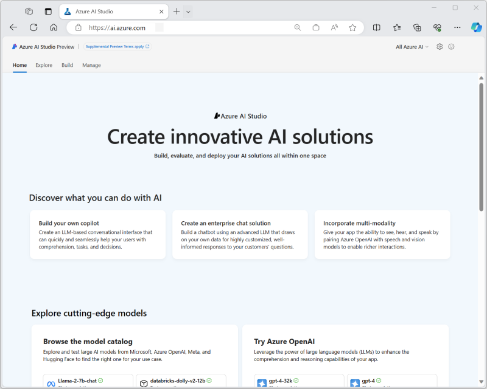

Azure AI Studio is a web portal that brings together multiple Azure AI-related services into a single, unified development environment. Specifically, Azure AI Studio combines:

- The model catalog and prompt flow development capabilities of Azure Machine Learning service.
- The generative AI model deployment, testing, and custom data integration capabilities of Azure OpenAI service.
- Integration with Azure AI Services for speech, vision, language, document intelligence, and content safety.

> [!NOTE]
> In some cases, Azure AI services are integrated directly into to the Azure AI Studio interface and the underlying Azure AI Service resource. In other cases, a link is provided to external service-specific studios where you can create and use Azure AI services resources. In either case, Azure AI Studio provides a central starting point from which you can find and integrate Azure AI services into your solution.

In addition to providing a unified interface for multiple AI services, Azure AI Studio includes support for:

- Creating *Azure AI hubs* that provide a collaborative development workspace for data scientists, developers, and others to build AI solutions.
- Creating *projects* in which assets and code for a specific solution are managed.
- Scalable, on-demand compute.
- Integration with data sources and other cloud services.
- Web-based code development environments.
- SDKs and CLI libraries for automation.

## What can I do with Azure AI Studio?

Azure AI Studio enables teams to collaborate efficiently and effectively on AI projects, such as developing custom *copilot* applications that use large language models. Tasks you can accomplish with Azure AI Studio include:

- Deploying models from the model catalog to real-time inferencing endpoints for client applications to consume.
- Deploying and testing generative AI models in an Azure OpenAI service.
- Integrating data from custom data sources to support a *retrieval augmented generation* (RAG) approach to prompt engineering for generative AI models.
- Using *prompt flow* to define workflows that integrate models, prompts, and custom processing.
- Integrating *content safety* filters into a generative AI solution to mitigate potential harms.
- Extending a generative AI solution with multiple AI capabilities using Azure AI services.

> [!NOTE]
> Azure AI Studio is currently in active development. Its capabilities may expand or change as new features are released.
