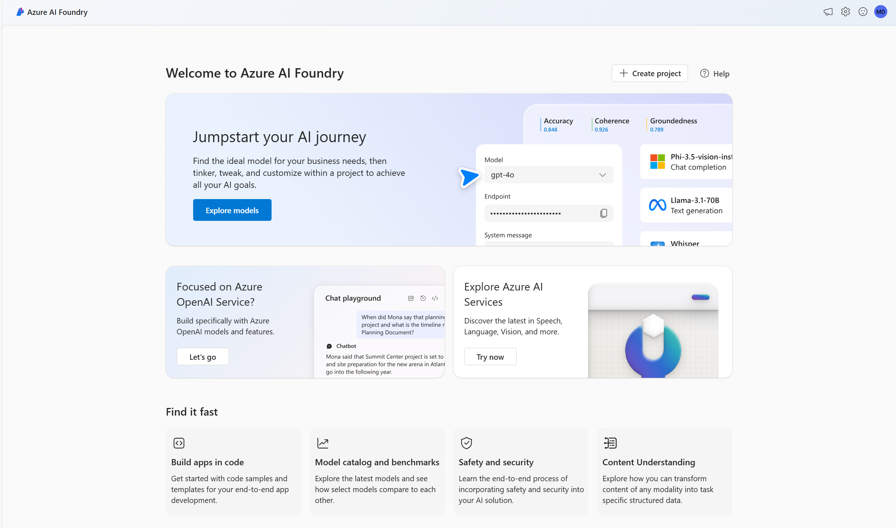

The Azure AI Foundry portal is a web portal that brings together multiple Azure AI-related services into a single, unified development environment. Specifically, Azure AI Foundry combines:

- The model catalog and prompt flow development capabilities.
- The generative AI model deployment, testing, and custom data integration capabilities of Azure OpenAI service.
- Integration with Azure AI Services for speech, vision, language, document intelligence, and content safety.

In addition to providing a unified interface for multiple AI services, Azure AI Foundry includes support for:

- Creating *Azure AI hubs* that provide a collaborative development workspace for data scientists, developers, and others to build AI solutions.
- Creating *projects* in which assets and code for a specific solution are managed.
- Scalable, on-demand compute.
- Integration with data sources and other cloud services.
- Web-based code development environments.
- SDKs and CLI libraries for automation.

## What can I do with Azure AI Foundry?

Azure AI Foundry enables teams to collaborate efficiently and effectively on AI projects, such as developing generative AI apps that use language models. Tasks you can accomplish with the Azure AI Foundry portal include:

- Deploying models from the model catalog to real-time inferencing endpoints for client applications to consume.
- Deploying and testing generative AI models in an Azure OpenAI service.
- Integrating data from custom data sources to support a *retrieval augmented generation* (RAG) approach to prompt engineering for generative AI models.
- Using *prompt flow* to define workflows that integrate models, prompts, and custom processing.
- Integrating *content safety* filters into a generative AI solution to mitigate potential harms.
- Extending a generative AI solution with multiple AI capabilities using Azure AI services.

> [!NOTE]
> You can also develop code-first by using the Azure AI Foundry SDK. This module focuses on using the web portal. Learn more about the [Azure AI Foundry SDK](/azure/ai-studio/how-to/develop/sdk-overview?azure-portal=true).
