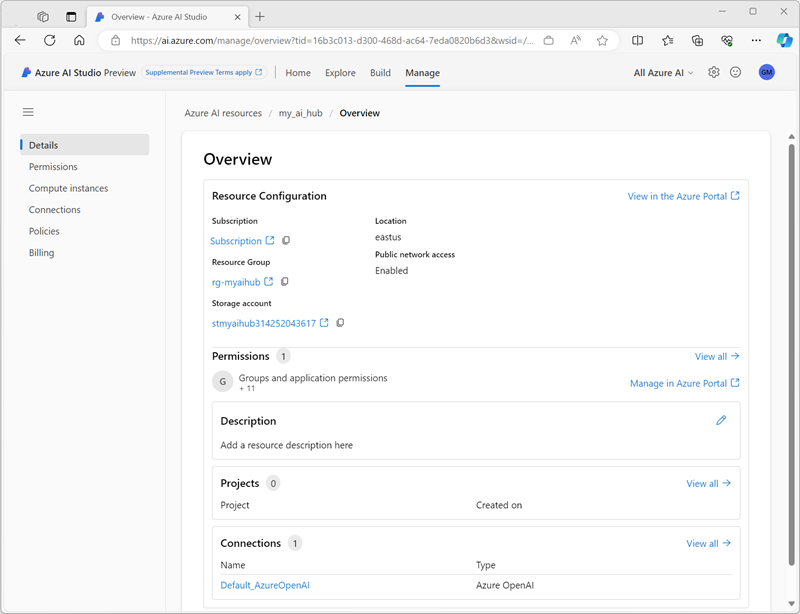

An *AI hub* provides a collaborative workspace for AI solution development and management. You need at least one Azure AI hub to use the solution development features and capabilities of AI Studio.

An Azure AI hub can host one or more *projects*. Each project encapsulates the tools and assets used to create a specific AI solution. For example, you might create a project to enable data scientists and developers to collaborate on building a custom copilot for a business application or process.

## What can I do with an Azure AI hub?

An Azure AI hub is the foundation for AI development projects on Azure, and enables you to define shared assets that can be used across multiple projects. You can use AI Studio to perform the following tasks in an Azure AI hub on the **Manage** page:

- Create *members* and assign them to specific roles.
- Create and manage *compute instances* on which to run experiments, prompt flows, and custom code.
- Create and manage *connections* to resources, such as data stores, GitHub, Azure AI Search indexes, and others.
- Define *policies* to manage behavior, such as automatic compute shutdown.

## What can I do with a project?

All AI development in Azure AI Studio is performed within a project. You can create a new project on the **Build** page in Azure AI Studio, and then use it to:

- Deploy large language models to support a chatbot or copilot.
- Test models in the chat playground.
- Add your own data to augment prompts.
- Use *prompt flow* to define flows that combine models, prompts, and custom code.
- Evaluate model responses to prompts.
- Manage indexes and datasets for custom data.
- Define content filters to mitigate potentially harmful responses.
- Use Visual Studio Code in your browser to create custom code.
- Deploy solutions as web apps and containerized services.

## Associated Azure resources

You can use Azure AI Studio to create an Azure AI hub on the **Manage** page, or you can create one during the process of creating a new project (on the **Build** page). When you do so, an **AI hub** resource is created in your Azure subscription in the resource group you specify. This resource provides a collaborative workspace for AI development.

In addition to the core **AI hub** resource, other Azure resources are created to provide supporting services. These include

- A **Storage account** in which the data for your AI projects is stored securely.
- A **Key vault** in which credentials used to access external resources and other sensitive values are secured.
- A **Container registry** to store Docker images used by your AI solutions.
- An **Application insights** resource to record usage and performance metrics.
- An **Azure OpenAI Service** resource that provides generative AI models for your applications.

## All of Azure AI

Azure AI Studio provides an integration point for other AI Services, such as Speech, Language, and Vision. By adding other AI Services to your solution, you can add even more capabilities to your AI solution.