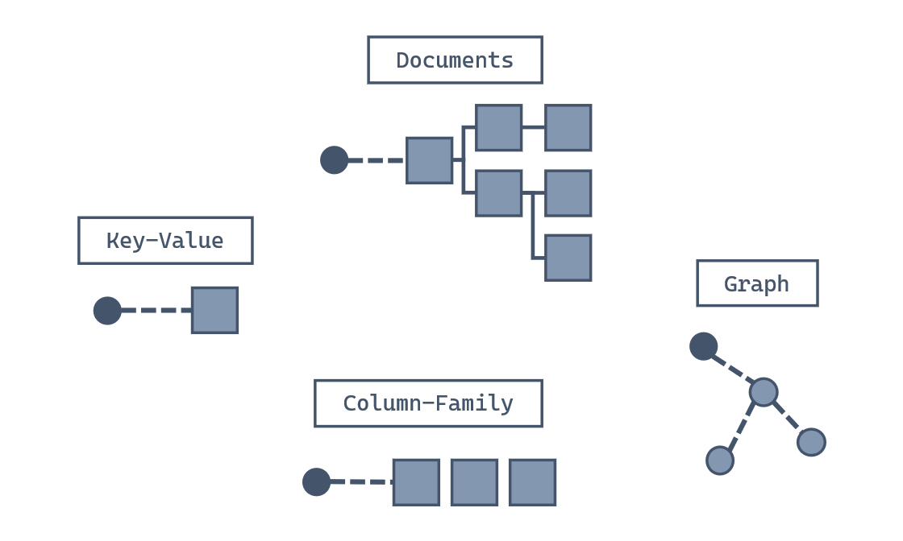
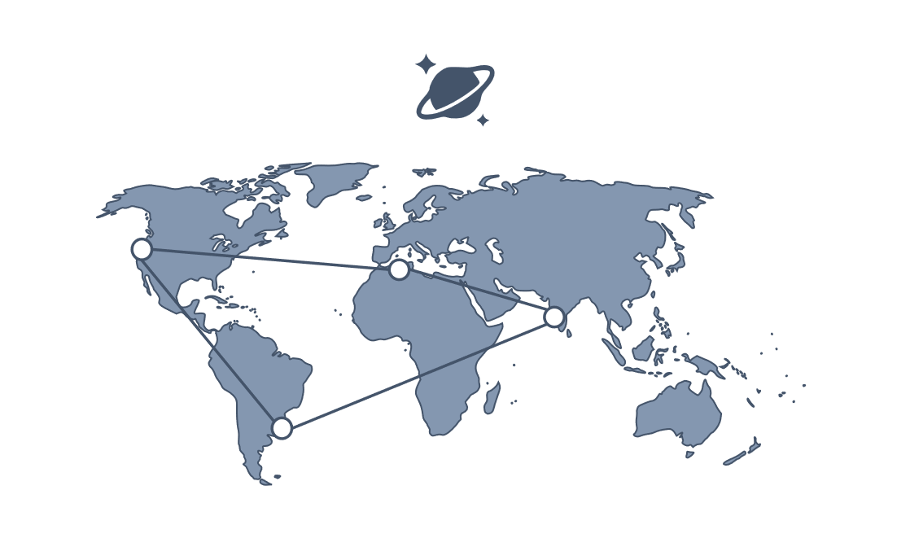

Let's start with a few definitions and a quick tour through Azure Cosmos DB for NoSQL. This overview should help you see whether Azure Cosmos DB might be a good fit for your work.

## What is a NoSQL database?

Developers require new kinds of databases that can address the unique challenges of modern apps. NoSQL databases were designed to address needs such as:

- High volumes of data.
- Data with many different sources and forms.
- Dynamic data schemas that store different types of data.
- Using high-velocity and/or real-time data.

You define NoSQL databases by the common characteristics they share rather than by a specific formal definition. These characteristics include:

- A nonrelational data store.
- Being designed to scale out.
- Not enforcing a specific schema.

Generally, NoSQL databases don't enforce relational constraints or put locks on data, making writes fast. Also, they're often designed to horizontally scale via sharding or partitioning, which allows them to maintain high-performance regardless of size.

While there are many NoSQL data models, four broad data model families are commonly used when modeling data in a NoSQL database:



Moving forward, we focus on the data model supported by Azure Cosmos DB for NoSQL: The *document* data model.

## Why use a NoSQL database with the document data model?

The document data model breaks data down into individual **document** entities. A document can be any structured data type, but JSON is commonly used as the data format. The Azure Cosmos DB for NoSQL supports JSON natively.


A document is an atomic entity and can have its own data form, regardless of what is stored in other documents in the same database. Because of this flexibility, there's no need for a predefined schema making it easier to build new applications rapidly. Additionally, this flexibility enables scenarios where different types of data can be stored together and where models can evolve over the lifetime of an application.

## What is a JSON document?

JavaScript Object Notation, or [JSON][json.org], is a lightweight data format. JSON was built to be highly compatible with the literal notation of an object in the JavaScript language. Many frameworks, browsers, and even databases support JavaScript natively making JSON a popular format for transmitting and storing data.

Here's an example of a JSON document:

```json
{
  "device": {
    "type": "mobile"
  },
  "sentTime": "2019-11-12T13:08:42",
  "spoolRefs": [
    "6a86682c-be5a-4a4a-bacd-96c4d1c7ece6",
    "79e78fe2-93aa-4688-89db-a7278b034aa6"
  ]
}
```

As you can see, JSON is a relatively readable data format that clearly exposes its content. JSON is also relatively easy to parse and use in JavaScript applications.

## What is Azure Cosmos DB for NoSQL?

Azure Cosmos DB for NoSQL is a fast NoSQL database service that offers rich querying over diverse data. It helps deliver configurable and reliable performance, is globally distributed, and enables rapid development.



The NoSQL API is the core or native API for working with documents. The NoSQL API supports fast, flexible development utilizing JSON documents, a query language with a familiar syntax, and client libraries for popular programming languages. Azure Cosmos DB provides other APIs, such as Mongo, Gremlin, and Cassandra. These APIs offer compatibility with each database ecosystem, while still mapping to the same underlying infrastructure of the native NoSQL API.

Azure Cosmos DB for NoSQL has a few advantages such as:

- **Guaranteed speed at any scale**—even through bursts—with instant, limitless elasticity, fast reads, and multi-master writes, anywhere in the world.
- **Fast, flexible app development** with SDKs for popular languages, a native NoSQL API along with APIs for MongoDB, Cassandra, and Gremlin, and no-ETL (extract, transform, load) analytics.
- **Ready for mission-critical applications** with guaranteed business continuity, 99.999-percent availability, and enterprise-grade security.
- **Fully managed and cost-effective serverless database** with instant, automatic scaling that responds to application needs.

These capabilities make Azure Cosmos DB ideally suited for modern application development. Azure Cosmos DB for NoSQL is especially suited for applications that:

- Experience unpredictable spikes and dips in traffic
- Generate lots of data
- Need to deliver real-time user experiences
- Are depended upon for business continuity

The Azure Cosmos DB for NoSQL can arbitrarily store native JSON documents with flexible schema. Data is indexed automatically and is available for query using a flavor of the SQL query language designed for JSON data. The NoSQL API can be accessed using SDKs for popular frameworks such as [.NET][/azure/cosmos-db/sql/sql-api-sdk-dotnet-standard], [Python][/azure/cosmos-db/sql/sql-api-sdk-python], [Java][/azure/cosmos-db/sql/sql-api-sdk-java-v4], and [Node.js][/azure/cosmos-db/sql/sql-api-sdk-node].

[/azure/cosmos-db/sql/sql-api-sdk-dotnet-standard]: /azure/cosmos-db/sql/sql-api-sdk-dotnet-standard
[/azure/cosmos-db/sql/sql-api-sdk-java-v4]: /azure/cosmos-db/sql/sql-api-sdk-java-v4
[/azure/cosmos-db/sql/sql-api-sdk-node]: /azure/cosmos-db/sql/sql-api-sdk-node
[/azure/cosmos-db/sql/sql-api-sdk-python]: /azure/cosmos-db/sql/sql-api-sdk-python
[json.org]: https://www.json.org