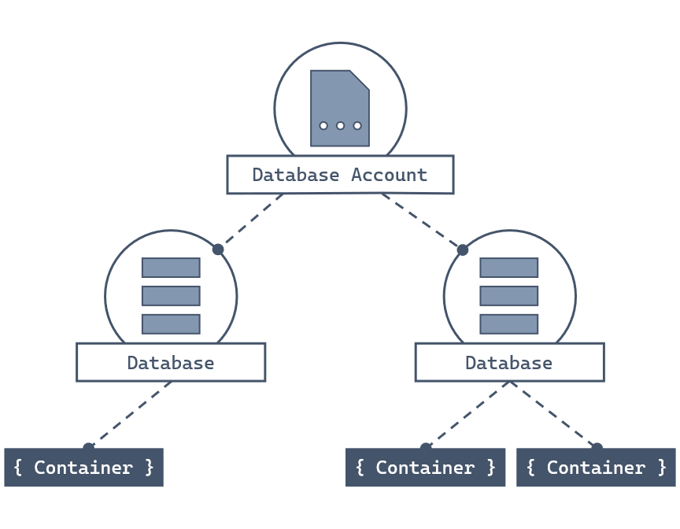
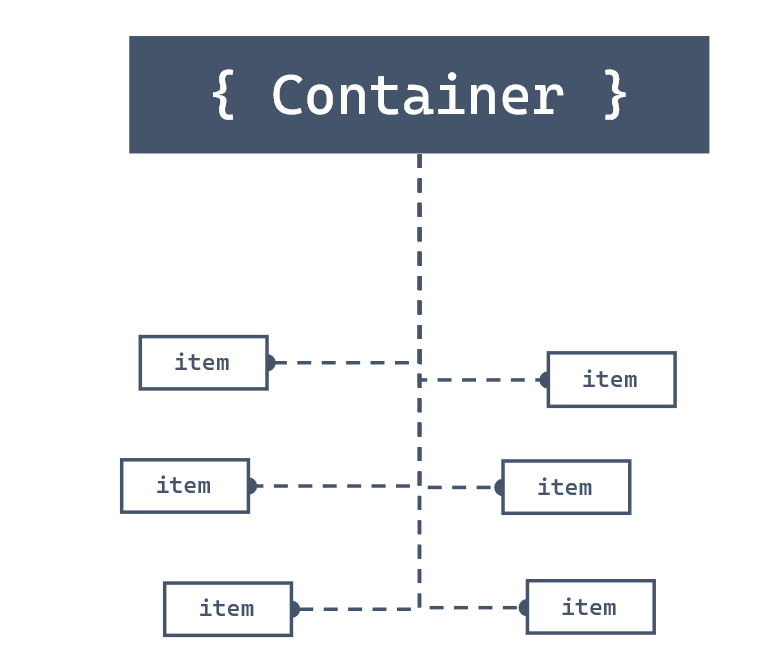

Now that we know the basics of Azure Cosmos DB, let's see what resources and information are required to start working with an account. This information should help you decide whether Azure Cosmos DB for NoSQL works for your data set. Also, it should help you decide how much, if any, extra configuration is necessary.

## What are the components of Azure Cosmos DB for NoSQL?

To begin using Azure Cosmos DB, you first create various resources in Azure such as accounts, databases, containers, and items.



### Accounts

**Accounts** are the fundamental units of distribution and high availability. At the account level, you can configure the region\[s\] for your data in Azure Cosmos DB for NoSQL. Accounts also contain the globally unique DNS name used for API requests. You can also set the default consistency level for requests at the account level. You can manage or create accounts using the Azure portal, Azure Resource Manager templates, the Azure CLI, or Azure PowerShell.

### Databases

Each account can contain one or more **Databases**. A database is a logical unit of management for containers in Azure Cosmos DB for NoSQL.

### Containers

**Containers** are the fundamental unit of scalability in Azure Cosmos DB for NoSQL. With Azure Cosmos DB, you provision throughput at the container level. You can also optionally configure an indexing policy or a default time-to-live value at the container level. Azure Cosmos DB for NoSQL will automatically and transparently partition the data in a container.

### Items

The NoSQL API for Azure Cosmos DB stores individual documents in JSON format as *items* within the container. Azure Cosmos DB for NoSQL natively supports JSON files and can provide fast and predictable performance because write operations on JSON documents are atomic.



## Partitioning & Partition Keys

> [!VIDEO https://www.microsoft.com/videoplayer/embed/RE4OAlA]

Every Azure Cosmos DB for NoSQL container is required to specify a **partition key path**. Behind the scenes, Azure Cosmos DB for NoSQL uses this path to logically partition data using **partition key values**. For example, consider the following JSON document:

```json
{
  "id": "35b5bf7d-5f0e-4209-b7cb-8c5c70c3bb59",
  "deviceDisplayName": "shared-printer",
  "acquiredYear": 2019,
  "department": {
    "name": "information-technology",
    "metadata": {
      "location": "floor-5-unit-27"
    }
  },
  "queuedDocuments": [
    {
      "sender": "user-293749329",
      "sentTime": "2019-07-26T05:12:37",
      "pages": 5,
      "spoolRef": "3f4b759c-3230-4269-a88e-de7620ad91c0"
    },
    {
      "device": {
        "type": "mobile"
      },
      "sentTime": "2019-11-12T13:08:42",
      "spoolRefs": [
        "6a86682c-be5a-4a4a-bacd-96c4d1c7ece6",
        "79e78fe2-93aa-4688-89db-a7278b034aa6"
      ]
    }
  ]
}
```

If your container specifies a partition key **path** of `/department/name`, then the partition key **value** of this document would be `information-technology`. Behind the scenes, Azure Cosmos DB for NoSQL automatically manages the physical resources necessary to support your data workload.

Selecting a partition key path for a container can be one of the most important design decisions for a new workload. Review the [choosing a partition key][azure/cosmos-db/partitioning-overview#choose-partitionkey] documentation for a deeper technical explanation and best practices.

[azure/cosmos-db/partitioning-overview#choose-partitionkey]: /azure/cosmos-db/partitioning-overview#choose-partitionkey