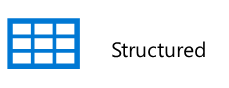
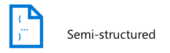
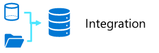
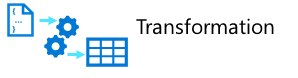
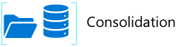
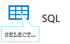
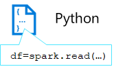

The data engineer will often work with multiple types of data to perform many operations using a number of scripting or coding languages that are appropriate to their individual organization. In this section you will find some of the more common types and patterns you will be addressing as a data engineer.

## Types of Data

There are three primary types of data that a data engineer will interact with on any give project and depending upon the type dictates optimal storage methods and how you interact with it.

### Structured Data

Structured data primarily comes from source systems that are table based, such as a database server, which can be through a direct connection or direct query or from a flat file such as a comma separated (CSV) file.. The primary elements of a structured file is that the rows and columns are aligned consistently throughout the file.

### Semi-structured Data

Semi-structured data, as the name implies is data, such as java script object notation (json) files, which may require flattening prior to loading into your source system. This data when flattened doesn't have to fit neatly into a table structure and when forced into a relational structure can contain many null values. This doesn't mean it has no value, in fact, many times it provides key insights that just need to be handled in a different manner than relational or structured data.

### Unstructured Data

Not only SQL (NoSQL) is a type of data that may contain key-value pairs data and doesn't adhere to standard relational models. This is a popular data storage format type and allows for a very quick way to store transactional data in a compact form that is optimized for data entry. Other types of unstructured data that are commonly used include portable data format (PDF), word processor documents, and simple text documents.

## data operations

As a data engineer some of the main tasks that you will perform in Azure are data integration, data transformation, and data consolidation with the use of tools such as Azure Synapse Analytics, Azure Synapse Notebooks, and scripting languages including python, SQL, and more.

### Data Integration

Data Integration is the process of sourcing data from multiple sources and utilizing the linking service to have a steady flow of data available for processing. From a high level, data integration is about data movement and preparing it for transformation.

### Data Transformation

Data transformation is where the data is prepared through cleansing, applying business rules, performing lookups to existing data to extract and replace key values, removing duplicates and corrupt data and many other elements to ensure our data is properly prepared to support downstream business needs. These operations on the data happen as it streams through the Pipeline data flow.

Some example transformations may include:

- Performing dimension key lookup and checking for new entries to ensure data integrity
- Removing duplicate records
- replacing null values in records or removing them entirely
- splitting data, such as name into last_name and first_name 
- Applying business logic calculations to new fields in records, such as Net and Gross Values or key performance indicator (KPI) measures based on values in the source dataset(s)

### Data Consolidation

Data consolidation is the process of combining the previously heterogenous data sources, now transformed information into a related structures that is consumable by downstream tools.
### Common Languages

Data Engineers must be proficient with a range of tools and scripting languages - in particular SQL and Python, and potentially others.

### SQL

One of the most common languages a data engineer might traditionally use is SQL or Structured Query Language which is a relatively easy language to learn and uses data manipulation language (DML) to directly work with the data stored within tables and data definition language (DDL) to control the structures of tables, views, and other objects within a relational database. DDL is more likely to be vendor/product specific.

### Python

Python is one of the most popular and fastest growing programming languages in the world. It's used for all sorts of tasks, including web programming and data analysis, and it has emerged as the language to learn for machine learning and increasing in popularity in data engineering with the use of notebooks.

### Others

Depending upon the needs of the organization and your individual skill-sets, you may also use other popular languages within or outside of notebooks including R, Java, Scala, .NET, and more. The use of notebooks, as stated before, is growing in popularity, and allows collaboration using different languages within the same notebook.