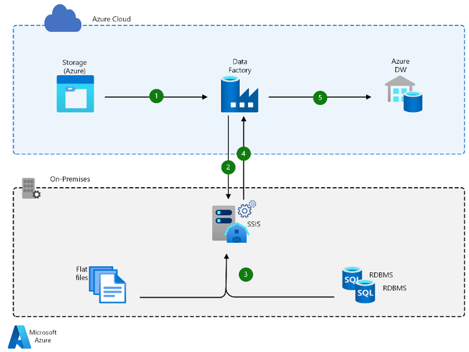
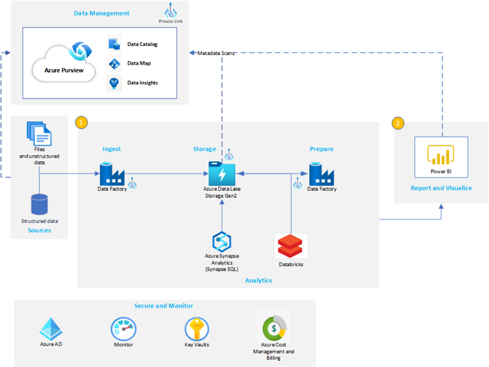

## How is Data Engineering Different in Microsoft Azure
One of the biggest differences in data engineering on Microsoft Azure is related to the change from traditional Extract, Transfomation, and Load (ETL) processes to a more efficient Extract, Load, and Transform (ELT) approach as there are major benefits of putting the data into the cloud first and then leveraging the linear scale of cloud compute to quickly transform the data. Some of the tooling has changed as well. For a traditional SQL Server data engineer, SQL Server Integration Services is still supported in different ways; however, the Pipeline tools are now the primary modes of data movement and cleansing. These tools include Azure Data Facory and Synapse Pipelines.
 
## Data Governance using Azure Purview
When integrating Azure Purview with Azure Synapse Analytics we are provided with a comprehensive data governance solution providing a single pane of glass for all analytics workloads. This tight integration allows project teams to put data to work much more quickly, productively, and securely, generating insights from **all data** sources. Azure Purview integration into Azure Synapse Analytics provides deep insights that have proven ellusive in on-premises solutions.
 
## High Throughput of real-time data with Azure Event Hubs and Azure Stream Analytics
Many organizataions are focused on getting access to their real-time data to performing streaming analytic capabilities as part of the speed layer in their LAMBDA architectures. In Azure, there are native tools that allow for native cloud support with tools such as Azure Event Hubs and Azure Stream Analytics. Additionally, on-premises tools, such as Kafka can be tightly integrated into Azure Event Hubs quicly and securely to enable cloud scale. Customers also have the ability to use streaming capabilities using other Open-Source Software (OSS) tools, and first party tools, such as Azure Databricks.
