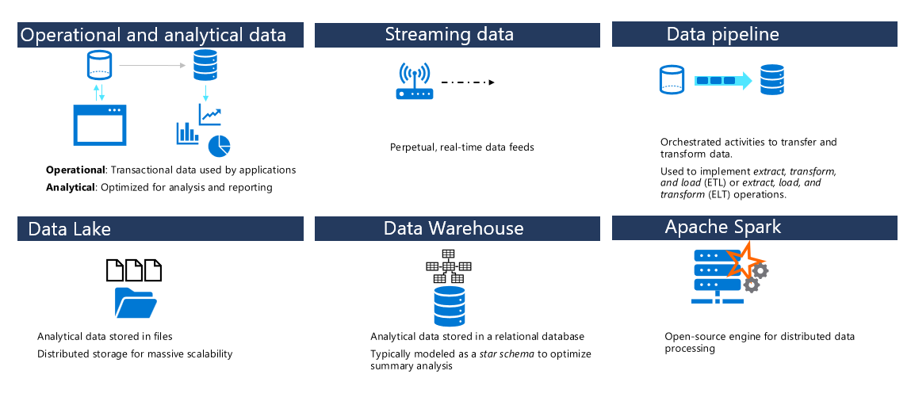

## Important data engineering concepts

- Operational and analytical data
  - Operational: Transactional data used by applications
  - Analytical: Optimized for analysis and reporting
- Streaming data
  - Pepetual, real-time data feeds
- Data pipeline
  - Orchestrated activities to transfer and transform data
  - Used to implement extract, transform, and load (ETL) or extract, load, and transform (ELT) operations
  
- Data Lake
  - Analytical data stored in files
  - Distributed storage for massive scalability
  - hierarchical and highly secure in design
- Data Warehouse
  - Analytical data stored in a relational database
  - Typically modeled as a star schema to optimize summary analysis
- Apache Spark
  - Open-source engine for distributed data processing
  

