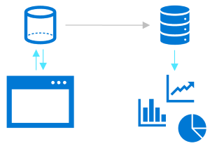
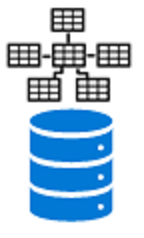
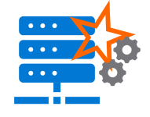

There are some core concepts with which data engineers should be familiar. These concepts underpin many of the workloads that data engineers must implement and support.

## Operational and analytical data

*Operational* data is usually transactional data that is generated and stored by applications, often in a relational or non-relational database. *Analytical* data is data that has been optimized for analysis and reporting, often in a data warehouse.

One of the core responsibilities of a data engineer is to design, implement, and manage solutions that integrate operational and analytical data sources or extract operational data from multiple systems, transform it into appropriate structures for analytics, and load it into an analytical data store (usually referred to as ETL solutions).

## Streaming data

Streaming data refers to perpetual sources of data that generate data values in real-time, often relating to specific events. Common sources of streaming data include internet-of-things (IoT) devices and social media feeds.

Data engineers often need to implement solutions that capture real-time stream of data and ingest them into analytical data systems, often combining the real-time data with other application data that is processed in batches.

## Data pipelines

Data pipelines are used to orchestrate activities that transfer and transform data. Pipelines are the primary way in which data engineers implement repeatable extract, transform, and load (ETL) solutions that can be triggered based on a schedule or in response to events.

## Data lakes

A data lake is a storage repository that holds large amounts of data in native, raw formats. Data lake stores are optimized for scaling to massive volumes (terabytes or petabytes) of data. The data typically comes from multiple heterogeneous sources, and may be structured, semi-structured, or unstructured.

The idea with a data lake is to store everything in its original, untransformed state. This approach differs from a traditional data warehouse, which transforms and processes the data at the time of ingestion.

## Data warehouses

A data warehouse is a centralized repository of integrated data from one or more disparate sources. Data warehouses store current and historical data in relational tables that are organized into a schema that optimizes performance for analytical queries.

Data engineers are responsible for designing and implementing relational data warehouses, and managing regular data loads into tables.

## Apache Spark

Apache Spark is a parallel processing framework that takes advantage of in-memory processing and a distributed file storage. It's a common open-source software (OSS) tool for big data scenarios.

Data engineers need to be proficient with Spark, using notebooks and other code artifacts to process data in a data lake and prepare it for modeling and analysis.
