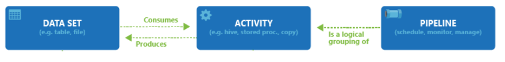

There are several common design patterns for data engineering on Azure that can be used to build and manage data pipelines effectively:

1. **Data Lake Architecture**: This pattern uses Azure Data Lake Storage as the central repository for all data, and data engineers can use tools like Azure Data Factory, Azure Databricks, and Azure Stream Analytics to extract, transform, and load data into the data lake. This pattern allows data engineers to handle large volumes of data and perform complex data processing and analytics tasks.

2. **Lambda Architecture**: This pattern uses a combination of batch and real-time processing to handle both historical and real-time data. Data engineers can use tools like Azure Data Factory, Azure Databricks, and Azure Stream Analytics to extract, transform, and load data into both a batch layer and a real-time layer.

3. **ELT Architecture**: This pattern uses Azure Data Factory, Azure Databricks, and Azure SQL Data Warehouse to extract, load, and transform data into a data warehouse. This pattern allows data engineers to perform data transformation tasks directly in the data warehouse and allows for faster querying and reporting.

4. **Data Hub Architecture**: This pattern uses Azure Data Factory, Azure Databricks, and Azure SQL Data Warehouse to extract, transform, and load data into a central hub. This pattern allows data engineers to integrate data from multiple sources and create a single source of truth for the organization.

5. **Event-Driven Architecture**: This pattern uses Azure Event Grid, Event Hub, Logic Apps, and Azure Functions to handle real-time data streams, and trigger downstream processing and analytics.

Each of these patterns has its own advantages and disadvantages, and the best design pattern for a specific use case will depend on factors such as data volume, data complexity, and performance requirements.

## Notebooks
Azure Notebooks are a cloud-based Jupyter notebook service provided by Microsoft as part of Azure Machine Learning service. Jupyter Notebooks are a web-based interactive development environment (IDE) that allows data scientists and data engineers to create and share documents that contain live code, equations, visualizations, and narrative text. Azure Notebooks allows users to create and run Jupyter notebooks directly in the Azure cloud, without the need to set up and maintain a local environment.

With Azure Notebooks, users can:
- Create and run Jupyter notebooks in the Azure cloud
- Collaborate with others by sharing notebooks and projects
- Leverage pre-configured environments for data science and machine learning tasks
- Access to a wide range of libraries and packages that are pre-installed in the notebooks
- Scale the computational resources as needed
- Monitor the progress of long-running computations
- Schedule notebooks to run at specified intervals

Azure Notebooks provide a convenient and easy-to-use platform for data scientists and data engineers to perform data analysis, machine learning, and other computational tasks in the Azure cloud.

## Pipelines
Azure Synapse Pipelines and Azure Data Factory are both data integration services provided by Microsoft as part of the Azure platform. They are designed to help organizations extract, transform, and load data from various sources into a central location for analysis and reporting.

Azure Synapse Analytics is a cloud-based data integration, analytics, and data warehousing service that allows data engineers to create, schedule, and manage data pipelines, and perform complex data processing and analytics tasks. It provides a unified experience for data integration, big data analytics, and data warehousing that allows data engineers to work with data in a more seamless and efficient way.

Azure Data Factory is a fully-managed data integration service that allows data engineers to create, schedule, and manage data pipelines. It provides a visual, code-free interface that allows data engineers to create data pipelines using a drag-and-drop interface. It also allows data engineers to use code to create custom data pipelines using various languages such as C#, Python, and SQL.

Both Azure Synapse and Azure Data Factory allow data engineers to:
- Extract data from various sources such as databases, cloud services, and file systems
- Transform data using built-in or custom data flow activities
- Load data into various destinations such as data lakes, data warehouses, and cloud services
- Schedule and automate data pipelines
- Monitor and troubleshoot data pipelines

Azure Synapse Pipelines is a newer version of Azure Data Factory, it provides more advanced features for data integration, big data analytics and data warehousing, such as ability to work with big data, ability to work with data lake and data warehousing together in a seamless way, and ability to work with Power BI, Azure Machine Learning and other analytics services.
  
## Ten Dsign Principles around Cloud Design Patterns.
Although these ten may not be directly related to Data Engineering, a data engineer will find that many of them will impact their role in some way and should be understood from a high level.
Follow these design principles to make your application more scalable, resilient, and manageable.

[Design for self healing](/azure/architecture/guide/design-principles/self-healing). In a distributed system, failures happen. Design your application to be self healing when failures occur.

[Make all things redundant](/azure/architecture/guide/design-principles/redundancy). Build redundancy into your application, to avoid having single points of failure.

[Minimize coordination](/azure/architecture/guide/design-principles/minimize-coordination). Minimize coordination between application services to achieve scalability.

[Design to scale out](/azure/architecture/guide/design-principles/partition). Design your application so that it can scale horizontally, adding or removing new instances as demand requires.

[Partition around limits](/azure/architecture/guide/design-principles/partition). Use partitioning to work around database, network, and compute limits.

[Design for operations](/azure/architecture/guide/design-principles/design-for-operations). Design your application so that the operations team has the tools they need.

[Use managed services](/azure/architecture/guide/design-principles/managed-services). When possible, use platform as a service (PaaS) rather than infrastructure as a service (IaaS).

[Use an identity service](/azure/architecture/guide/design-principles/identity). Use an identity as a service (IDaaS) platform instead of building or operating your own.
[Use the best data store for the job](/azure/architecture/guide/design-principles/use-best-data-store). Pick the storage technology that is the best fit for your data and how it will be used.

[Design for evolution](/azure/architecture/guide/design-principles/design-for-evolution). All successful applications change over time. An evolutionary design is key for continuous innovation.

[Build for the needs of business](/azure/architecture/guide/design-principles/build-for-business). Every design decision must be justified by a business requirement.

