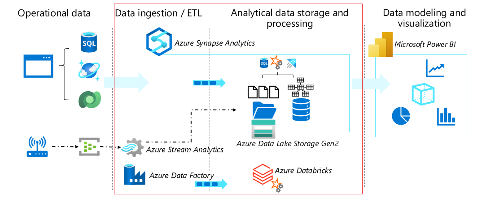

The diagram below displays the flow from left to right of a typical enterprise data analytics solution. Operational data is generated by applications and devices and must be captured, ingested, and consolidated into analytical stores; from where it can be modeled and visualized in reports and dashboards.

The core technologies covered in the Azure data engineer course are in the Data ingestion and Analytical data storage and processing sections (outlined in red) – we’ll be exploring these technologies and using them to implement typical workloads in the presentations and exercises that follow.

Although we’ll briefly touch on Power BI in the course, enterprise-level data modeling and visualization is covered in more depth in course DP-500: Designing and Implementing Enterprise-Scale Analytics Solutions Using Microsoft Azure and Microsoft Power BI.

