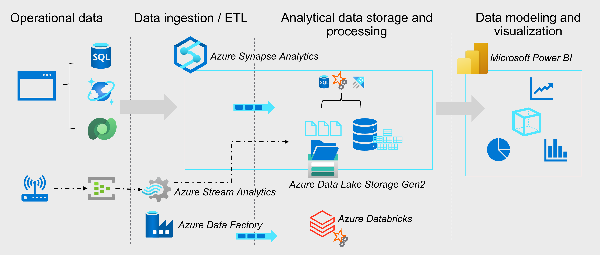

Microsoft Azure includes many services that can be used to implement and manage data engineering workloads.

The diagram displays the flow from left to right of a typical enterprise data analytics solution, including some of the key Azure services that may be used. Operational data is generated by applications and devices and stored in Azure data storage services such as Azure SQL Database, Azure Cosmos DB, and Microsoft Dataverse. Streaming data is captured in event broker services such as Azure Event Hubs.

This operational data must be captured, ingested, and consolidated into analytical stores; from where it can be modeled and visualized in reports and dashboards. These tasks represent the core area of responsibility for the data engineer. The core Azure technologies used to implement data engineering workloads include:

- Azure Synapse Analytics
- Azure Data Lake Storage Gen2
- Azure Stream Analytics
- Azure Data Factory
- Azure Databricks

The analytical data stores that are populated with data produced by data engineering workloads support data modeling and visualization for reporting and analysis, often using sophisticated visualization tools such as Microsoft Power BI.