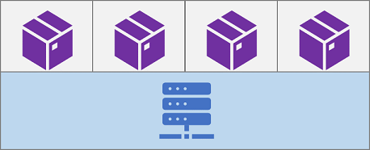

When you deploy a software service, it must be hosted in an environment that provides the hardware, operating system, and supporting runtime components on which the service depends.

Azure AI Services is provided as a cloud service, in which the service software is hosted in an Azure data center that provides the underlying runtime services, operating system, and hardware. However, you can also deploy some Azure AI Services in a *container*, which encapsulates the necessary runtime components, and which is in turn deployed in a container host that provides the underlying operating system and hardware.

## What is a container?

A container comprises an application or service and the runtime components needed to run it, while abstracting the underlying operating system and hardware. In practice, this abstraction results in two significant benefits:

- Containers are portable across hosts, which may be running different operating systems or use different hardware - making it easier to move an application and all its dependencies.
- A single container host can support multiple isolated containers, each with its own specific runtime configuration - making it easier to consolidate multiple applications that have different configuration requirement.

A container is encapsulated in a *container image* that defines the software and configuration it must support. Images can be stored in a central registry, such as *Docker Hub*, or you can maintain a set of images in your own registry.

## Container deployment

To use a container, you typically pull the container image from a registry and deploy it to a container host, specifying any required configuration settings. The container host can be in the cloud, in a private network, or on your local computer. For example:

- A *Docker*\* server.
- An Azure Container Instance (ACI).
- An Azure Kubernetes Service (AKS) cluster.

\*_Docker is an open source solution for container development and management that includes a server engine that you can use to host containers. There are versions of the Docker server for common operating systems, including Microsoft Windows and Linux._

> [!Tip]
> To learn more about containers, review the [Introduction to Docker containers](/training/modules/intro-to-docker-containers/) module on Microsoft Learn.