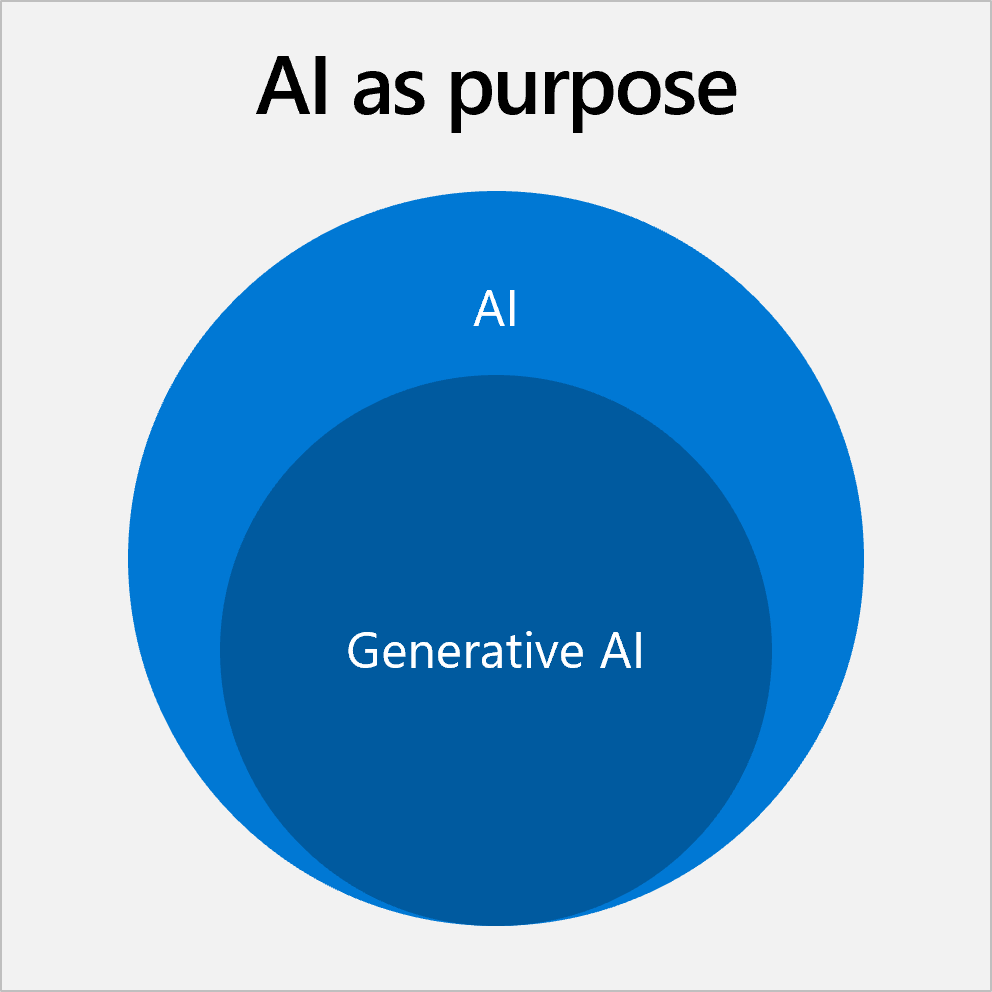
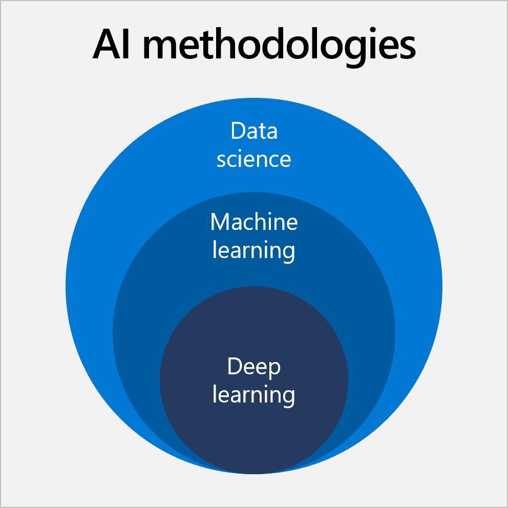

The term AI tends to be thrown around a lot. You've probably heard about machine learning, deep learning, data science, generative AI, and responsible AI. However, it may not be clear what all these terms mean and how they're different to each other. In this unit, we'll clarify these concepts so you can understand how they apply to your business problem.

## What is AI?
Artificial Intelligence (AI) is an ability of a computer program or machine to **mimic human-like behavior** (for example, visual senses, speech recognition, decision-making, natural language understanding, and so on). Then, it's not a technology of itself, but a goal set by technologists: to imitate human intelligence.

## What is generative AI?
Generative AI is a **subset of AI**. AI can be used to predict outcomes, detect entities, or classify documents, among others. However, generative AI, also known as GenAI, creates content, such as images, videos, or text. The goal is that this AI-generated content should be as useful as any created by humans. This approach is possible thanks to large language models (LLMs), which are very complex AI models that can be used for a broad range of use cases.

For example, you may use generative AI to translate images to text. Users with visual disabilities can use generative AI to understand what the image represents. Going further, generative AI can even explain the context or punchline of a joke, even if it's a picture.

## What is data science?
Data science is an **interdisciplinary field** whose aim is to achieve AI. It uses many different techniques, mostly machine learning and statistics. In most cases, data scientists are the experts in charge of solving AI problems.

## What is machine learning?
Machine learning is a **technique** where a machine sifts through numerous amounts of data to find patterns over time. This technique is frequently used for AI purposes. Machine learning uses algorithms that train a machine to learn patterns based on differentiating features about the data. The more training data, the more accurate the predictions. Here are some examples:
* **Email spam detection** - Machine learning could look for patterns where email has words like "free" or "guarantee", the email address domain is on a blocked list, or a link displayed in text doesn't match the URL behind it.
* **Credit card fraud detection** - Machine learning could look for patterns like the spending in a zip code the owner doesn't usually visit, buying a very expensive item, or a sudden shopping spree.

## What is deep learning?
Deep learning is a **subset of machine learning**. Deep learning is imitating how a human brain processes information, as a connected artificial neural network. Unlike machine learning, deep learning can discover complex patterns and differentiating features about the data on its own. It normally works with unstructured data like images, text, and audio. That’s why it requires enormous amounts of data for better analysis and massive computing power for speed.

For instance, deep learning can be used to detect cancerous cells in medical images. Deep learning scans every pixel in the image as input to the neural nodes. The nodes analyze each pixel to filter out features that look cancerous. Each layer of nodes pushes findings of potential cancerous cells to the next layer of nodes to repeat the process and eventually aggregate all of the findings to classify the image. For example, the image might be classified as a healthy image or an image with cancerous features.

 

## What is responsible AI?
AI has a great disruptive potential. That is why it should follow the highest ethical standards. Responsible AI refers to the **principles and best practices** that ensure AI work is accountable, inclusive, reliable, safe, fair, transparent, secure, and respects privacy.

For instance, AI could create a video that shows a real person at an event they didn't attend in real life. Responsible AI involves not using this technology for deceitful purposes, since it would compromise their privacy and have unfair consequences.

Expanding on the primary concepts of AI, where machines show capabilities that are usually associated with human capabilities, you can see how learning over time, interpreting data, and reasoning with data works. To achieve this, we need to feed the machine a lot of data before it can learn. Additionally, machine learning creates algorithms varying from simple linear functions to extremely complex ones, like an artificial neural network.

Next, let’s explore which tools and frameworks you have available if you want to add AI to your business.
