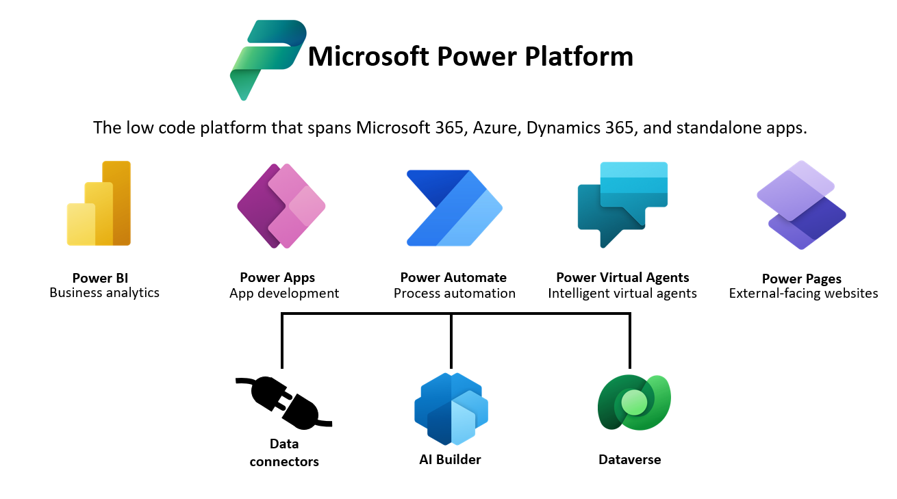
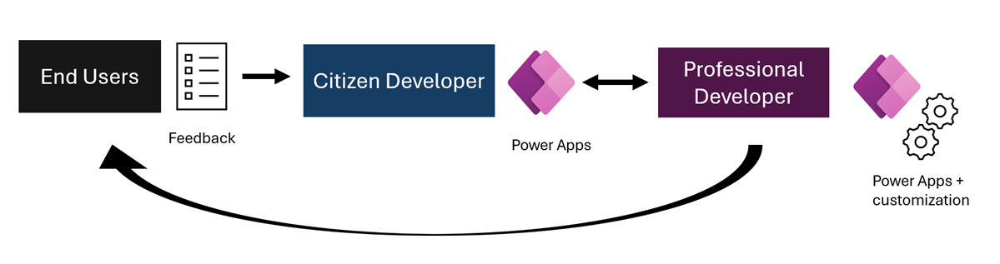

AI embedded in everyday applications may not be enough to power the business applications an organization needs. In these cases, Power Platform is the next step towards more customizable AI solutions. It provides a simple, low-code way to introduce AI in your business applications without having to create or manage the AI yourself.

## What is Microsoft Power Platform?

Microsoft Power Platform is a low-code or no-code set of services designed to simplify the process of building solutions. It provides building blocks that help teams work faster. Even if Power Platform isn't centered on AI, its services are often powered by AI and help you create smart solutions.

The Power Platform portfolio includes five different products: Power BI, Power Apps, Power Automate, Power Virtual Agents, and Power Pages. It also offers three additional tools: AI Builder, Microsoft Dataverse, and Connectors. Let's see what each of them can do for you.

## What can you do with Microsoft Power Platform?

All of the products contained in Power Platform are used to speed up business app development. Beside the specific AI functionalities included in them, they can be connected to Copilot. Thanks to this feature, users can leverage the Copilot generative AI to automatically create the report, workflow, app, website, or chatbot just by describing what they need.

### Power BI

Power BI is a business analytics service. It provides insights on a customizable dashboard. It helps organizations be more data-driven and take better decisions based on data. This data-driven approach aligns with one of the core principles of AI, which emphasizes using data to gain valuable insights and make better choices. 

### Power Apps

Power Apps is a low-code development environment that enables businesses to easily create custom apps without extensive coding knowledge. With the inclusion of AI Builder, developers can seamlessly integrate prebuilt or custom AI models, optimizing business processes and enhancing the intelligence of their applications.

### Power Automate

Power Automate is a powerful tool that allows businesses to automate repetitive tasks and streamline workflows without the need for extensive programming. With the integration of AI Builder, users can effortlessly incorporate prebuilt or custom AI models, enabling intelligent decision-making and driving efficiency in business processes.

### Power Virtual Agents

Power Virtual Agents is a tool for building chatbots. It's built over many AI models, mostly those enabling natural language understanding (NLU), so the bot can understand what is being said. However, its AI can also detect pieces of the bot that can be improved, and even automatically implement the improvements.

### Power Pages

Power Pages is a low-code software-as-a-service (SaaS) platform for creating, hosting, and managing websites. Power Pages simplifies the website development process, making it accessible even to users with limited technical expertise.

### Data connectors 

Data connectors establish seamless connections between various components (apps, data, devices) and the cloud. These connectors ensure smooth integration and communication, creating a cohesive experience across the platform. 

### AI Builder 

AI Builder empowers developers to incorporate AI capabilities into their applications and workflows without requiring data science expertise. With prebuilt and customizable AI models, AI Builder enhances Power Apps and Power Automate by enabling functionalities like sentiment analysis, category classification, entity detection, key phrase identification, and language analysis.

### Dataverse

Dataverse acts as the storage solution in the Power Platform, enabling seamless integration with all its products. It serves as a central repository for data, allowing for efficient organization and accessibility.

Power Platform is a suite of powerful tools designed to help businesses create apps, analyze data, automate tasks, build chatbots, and manage websites. With Power BI, you can get valuable insights from your data and make better decisions. Power Apps lets you easily build custom apps without coding, and AI Builder adds intelligent features like language analysis and sentiment analysis. Power Automate helps you automate repetitive tasks and save time, and Power Virtual Agents allows you to create chatbots that understand and respond to users. Plus, Data connectors ensure smooth integration between different components, and Dataverse provides a central place to store and access your data. By using these tools together, you can enhance productivity and make your business more efficient.

## What is the business value of Microsoft Power Platform?

There are two main ways in which Power Platform creates business value for organizations:

* **Reducing development costs**: It provides the building blocks for teams to create custom solutions in much less time than required when starting by scratch. Teams can build custom apps in just a matter of days or weeks.
* **Enabling more agile, scalable development**: The low-code philosophy is central to Power Platform. It allows for faster, more agile solution development. It empowers citizen developers, that is, employees with less coding expertise, to provide working solutions to end users. Professional developers can iterate on this version for further improvement. This collaborative development approach implies solutions are available to end users at an earlier stage and are less costly. This structure is easy to escalate by adding custom functionality.

The diagram shows how this fusion development approach works.

### Use Microsoft Power Platform to build a smart inventory app

Let's imagine a retail organization needs an app to manage their inventory. Traditionally, professional developers would build this, but that option would take more time. Thanks to Power Platform, the employees in charge of the inventory can become citizen developers and create an app tailored to what they know they need, based on their expertise.

Citizen developers can use Power Apps to build this prototype of the inventory app. They can even explain in natural language their needs and Copilot can translate them to an actual app. Once this prototype is built, professional developers can fill in any potential gaps for further functionalities. Then, professional developers can develop an API to check the inventory in real time and update the data on the app. This data would be stored and managed in Microsoft Dataverse. With the information provided by the API, workflows can be created to automatically detect what's missing and replenish inventory with Power Automate. All these data and operations would be reflected in a Power BI report, so it's easier to understand what's happening with the inventory and take the best data-informed decisions.

Each of the products and services we've covered are prebuilt AI models, so the user doesn't require any data science expertise. If your business requires more ambitious solutions, the next available AI tools require some degree of AI knowledge. To fully benefit from them, let's first learn more about how data science teams work and what's the typical machine learning lifecycle.