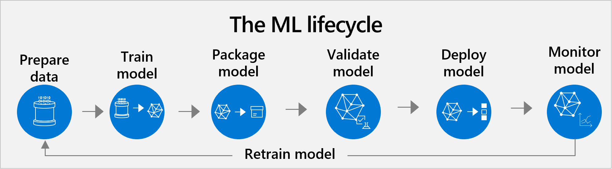

In this unit, we discuss the typical machine learning lifecycle and its common challenges. It provides an overview of the process if you're building a custom model, either from the ground up or using a pretrained model as a starting point. This knowledge should empower you to approach data science projects.

## Machine learning challenges and need of machine learning operations

The recent boom of AI premade models, such as those offered by OpenAI, can help organizations reduce significantly the intimidating amount of resources a data science project can require. However, as more organizations experiment with AI, they find that the machine learning lifecycle is more complex than just creating an AI model or reusing a prebuilt one.

Even if your organization is using premade AI models like those provided by Azure AI Services, you probably still need to document and manage data, code, model environments, and the machine learning models themselves. You need to establish processes for developing, packaging, and deploying models, as well as monitoring their performance and occasionally retraining them. And most organizations are managing multiple models in production at the same time, adding to the complexity.

To cope effectively with this complexity, some best practices are required. They focus on cross-team collaboration, automating and standardizing processes, and ensuring models can be easily audited, explained, and reused. To get this done, data science teams rely on the **machine learning operations** approach. This methodology is inspired by DevOps (development and operations), the industry standard for managing operations for an application development cycle, since the struggles of developers and data scientists are similar.

Let's see what the typical machine learning lifecycle looks like, first if you're building your own AI model, and then if you're using premade models. Data scientists can manage and execute machine learning workflows from **Azure Machine Learning**, a platform by Microsoft to make machine learning operations practices easier. Such tools help teams collaborate in a shared, auditable, and safe environment where many processes can be optimized via automation.

## Machine learning lifecycle to build your own AI model

This is the classic approach and covers all the usual steps of a data science project. In many scenarios, the resulting AI model performs better than a more generic prebuilt model.

1. **Prepare dataset**. AI starts at data. First, data scientists need to prepare data with which to train the model. This is often the biggest time commitment in the lifecycle. This task involves finding or building your own dataset, cleaning it so it's easily readable by machines, ensuring it's a representative sample, discovering which variables are pertinent for your goal, and so on.
2. **Train and test**.  Next, data scientists apply algorithms to the data to train a machine learning model. Then they test it with new data to see how accurate its predictions are.
3. **Package**. A model can't be directly put into an app. It needs to be containerized, so it can run with all the tools and frameworks that have been used in its building.
4. **Validate**. At this point, the team evaluates how model performance compares to their business goals. Testing may have returned good enough metrics, but still the model may not work as expected when used in a real business scenario.
   * **Repeat steps 1-4**. It can take hundreds of training hours to find a satisfactory model. The development team may train many versions of the model by adjusting training data, tuning algorithm hyperparameters, or trying totally different algorithms. Ideally the model improves with each round of adjustment. Ultimately, it's the development team's role to determine which version of the model best fits the business use case.
5. **Deploy**. Finally, they deploy the model in the cloud (often through an API), on an on-premises server, or at the edge on devices like cameras, IoT gateways, or machinery.
6. **Monitor and retrain**. Even if a model works well at first, it needs to be continually monitored and retrained to stay relevant and accurate.

## Machine learning lifecycle using a prebuilt model

Creating your own model from scratch used to be the default option. However, the boom of premade models has changed the paradigm. It's increasingly common to base your data science projects on integrating premade models and adapting them to your business needs. This approach can change the workflow significantly.

1. **Validate**: Using a prebuilt model means organizations start just by checking if it works for them. It's key to understand as soon as possible which premade model to use and how viable it is.
   * **Repeat steps 1-4**: Data scientists repeat steps 1-4 until results are good enough. It may often take some effort for the premade model to deliver what is required.
2. **Engineer prompts**: It's the first option to improve results obtained with a prebuilt model. The team needs to explain what they need so the model understands every nuance. This task involves rephrasing the request (prompt) until the model gets it. It may take time. However, citizen developers and even end users can do prompt engineering if guided by data scientists. This approach gives more power to business users.
3. **Customize dataset**: If prompt engineering doesn't improve results enough, it may be because the prebuilt model is too generic for the intended use case. Then, data scientists need to complement the model with custom training data.
4. **Train and test**: Data scientists can add a custom training layer on top of the premade models with the additional data of step 3. This way, they get a new version of the prebuilt model, tailored to the AI problem they're trying to solve. Another option is to develop a full custom model that covers for the gaps left by the premade one. Many models can coexist within an AI solution.
5. **Package and deploy**: There are different ways to use a prebuilt model. In many cases, it may be enough to use it via API. This approach implies the organization doesn't own it and can't customize it, but it saves the time of packaging and deploying it. If there's been some level of custom training, the AI team needs to package and deploy this new version of the model.
6. **Monitor**: As all models, prebuilt ones also need to be checked regularly to keep its edge. Data scientists should bring themselves be up to date on new prebuilt models. New custom trainings may also be necessary at some point.

Which of the two approaches is better? It depends on the scenario. Working with premade models has the advantage of requiring less resources and delivering results faster. However, prebuilt models are trained to solve a wide range of use cases, so they may struggle to meet very specific needs. In these cases, a full custom model may be a better idea. A flexible mix of both approaches is often preferable and helps scale. AI teams can save resources using premade models for the easiest use cases, while investing these resources in building custom AI models for the hardest scenarios. Further iterations can improve the prebuilt models by retraining them.

Next, let’s dive deeper into the benefits and business value that machine learning operations can provide.
