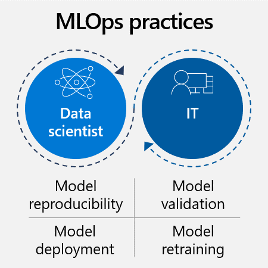
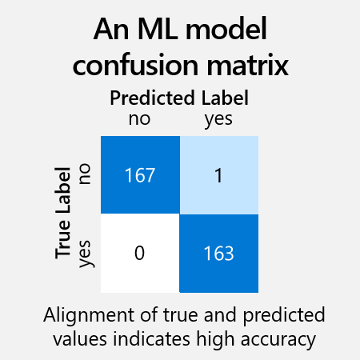

In this unit, we discuss the importance of machine learning operations (MLOps). MLOps applies the methodology of DevOps (development and operations) to manage the machine learning lifecycle more efficiently. It enables a more agile, productive collaboration in AI teams among all stakeholders. These collaborations involve data scientists, AI engineers, app developers, and other IT teams.

There are many available products to help teams implement MLOps. Microsoft offers Azure Machine Learning, Azure DevOps, and GitHub.

MLOps processes and tools help those teams collaborate and provide visibility through shared, auditable documentation. MLOps technologies provide the ability to save and track changes to all resources, like data, code, models, and other tools. These technologies can also create efficiencies and accelerate the lifecycle with automation, repeatable workflows, and reusable assets. All these practices make AI projects more agile and efficient.

## Model reproducibility

During initial iterative training and later model retraining, there are a few things that can make the complex process more manageable. One of them is to keep models reproducible, which means they can easily be run on the same dataset by any team member with same or similar results. Reproducibility is achieved by documenting processes and sharing resources.

First, it's helpful to centrally **manage assets** like environments, code, datasets, and models so teams can share and reuse them.

:::row:::
:::column span="2":::
* **Model registry**: As teams experiment with different versions of a model, a model registry provides a central place to save each version. With a registry, teams can easily revert to a previous version if something isn't working, even after the solution has gone into production. The model registry also serves as an audit trail for each model's history.
* **Code management**: Technical decision-makers need to determine which technologies and processes their teams will use for code management. This generally includes code repositories like GitHub where code can be saved, versioned, shared, and reused. It also includes tools for using and versioning code.
* **Dataset management**: We also recommend saving training datasets centrally. This way, teams can reuse them, share them with colleagues, or monitor how they change over time to manage drift.
:::column-end:::
:::column span="2":::
> [!div class="mx-imgBorder"]
> 
:::column-end:::
:::row-end:::
* **Shared environments**: Create model environments that can be shared among individuals. This simplifies the handoff between steps in the model creation process and makes it possible for teams to collaborate on certain steps.

Second, we recommend automating tasks with **machine learning pipelines**. A pipeline is a workflow of complete computing tasks that can be run independently. In machine learning, a pipeline can automate data preparation, training configuration, training processes, or model validation. Pipelines save costs and time for data scientists each time they need to iterate some part of the machine learning lifecycle.

## Model validation

Before a model is deployed, it's critical to validate its performance metrics. You may have several metrics that are used to indicate the "best" model. It's important to work with data scientists to understand what metrics are important and evaluate them before deployment. There are **tools to evaluate model metrics**, such as a loss function or a confusion matrix.
:::row:::
:::column span="2":::
Metrics usually compare what the model has predicted with what it should have predicted (the true value or ground truth). Overall, the focus is to maximize true positives and true negatives, that is, the model succeeding in predicting true values. It's equally important to avoid false positives and false negatives, that is, wrong predictions and missed predictions.

It's critical to validate performance metrics against the business use case. For example, perhaps you designed a model to predict patient health. As a healthcare provider dealing with life and death situations, you likely prefer to have false positive diagnoses rather than an incredibly high rate of accuracy that misses diagnoses.

If the model is a newer version of an existing model, you need to see if it performs better than the previous one on key metrics.

:::column-end:::
:::column span="2":::

> [!div class="mx-imgBorder"]
> 

:::column-end:::
:::row-end:::

## Model deployment

There are several options for deploying the model into production. Data scientists and AI engineers must work together to find out the best option for each case.
* **Cloud**: One option is deploying models using the cloud, often leveraging an application programming interface (API). There are scalable tools to automate and simplify this process, like Kubernetes or Azure Container Instances.
* **On-premises**: Models can also be deployed directly onsite, in the organization's own servers.
* **Edge**: It's also possible to deploy models on edge devices, like cameras, drones, and machinery. This option may be helpful in IoT scenarios.

No matter where you deploy the model, the workflow is similar. First, you register the model in the model registry. Then, you prepare to deploy the model by specifying assets, usage, and the compute target. Finally, you deploy it to your desired location, test it, and continue to monitor model-specific metrics throughout the lifecycle.

## Model retraining

Although this is the end of the development process, this is just the beginning of the maintenance cycle. Models need to be monitored and periodically retrained to correct performance issues and take advantage of newer training data. To set yourself up for success, you want to create a retraining loop—or a systematic and iterative process to continually refine and ensure the accuracy of the model.

This process may seem overly complicated. Keep in mind that it can be greatly simplified by using prebuilt models. MLOps tools like Azure Machine Learning don't necessarily need to be populated with custom models, they also accept prebuilt models. In this sense, Azure Cognitive Services is a great alternative, as it offers faster results with less data science expertise required.

In the next unit, let's discuss the opportunities of Azure Cognitive Services.
