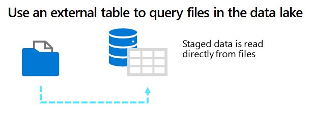
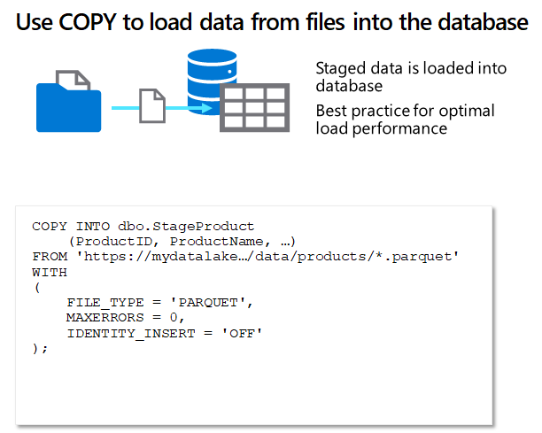

One of the most common patterns for loading a data warehouse is to transfer data from source systems to files in a data lake, ingest the file data into staging tables, and then use SQL statements to load the data from the staging tables into the dimension and fact tables. Usually data loading is performed as a periodic batch process in which inserts and updates to the data warehouse are coordinated to occur at a regular interval (for example, daily, weekly, or monthly).

Many organized warehouses will have standard structures for staging the database and may even use a specific schema for staging the data. The following code example creates a staging table for product data that will ultimately be loaded into a dimension table:

> [!NOTE]
> A common practice in data warehousing is to create seperate schemas for staging tables with a meaningful name, such as **stage** so architects and users understand the purpose of the schema.
### External tables

In some cases, if the data to be loaded is stored in files with an appropriate structure, it can be more effective to create external tables that reference the file location. This way, the data can be read directly from the source files instead of being loaded into the relational store. The following example, shows how to create an external table that references files in the data lake associated with the Synapse workspace:



```sql

CREATE EXTERNAL TABLE dbo.ExternalStageProduct
 (
     ProductID NVARCHAR(10) NOT NULL,
     ProductName NVARCHAR(10) NOT NULL,
 ...
 )
WITH
 (
    DATE_SOURCE = StagedFiles,
    LOCATION = 'folder_name/*.parquet',
    FILE_FORMAT = ParquetFormat
 );
GO

```

### COPY command

If you use external tables for staging, there's no need to load the data into them because they already reference the data files in the data lake. However, if you use "regular" relational tables, you can use the COPY statement to load data from the data lake, as shown in the following example:

> [!NOTE]
> This is generally the recommended approach to load staging tables due to its high performance throughput.



```sql

COPY INTO dbo.StageProduct
    (ProductID, ProductName, ...)
FROM 'https://mydatalake.../data/products*.parquet'
WITH
(
    FILE_TYPE = 'PARQUET',
    MAXERRORS = 0,
    IDENTITY_INSERT = 'OFF'
);


```

> [!TIP]
> For more information about using external tables, see [Use external tables with Synapse SQL](/azure/synapse-analytics/sql/develop-tables-external-tables) in the Azure Synapse Analytics documentation.