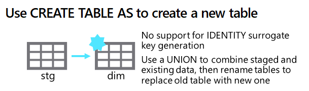
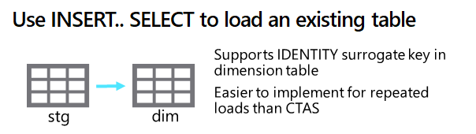

After staging dimension data, you can load it into dimension tables using SQL.

### Using a CREATE TABLE AS (CTAS) statement

One of the simplest ways to load data into a new dimension table is to use a `CREATE TABLE AS` (*CTAS*) expression. This statement creates a new table based on the results of a SELECT statement.

Another way to load a combination of new and updated data into a dimension table is to use a CREATE TABLE AS (CTAS) statement to create a new table that contains the existing rows from the dimension table and the new and updated records from the staging table. After creating the new table, you can delete or rename the current dimension table, and rename the new table to replace it.

> [!NOTE]
> While this technique is effective in merging tables together and performing upserts this example does not generate a surrogate key leaving a gap which makes it less effective for loading dimension tables in a relational data warehouse.



```sql

CREATE TABLE dbo.DimProduct
WITH
(
    DISTRIBUTION = REPLICATE,
    CLUSTERED COLUMNSTORE INDEX
)
AS
SELECT ROW_NUMBER() OVER(ORDER BY ProdID) AS ProdKey,
    ProdID as ProdAltKey,
    ProductName,
    ProductCategory,
    Color,
    Size,
    ListPrice,
    Discontinued
FROM dbo.StageProduct;

```

> [!NOTE]
> You can't use `IDENTITY` to generate a unique integer value for the surrogate key when using a CTAS statement, so  this example uses the `ROW_NUMBER` function to generate an incrementing row number for each row in the results ordered by the **ProductID** business key in the staged data.

> [!TIP]
> For more information, see [CREATE TABLE AS SELECT (CTAS)](/azure/synapse-analytics/sql-data-warehouse/sql-data-warehouse-develop-ctas) in the Azure Synapse Analytics documentation.

Another example of a CTAS that you might see in a normal data warehouse environment. The following code creates a new **DimProduct** table based on the results of a query that retrieves data from the **StageProduct** table:

```sql

CREATE TABLE dbo.DimProductUpsert
WITH
(
    DISTRIBUTION = REPLICATE,
    CLUSTERED COLUMNSTORE INDEX
)
AS
-- New or updated rows
SELECT  stg.ProductID AS ProductBusinessKey,
        stg.ProductName,
        stg.ProductCategory,
        stg.Color,
        stg.Size,
        stg.ListPrice,
        stg.Discontinued
FROM    dbo.StageProduct AS stg
UNION ALL  
-- Existing rows
SELECT  dim.ProductBusinessKey,
        dim.ProductName,
        dim.ProductCategory,
        dim.Color,
        dim.Size,
        dim.ListPrice,
        dim.Discontinued
FROM    dbo.DimProduct AS dim
WHERE NOT EXISTS
(   SELECT  *
    FROM dbo.StageProduct AS stg
    WHERE stg.ProductId = dim.ProductBusinessKey
);

RENAME OBJECT dbo.DimProduct TO DimProductArchive;
RENAME OBJECT dbo.DimProductUpsert TO DimProduct;
```
### Using an INSERT statement

When you need to load staged data into an existing dimension table, you can use an `INSERT` statement. This approach works if the staged data contains only records for new dimension entities (not updates to existing entities). This approach is much less complicated than the technique in the last section which required a `UNION ALL` and then renaming table objects.



```sql

INSERT INTO dbo.DimCustomer
SELECT CustomerNo AS CustAltKey,
    CustomerName,
    EmailAddress,
    Phone,
    StreetAddress,
    City,
    PostalCode,
    CountryRegion
FROM dbo.StageCustomers

```

> [!NOTE]
> Assuming the **DimCustomer** dimension table is defined with an `IDENTITY` **CustomerKey** column for the surrogate key (as described in the previous unit), the key will be generated automatically and the remaining columns will be populated using the values retrieved from the staging table by the `SELECT` query.

