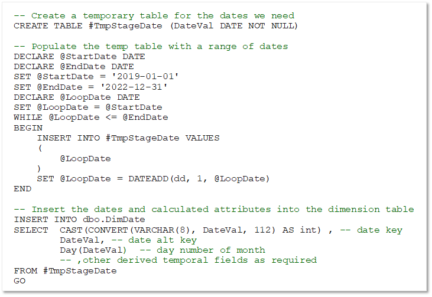

Time dimension tables are a special type of table and store a record for each time interval based on the grain of the table. For example, a time dimension table at the *date* grain contains a record for each date between the earliest and latest dates referenced by the data in related fact tables.

As the data warehouse is populated in the future with new fact data, you periodically need to extend the range of dates in the **DimDate** table.

>[!TIP] Scripting this in SQL may be time-consuming in a dedicated SQL pool – it may be more efficient to prepare the data in Microsoft Excel or an external script and import it using the COPY statement
