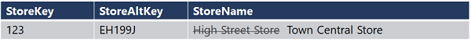
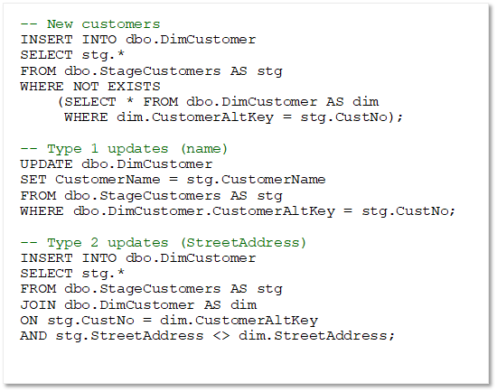
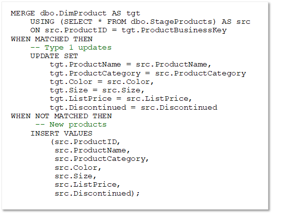

In many data warehouses, you need to handle updates to dimension data and support what are commonly referred to as *slowly changing dimensions* (SCDs).

There are multiple kinds of slowly changing dimension, of which three are commonly implemented:
|Type 0|
| -- |
|Dimension data can't be changed. Any attempted changes fail.|
||  

|Type 1|
| -- |
|A change made to an existing dimension row applies to all previously loaded facts related to the dimension|
|

|Type 2|
| -- |
|A change to a dimension results in a new dimension row. Existing rows for previous versions of the dimension are retained for historical fact analysis and the new row is applied to future fact table entries.|
||

### Combining INSERT and UPDATE statements
Logic to implement Type 1 and Type 2 updates can be complex, and there are various techniques you can use. For example, you could use a combination of `UPDATE` and `INSERT` statements.

> [!NOTE]
> In the previous example, it is assumed that an incrementing surrogate key based on an `IDENTITY` column identifies each row, and that the highest value surrogate key for a given alternate key indicates the most recent or "current" instance of the dimension entity associated with that alternate key. In practice, many data warehouse designers include a Boolean column to indicate the current active instance of a changing dimension or use DateTime fields to indicate the active time periods for each version of the dimension instance. With these approaches, the logic for a type 2 change must include an `INSERT` of the new dimension row *and* an `UPDATE` to mark the current row as inactive.

### Using a MERGE statement

As an alternative to using multiple `INSERT` and `UPDATE` statements, you can use a single `MERGE` statement to perform an "*upsert*" operation to insert new records and update existing ones.

> [!NOTE]
> MERGE is now Generally Available in Synapse Dedicated SQL Pool with version '10.0.17829.0' or higher. Connect to your dedicated SQL pool (formerly SQL DW) and run SELECT @@VERSION. A pause and resume may be required to ensure your instance gets the latest version. See the [MERGE documentation for Azure Synapse Analytics](/sql/t-sql/statements/merge-transact-sql?view=azure-sqldw-latest&preserve-view=true) for more details.
