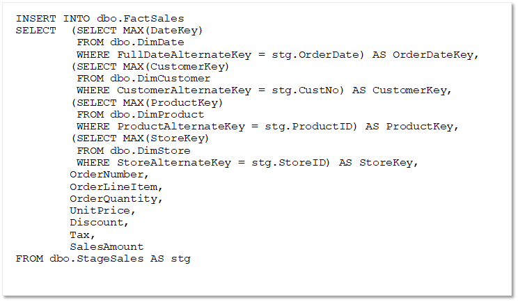

Typically, a regular data warehouse load operation loads fact tables after dimension tables. This ensures that the dimensions to which the facts will be related are already present in the data warehouse.

The staged fact data usually includes the business (alternate) keys for the related dimensions, so your logic to load the data must look up the corresponding surrogate keys. In the case of slowly changing dimensions, the appropriate version of the dimension record must be identified to ensure the correct surrogate key is used to match the event recorded in the fact table with the state of the dimension at the time the fact occurred. 

In most cases, this means retrieving the latest "current" version of the dimension; but in some cases you might need to find the right dimension record based on DateTime columns that indicate the period of validity for each version of the dimension.

The following example assumes that the dimension records have an incrementing surrogate key, and that the most recently added version of a specific dimension instance (which will have the highest key value) should be used.

> [!NOTE]
> As noted in the previous lesson, Querying Type 2 slowly changing dimension (SCD) has some caveats. As an example in the case of a changing customer address, the load process will create a new row for the customer with a new surrogate key (but the same alternate key) to reflect the new address. Optionally, the table could include a Boolean column to indicate which record for this alternate key is the currently active record, or a DateTime column to indicate the point in time from which the new record applies (otherwise you can rely on an incrementing surrogate key and use the `MAX` function to find the most recently inserted row for a given alternate key.). Keep this in mind when querying your fact table data to ensure you have included the proper indicator of the active data.