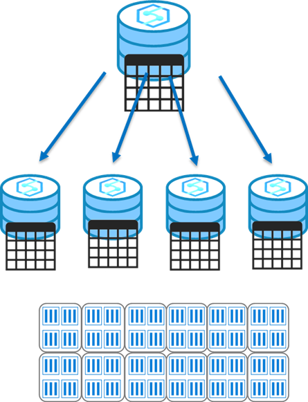

## Post-load optimization

After loading new data into the data warehouse, it's a good idea to rebuild the table columnstore indexes and update statistics on commonly queried columns.

The following example rebuilds all indexes on the **DimProduct** table.

```sql
ALTER INDEX ALL ON dbo.DimProduct REBUILD
```

The following example creates statistics on the **ProductCategory** column of the **DimProduct** table:

```sql
CREATE STATISTICS productcategory_stats
ON dbo.DimProduct (ProductCategory);
```

> [!NOTE]
> For more information, see the [Indexes on dedicated SQL pool tables in Azure Synapse Analytics](/azure/synapse-analytics/sql-data-warehouse/sql-data-warehouse-tables-index) and [Table statistics for dedicated SQL pool in Azure Synapse Analytics](/azure/synapse-analytics/sql-data-warehouse/sql-data-warehouse-tables-statistics) articles in the Azure Synapse Analytics documentation.

## Other Design Considerations
When data is loaded into Synapse Analytics dedicated SQL pools, the datasets are broken up and dispersed among the compute nodes for processing, and then written to a decoupled and scalable storage layer. This action is termed sharding.

The design decisions around how to split and disperse this data among the nodes and then to the storage is important to querying workloads, as the correct selection minimizes data movement that is a primary cause of performance issues in an Azure Synapse dedicated SQL Pool environment.

There are three main table distributions available in Synapse Analytics SQL Pools that will be described below:

> [!VIDEO https://www.microsoft.com/videoplayer/embed/RE4MerJ]
>
> Strategies for managing source data files include:

## Maintain a well-engineered data lake structure

Maintaining a well-engineered Data Lake structure allows you to know that the data you're loading regularly is consistent with the data requirements for your system. It's less important if your load is a once-off or exploratory rather than analytical. Some strategies include folder hierarchies based on the source system, and date/time or file format and focus.

In general, having well defined “zones” established for the data coming into the Data Lake and cleansing and transformation tasks that land the data you need in a curated and optimized state.

## Compress and optimize files

When loading large datasets, it’s best to use the compression capabilities of the file format. It ensures that less time is spent on the process of data transfers, using instead the power of Azure Synapse’ Massively Parallel Processing (MPP) compute capabilities for decompression

It's fairly standard to maintain curated source files in columnar compressed file formats such as RC, Gzip, Parquet, and ORC, which are all supported import formats.

## Split source files

One of the key architectural components within Azure Synapse Analytics dedicated SQL pools is the decoupled storage that is segmented into 60 parts. You should maintain alignment to multiples of this number as much as possible depending on the file sizes that you're loading, and the number of compute nodes you've provisioned. Since there are 60 storage segments and a maximum of 60 MPP compute nodes within the highest performance configuration of SQL Pools, a 1:1 file to compute node to storage segment may be viable for ultra-high workloads, reducing the load times to the minimum possible. 

A data warehouse that is built on a Massively Parallel Processing (MPP) system are built for processing and analyzing large datasets. As such they perform well with larger batch type loads and updates that can be distributed across the compute nodes and storage.

**Singleton** or smaller transaction batch loads should be grouped into larger batches to optimize the Synapse SQL Pools processing capabilities. To be clear, a one-off load to a small table with an INSERT statement may be the best approach, if it's a one-off. 

However, if you need to load thousands or millions of rows throughout the day, then singleton INSERTS aren't optimal against an MPP system. One way to solve this issue is to develop one process that writes the outputs of an INSERT statement to a file, and then another process to periodically load this file to take advantage of the parallelism that Azure Synapse Analytics. 

Selecting the correct table distribution can have an impact on the data load and query performance as follows:

## Round robin distribution
> [!div class="mx-imgBorder"]  
> 

This is the default distribution created for a table and delivers fast performance when used for loading data.

A round-robin distributed table distributes data evenly across the table but without any further optimization. A distribution is first chosen at random and then buffers of rows are assigned to distributions sequentially.

It's quick to load data into a round-robin table, but query performance can often be better with hash distributed tables for larger datasets.

Joins on round-robin tables may negatively affect query workloads, as data that is gathered for processing then has to be reshuffled to other compute nodes, which take additional time and processing.

## Hash distribution
> [!div class="mx-imgBorder"]  
> 

This distribution can deliver the highest query performance for joins and aggregations on large tables.

To shard data, a hash function is used to deterministically assign each row to a distribution. In the table definition, one of the columns is designated as the distribution column.

There are performance considerations for the selection of a distribution column, such as distinctness, data skew, and the types of queries that run on the system.

### Performance considerations

When choosing a hash column it's best to choose a column that will evenly distribute the data across all distributions that will allow for approximately the same number of rows within each distribution.
- Choose a column with a high number of unique values, for instance if your organization may operate in all 50 states within the United States, ensure that you have a good distribution of each StateID to prevent skew which impacts the time each query results is returned and impacts performance.
- Choose a column without Null values or very few null values, this can also result in an imbalance of data on a single distribution.
- Don't choose a date column as all data for a specific date will land in the same place and if it's a daily report that line of business users filter using the same date, only 1 of the 60 distributions will bear the bulk of the workload.


## Replicated tables
> [!div class="mx-imgBorder"]  
> 

A replicated table provides the fastest query performance for small tables which with compression should be less than 2GB as a starting point, static data can be larger.

A table that is replicated caches a full copy of the table on **each compute node**. Consequently, replicating a table removes the need to transfer data among compute nodes before a join or aggregation. As such extra storage is required and there is additional overhead that is incurred when writing data, which make large tables impractical.

Data modifications will cause the cached copy to be invalidated, and require the table be recached. You should use **sys.pdw_replicated_table_cache_state** in a query like the one below to determine which replicated tables have been modified but not rebuilt.

```sql

SELECT [ReplicatedTable] = t.[name]
  FROM sys.tables t  
  JOIN sys.pdw_replicated_table_cache_state c  
    ON c.object_id = t.object_id
  JOIN sys.pdw_table_distribution_properties p
    ON p.object_id = t.object_id
  WHERE c.[state] = 'NotReady'
    AND p.[distribution_policy_desc] = 'REPLICATE'

```
The next step would be to force a rebuild using the results from the code above, such as:

```sql

SELECT TOP 1 * FROM [ReplicatedTable]

```

### Additional replicated table performance considerations

Some additional items to consider when looking at creating a replicated table include the following situations which will negatively impact performance:

1) The table has frequent insert, update, and delete operations. The data manipulation language (DML) operations require a rebuild of the replicated table. Rebuilding frequently can cause slower performance.
2) The SQL pool is scaled frequently. Scaling a SQL pool changes the number of Compute nodes, which incurs rebuilding the replicated table.
3) The table has a large number of columns, but data operations typically access only a small number of columns. In this scenario, instead of replicating the entire table, it might be more effective to distribute the table, and then create an index on the frequently accessed columns. When a query requires data movement, SQL pool only moves data for the requested columns.

