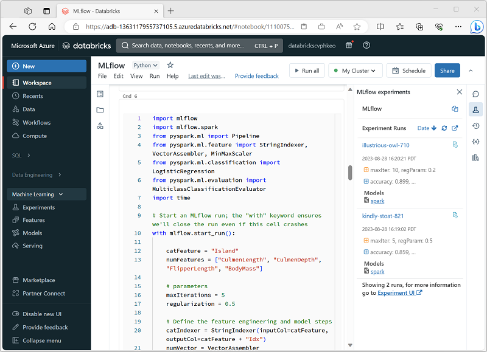

Azure Databricks provides a comprehensive, cloud-based environment for machine learning model development. Machine Learning is a discipline that involves collaboration between *data scientists*, who analyze and model the data, and *machine learning engineers* who deploy and manage models. Azure Databricks enables data scientists to perform data ingestion, exploration, and preparation tasks as well as model training, evaluation, and management tasks.

## Machine learning Databricks runtimes

When you create a cluster in an Azure Databricks workspace, you can specify the Databricks runtime to install in the cluster. Azure Databricks includes some databricks runtimes that are optimized for machine learning. They include support for libraries that are commonly used in machine learning workloads, including machine learning frameworks and utilities for managing machine learning operations.

If you are going to be implementing machine learning solutions, create a cluster with one of the **ML** runtimes. You can choose a CPU-based runtime for classical machine learning scenarios, or a GPU-based runtime if you need to build complex neural networks with deep learning frameworks, which can take advantage of a GPUs ability to efficiently process matrix and vector based data.

## Machine learning frameworks in Azure Databricks

Azure Databricks is built on Apache Spark, a highly scalable platform for distributed data processing. On Spark, data scientists and machine learning engineers usually work in interactive notebooks in which code to prepare data and use it to train machine learning models is written in PySpark (a variant of Python that is optimized for Spark). Within the Python ecosystem there are many commonly used machine learning frameworks, including:

- **Scikit-Learn**: A popular framework for machine learning that provides a wide range of algorithms and other libraries to help you train and evaluate predictive models.
- **Spark MLlib**: A machine learning library built specifically for Spark. MLlib provides two ways to train and evaluate machine learning models:
    - Classes based on the Spark resilient distributed dataset (RDD) structure.
    - Classes based on the Spark dataframe structure. This framework (commonly referred to as Spark ML) is the preferred one for using MLlib.
- **PyTorch**: A *deep learning* framework used to build *neural network* models for complex forecasting, computer vision, and natural language processing workloads.
- **TensorFlow**: Another commonly used deep learning framework.

You can use any of these frameworks (and more) in Azure Databricks to train and evaluate machine learning models.
