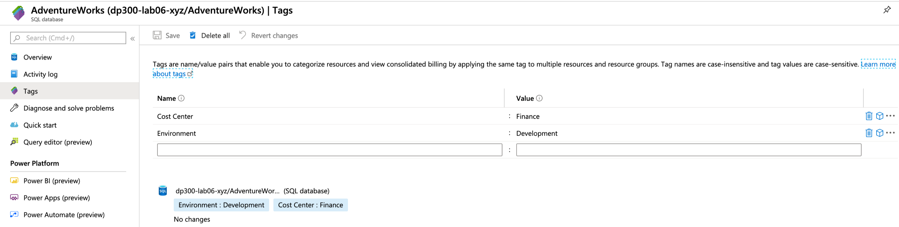

Organizations use multiple subscriptions for several reasons, including budget management, security, or isolation of resources. One example of this would be an organization that has both internal and customer facing resources. The internal resources could exist in one subscription, and the customer resources in another, for easier separation of billing and for isolation of the internal resources. These subscriptions may be managed together in a management group, which allows you to manage policy and compliance across subscriptions.

Tags are simply metadata that are used to better describe your Azure resources. These tags are stored as `key:value` pairs and appear in the Azure portal associated with your Azure resources. Since they are associated with the resource, when you use PowerShell or Azure CLI commands, you can filter your commands based on tags. In that sense, you can think of them like a WHERE clause in a SQL query. A basic example is shown below:

```powershell
$rg=(get-AzResourceGroup)

$rg=($rg|where-object {($_.tags['Use'] -ne 'Internal')}).ResourceGroupName
```

In this code sample on the second line, you can see that the list of resource groups is being filtered by the tag called 'Use', and will return only those resource groups where that tag does not have a value of 'Internal'. Tags can be applied in the Azure portal, or programmatically via PowerShell, Azure CLI, or as part of Azure Resource Manager template deployment. Tags can also be applied at the subscription, resource group, or individual resource level. Tags can also be modified at any time. Azure supports applying up to 15 tags to each Azure resource.

Tags are also included in Azure billing information, so tagging by cost center means it can be much easier for management to break down the Azure charges. Tags are in the overview section of the blade for every Azure Resource. To add tags to a resource using the Azure portal, click tags, and enter the key and value for your tag. Click save after you apply the tags to your resources.

[](../media/module-66-automation-final-17.png#lightbox)

You can also use PowerShell or the CLI to add tags. The PowerShell example is below:

```powershell
$tags = @{"Dept"="Finance"; "Status"="Normal"}

$resource = Get-AzResource -Name demoStorage -ResourceGroup demoGroup

New-AzTag -ResourceId $resource.id -Tag $tags
```

The Azure CLI example is below:

```powershell
az resource tag --tags 'Dept=IT' 'Environment=Test' -g examplegroup -n examplevnet `

 --resource-type "Microsoft.Network/virtualNetworks"
```
