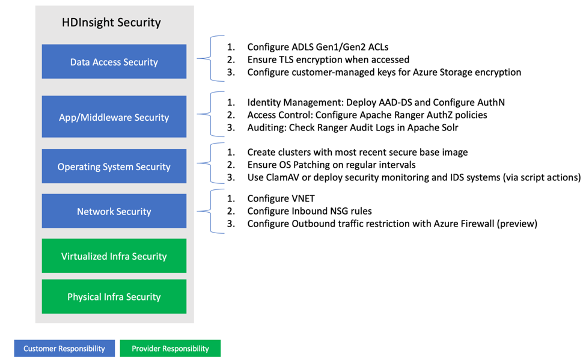

As a data architect responsible for enterprise security of an HDInsight cluster, you need to be aware of the various threat vectors and how each of these requirements is met. 

## Enterprise security and the shared responsibility model 

Security is a foundational property of Azure, which provides for multi-layers of security provided across physical datacenters, infrastructure, and operations with many thousands of cyber security experts actively monitoring to protect the data and assets of customers.  To learn more, explore [Azure Compliance certifications](https://azure.microsoft.com/overview/trusted-cloud/compliance/).
Security for an Azure HDInsight cluster is a shared responsibility between Microsoft and the customer. The responsibilities by area are tabulated below. 

| Customer | Azure (HDInsight Service Provider) |
|---|---|
| Data access security | Physical Infrastructure | 
| Application / Middleware security | Virtualized Infrastructure | 
| Operating system security |  | 	
| Network Security |  |  

In HDInsight, as with most Azure services, Microsoft is responsible for providing the Physical and Virtualized Infra security. 

Physical infrastructure security refers to security of the Azure’s globally distributed datacenter infrastructure, which confirms with key industry standards such as ISO/IEC 27001:2013 and NIST SP 800-53. A layered approach is adopted to minimize risk of unauthorized physical access to data center resources. Some of these layers are
- Access request and approval before arrival.
- Monitoring activities within the facility’s perimeter.
- Two factor authentication including biometrics to authenticate user identity. 
- Restricted need based minimum access within datacenters.
If you are interested to learn more about how Microsoft Data centers operate and physically secure customer assets, read through the [data center physical security section](/azure/security/fundamentals/physical-security).

Virtualized infrastructure security consists of availability SLAs, network architecture, operations, monitoring, integrity, and data protection. Go to [Azure Infrastructure Security documentation](/azure/security/fundamentals/infrastructure) to get a comprehensive understanding of how Azure works to protect virtual infrastructure assets.  

In subsequent sections, we will discuss design methodologies and recommend practices around security areas for which the customer is responsible. 

