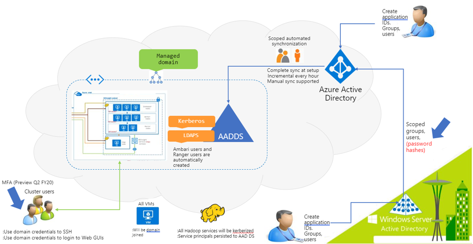
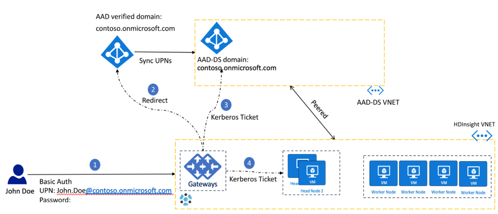
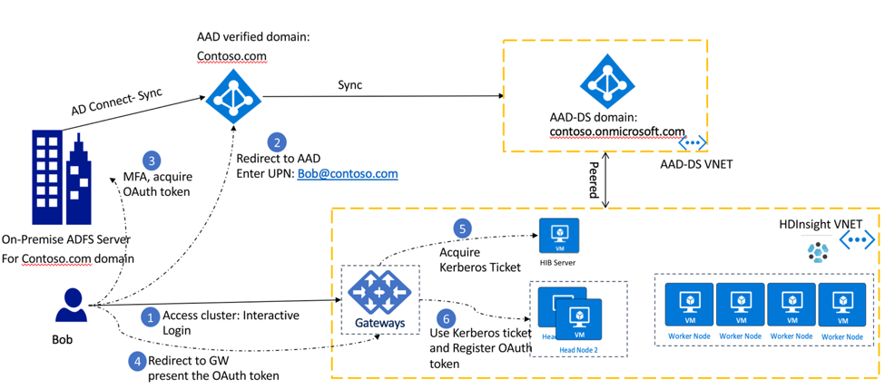
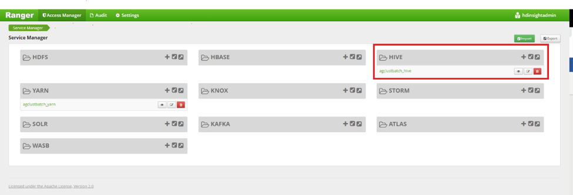
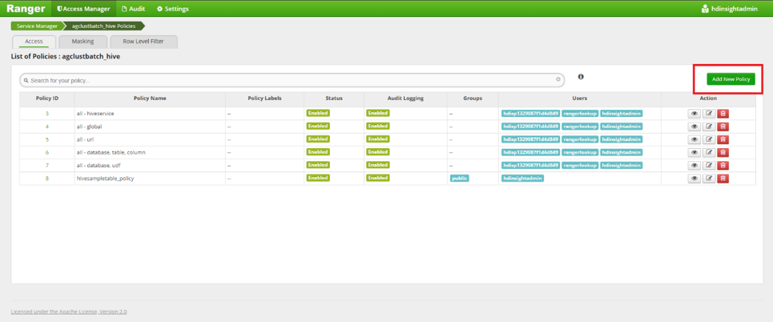
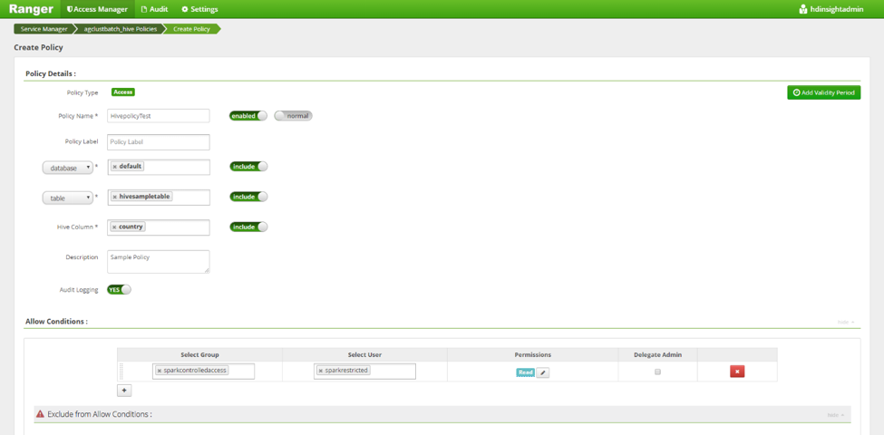
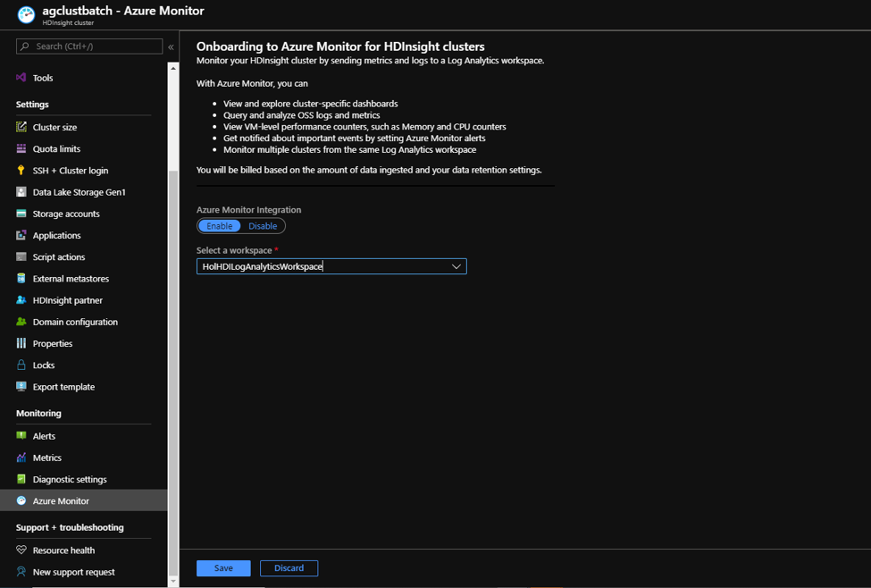
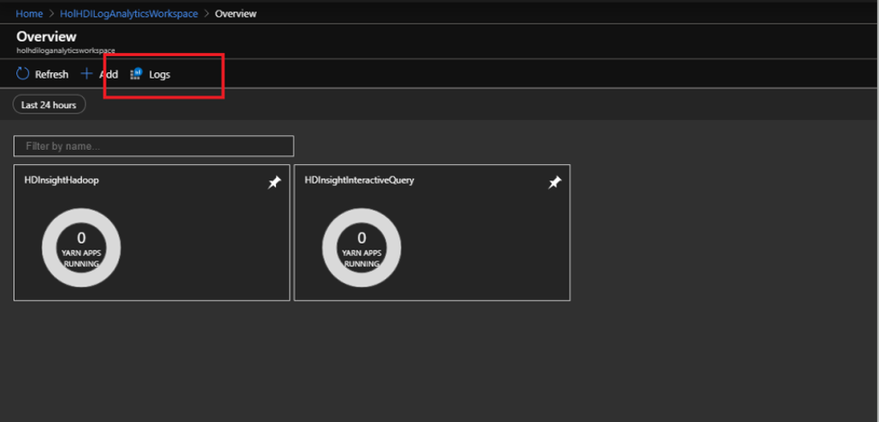
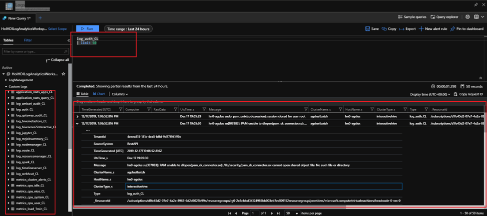

Large organizations have multiple users from various business groups who need to: 
- Log into the cluster in a secure manner
- Enforce the principle of least privilege (PLOP) when it comes to accessing the underlying data 
- Log the events that have security significance. 

The purpose of application security in HDInsight is to provide ways to securely authenticate multiple users into HDInsight, enforcing the practice of limiting access rights for users on data to the bare minimum permissions they need to perform their work and finally logging events that have security significance, such as a login, an attempt to perform a privileged action, a modification of an important record.

## Authentication 
Authentication is the process establishing one’s identity leading to validating that users are who they claim to be. HDInsight clusters in production scenarios typically need to enable a wide range of users from different business groups to authenticate into the cluster to run activities like configure, submit, run, and monitor workloads. Enabling the “Enterprise Security Package” (ESP) feature during HDInsight cluster creation enables clusters to be domain joined and for domain users to use their domain credentials to authenticate into the cluster. Active Directory groups can be used to create groups of individual users representing a function or department within an organization and multiple of these groups can be synchronized to the cluster at creation time. Clusters must have a domain cluster administrator and single or multiple of groups of users with restricted access. 
Below is a representation of the components and parties involved in the HDInsight authentication process. 

The below components in the Enterprise Identity domain participate in the set-up and authentication process for an ESP cluster.
- Windows Server Active directory: Domain controller on premises and stores the User Principal Name (a.k.a UPN) ( for example: `user@Contoso.com`) and their respective domain passwords. 
- [Active directory Connect](/azure/active-directory/hybrid/whatis-azure-ad-connect)(AD Connect): Microsoft tool designed to accomplish hybrid identity setup. Functionalities like password hash synch are critical in setting up ESP on HDInsight. 
- [Azure Activity directory](/azure/active-directory/fundamentals/active-directory-whatis) (Microsoft Entra ID): Microsoft Azure based identity and access management service.
- [Microsoft Entra Domain Services](/azure/active-directory-domain-services/overview) (Microsoft Entra Domain Services): Provides managed domain services such as domain join, group policy, lightweight directory access protocol (LDAP), and Kerberos/NTLM authentication that is fully compatible with Windows Server Active Directory. You use these domain services without the need to deploy, manage, and patch domain controllers in the cloud. Microsoft Entra Domain Services integrates with your existing Microsoft Entra tenant, which makes it possible for users to sign in using their existing credentials. You can also use existing groups and user accounts to secure access to resources, which provides a smoother lift-and-shift of on-premises resources to Azure.

HDInsight supports two kinds of authentication scenarios 
- When password hashes are synchronized onto Microsoft Entra ID.
- When password hashes are retained on-premises domain controllers.
Note that the user can choose to create the HDInsight cluster with Windows Azure Storage Blob (WASB) or ADLS Gen2 storage and the authentication process differs slightly in each one of them. 
While all the steps in the authentication process accomplished automatically and are abstracted away from the user, it helps to understand, at a high level the sequence of events that go into authenticating a user. 

## Authentication: when password hashes are synchronized to Microsoft Entra ID

1. User John Doe authenticates onto an HDInsight service (for example Ambari, ssh, Zeppelin, etc.) with his domain credentials `user@contoso.onmicrosoft.com` (known as a user principal name or UPN) and password. The gateway holds the username and password. 
1. The HDInsight Gateway sends the UPN and password provided by user to the Microsoft Entra ID using resource owner password credentials (ROPC) flow and requests an OAuth access request.  Microsoft Entra ID confirms the identity of the user and issues a refresh token that is saved to the credential service, which runs on the head node. In clusters with ADLS Gen 2 storage accounts, the storage drivers communicate with the credential service to retrieve the OAuth token for the purpose of passthrough authentication to ADLS. 
1. The gateway then authenticates the user with Microsoft Entra Domain Services and gets a Kerberos Ticket. The gateway then passes the Kerberos ticket to the head nodes and authenticates the user into the cluster.

## MFA Authentication: when password hashes are not synchronized to Microsoft Entra ID

> [!NOTE]
> This setup is also called HDInsight Identity Broker (HIB) and supports multi factor authentication (MFA). In this set up, if password hashes are not synched to Microsoft Entra ID, the user can still authenticate to the gateway.  

1. User John Doe launches a web-based HDInsight service such as Ambari, or Zeppelin. The page redirects the user to an interactive login screen. 
	The client is redirected to the Microsoft Entra ID for the user to authenticate using their UPN `user@contoso.onmicrosoft.com`.
3.	On entering the UPN, the client is redirected to the on-premise ADFS server where the user enters his password. MFA authentication, if enabled, is now executed. After successful authentication, an OAuth token is issued to the client.
4.	The client presents the OAuth token to the HDInsight gateway.
5.	The HDInsight gateway uses the OAuth token to acquire a Kerberos ticket from the HIB node.
6.	Gateway uses the Kerberos ticket and registers the OAuth token on the head nodes credential service and authenticates into the cluster. 

> [!NOTE]
> If the password hashes are not synced to the Microsoft Entra ID then the domain users cannot ssh to the head nodes. Only the local ssh user will be able to do ssh activities.
Guidance on setting up authentication mechanisms for both scenarios is explained in [Use ID Broker for credential management](/azure/hdinsight/domain-joined/identity-broker). 

## Authorization 

Authorization in HDInsight deals with determination and enforcement of user privileges on the underlying datasets.  Fine grained authorization on specific actions and/or operations is available on the HDInsight services of Hive, HBase, and Kafka and is managed through Apache Ranger. Ranger provides role-based access control, attribute-based access control and centralizes auditing of user access and administrative actions. 
You typically authenticate into Apache Ranger with the cluster administrator’s domain credentials and then set up policies for restricted groups or users on Ranger. 
In the below example we show ways in which you can create a ranger policy to set permissions on a sample Hive Table in Ranger.  
1. Launch Apache Ranger using the URL: `https://CLUSTERNAME.azurehdinsight.net/Ranger/`. Replace "CLUSTERNAME" with the name of your cluster. Use the cluster domain administrator and corresponding password to login. 

	

1. Click Add new policy to add a new ranger policy.

	

1. Populate the details of the policy with the following information:
	1. Policy Name: Name of the policy. 
	1. Database: Choose the Hive database. 
	1. Table: Choose the Hive table in the selected database.
	1. Hive Column: Choose the Hive column on which the policy would be applied.
	1. Set audit logging to Yes to enable logging all access. 
	1. Allow Conditions: 
		- Policies can be applied to active directory (AD) domain users or domain groups In the Allow Conditions section. If you would like to apply policy to all users in an AD group add that AD group to the Select Group section. 
		- Alternatively, if you would like the policy to apply to individual or a chosen set of users from say different AD groups, you could add all of the individual domain IDs of the users in the Select User field.
		- Choose from a set of permissions in the Permissions checkbox bar. 
    
1. Scroll down and click on Add. 

	

1. Post setting up this up, this rule will be enforced for all users who were included in the policy. 

Settings up ranger policies for [HBase](/azure/hdinsight/domain-joined/apache-domain-joined-run-hbase) and [Kafka](/azure/hdinsight/domain-joined/apache-domain-joined-run-kafka) are described in the respective hyperlinks in the section.

## Auditing

Auditing in HDInsight from a security perspective deals with the recording and monitoring authentication and authorization requests that happen during the operational lifetime of the cluster and even after the cluster is deleted.  

Auditing in HDInsight is enabled using Azure Monitor logs and can be used to surface logs which are critical to cluster security. A few log tables that contain information critical to cluster security are listed below. 

| Log table name | Purpose |
|-|-|
| ranger_audit_logs_CL | Audit logs from Apache Ranger on ESP clusters |
| log_gateway_audit_CL | Audit logs from gateway to show successful and failed attempts |
| log_ambari_audit_CL |	Audit logs from Ambari |
| log_auth_CL |	SSH logs for successful and failed attempts |

Azure Monitoring is enabled from the Azure portal using a few clicks.
 
1. On the HDInsight cluster click on Azure Monitor in the left blade.  Select Azure Monitor Integration to True and in Select a workspace, choose a pre-created Log Analytics workspace from the dropdown. 

	

1. Launch the log analytics workspace and import the relevant HDInsight monitoring solutions relevant to your cluster type. Launch the solution and click on Logs. 

	

1. Logs tables relevant to security can be found in the Custom Logs section on the left. These can then be queried to extract relevant access information.

	 
