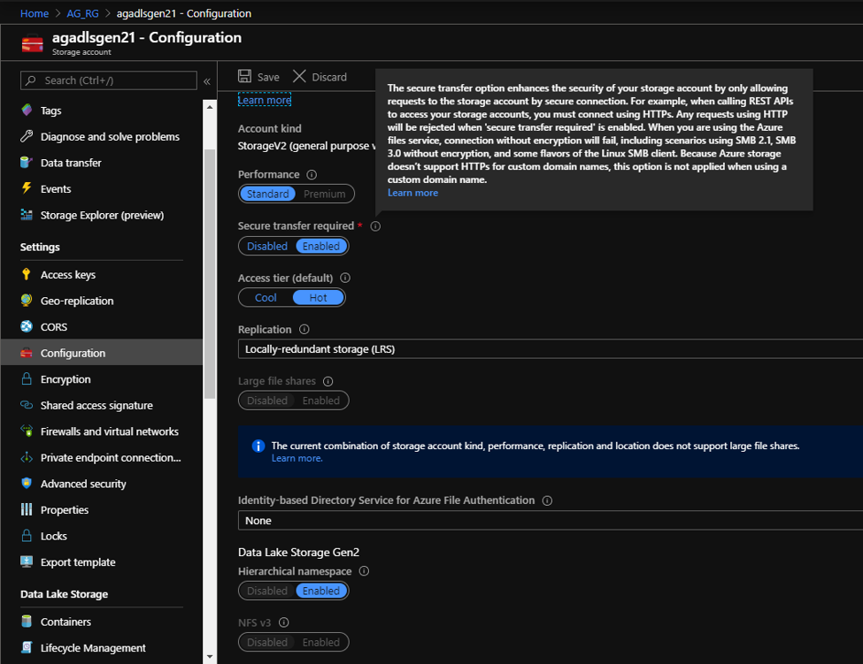
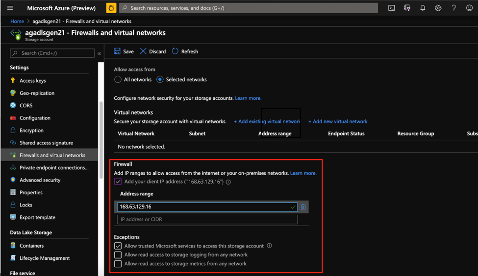
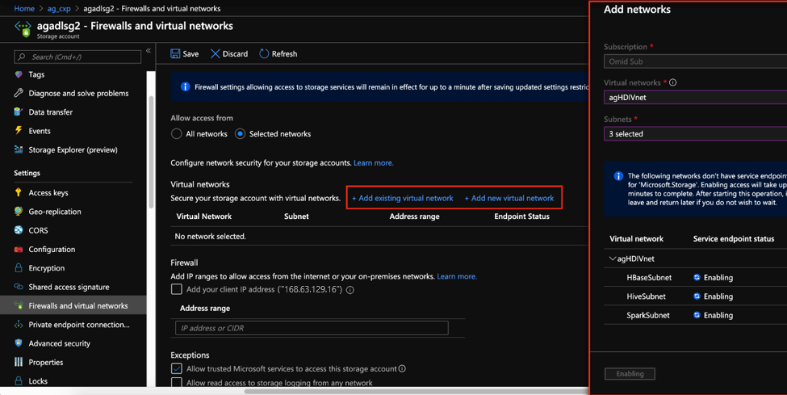
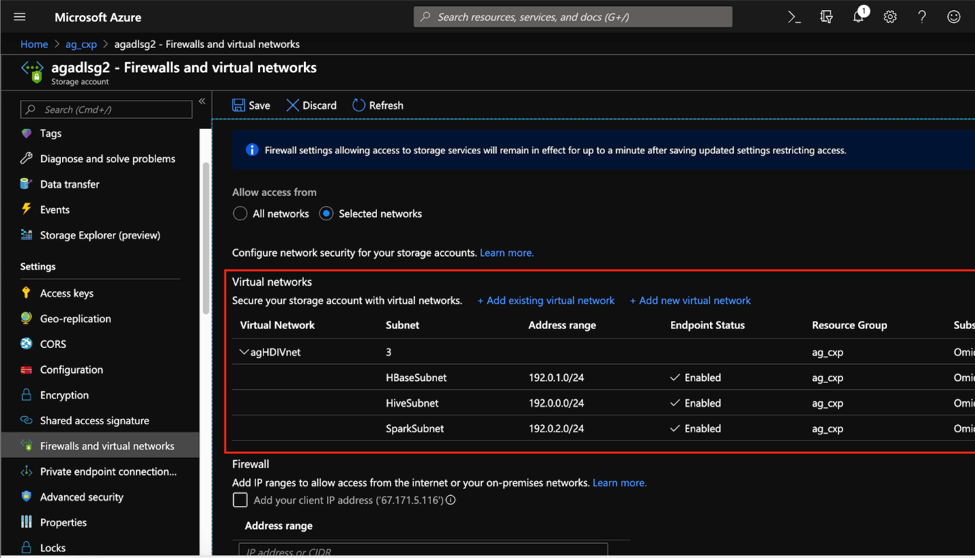
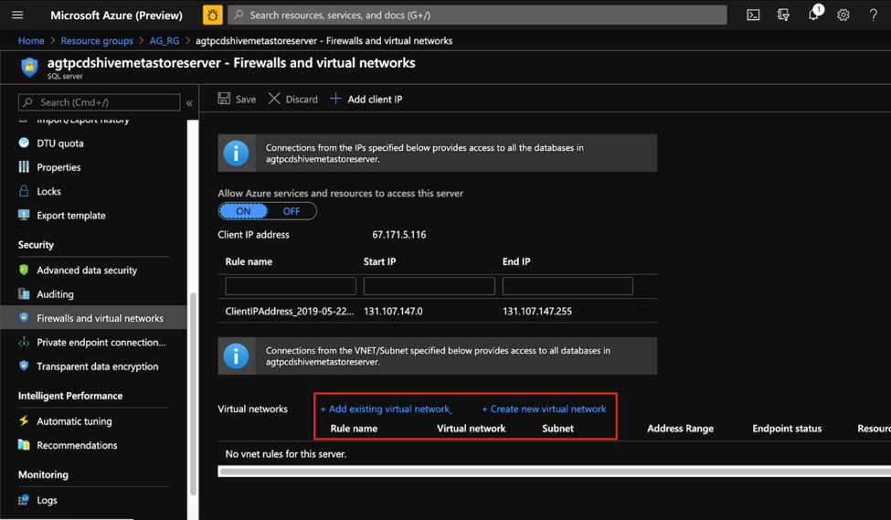
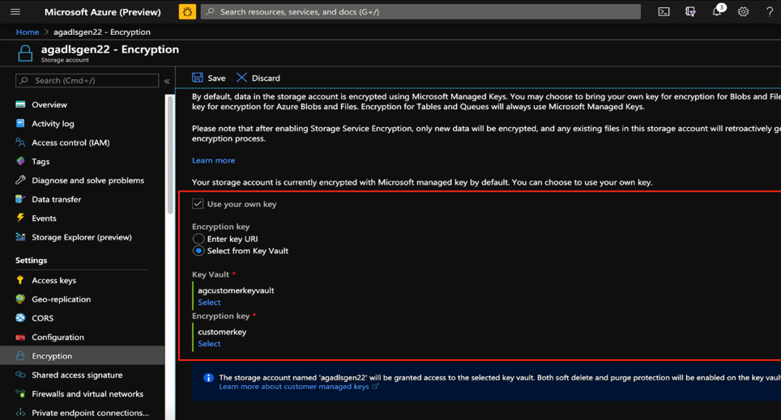

HDInsight is a PaaS service and the most implemented pattern is complete separation of compute from storage.  In such patterns data access security provides securing data at rest and securing traffic between HDInsight and the data layer. These security areas fall outside the purview of HDInsight specific security features and are accomplished by security features available in the Azure storage and networking services.
Below is the list of recommendations on how Data Access security might be achieved on HDInsight clusters. You may choose to implement some, or all these recommendations based on your use case. 

## Allow requests to storage from secure connections only 

Secure transfer allows requests originating from secure connections(https) and rejects any connections originating from http. Before creating the cluster, you should enable a secure transfer. Click the “Select Secure Transfer required” slider button to “Enabled”. Learn best practice security recommendations for ADLSG2 including [secure transfer](/azure/storage/blobs/data-lake-storage-best-practices). 

## Implement Access Control Lists (ACLs) for ADLS Gen2 

ADLS Gen2 access control model supports both Azure Role Based Access Control (RBAC) and POSIX like access control (ACL). You could choose to implement POSIX level ACL model for HDInsight to set up passthrough authentication for files and folders. Every file or directory on ADLS Gen2 has distinct permissions for these identities.
- The owning user
- The owning group
- Named users
- Named groups
- Named service principals
- Named managed identities
- All other users
POSIX level Access control for ADLS Gen2 file and folders can hence granted to HDInsight domain users and groups and these authorizations will be respected by all HDInsight services during access. Learn more about [Access Control on Azure Data lake Storage Gen2](/azure/storage/blobs/data-lake-storage-access-control).

## Azure storage firewalls

Azure storage firewall uses the networking policy of “deny-all, permit-by-exception” to ensure only the whitelisted entities can gain access to the storage account. Storage firewalls can be configured to enable account access from a fixed trusted IP address or a predetermined trusted IP range. Ensure that the storage account can be accessed by trusted Microsoft services to enable capabilities like logging. You can enable Azure Firewall on your storage account from the Firewalls and virtual networks blade as depicted below. 

## Transport Layer Security (TLS) for a storage client outside of HDInsight cluster

Enabling TLS on the storage account ensures that the data in transit to and from the storage account is encrypted. Azure storage uses TLS 1.2 on public HTTPs endpoints, but TLS 1.0 and TLS 1.1 are still supported for backward compatibility. To ensure secure and compliant connection to Azure Storage, you need to enable TLS 1.2 or newer version in client side before sending requests to operate Azure Storage service. In this case, TLS 1.2 is already enabled by default when a storage account exchanges data with HDInsight, and you do not have to do anything specific to enable it. Learn more about [secure TLS for Azure storage clients](/azure/storage/common/storage-security-tls).

## Virtual network service endpoints

HDInsight supports VNet Service endpoints for Azure Blob Storage, Azure Data Lake Storage Gen2, Cosmos DB, and SQL Database. In the context of HDInsight Security, VNet service endpoints can be set up on storage accounts, cluster metastores, and Cosmos DB to allow access from only the HDInsight subnet. Traffic moving from between these entities and HDInsight always remains on the Azure backbone. 
In the storage account, VNet Service endpoints can be enabled from the Firewalls and Virtual Networks Blade by clicking on the Add existing/new virtual network, choosing the radio button of Allow access from to Selected Network and then providing VNet information from which access is to be allowed. In this case, you would put your HDInsight VNet and Subnet/s from which you wish to access this storage account. 
In the example below, the storage account will be able to access traffic from only the three HDInsight subnets that have been explicitly specified. 

For SQL Databases, VNet service endpoints can be set up from the Firewalls and virtual networks blade.

 
Learn more about [VNet Service Endpoints in Azure](/azure/virtual-network/virtual-network-service-endpoints-overview).

## Customer-managed keys

Encryption of data at rest in a key requirement for security in big data landscapes. Azure storage encrypts all data in a storage account using Microsoft-managed keys by default. Customers can however choose to bring their own keys for leveraging additional control over their data. 
From the portal, the Encryption blade on the storage account is used to determine key settings on the storage account. Choose Use your own key and then select a Key URI or Select a Key from the Azure Key Vault. Learn more about [Customer Managed Keys for Azure storage](/azure/storage/common/storage-encryption-keys-portal). 

Similarly, for Kafka clusters, you can bring your own key when creating the cluster to encrypt all brokers data at rest.

 

