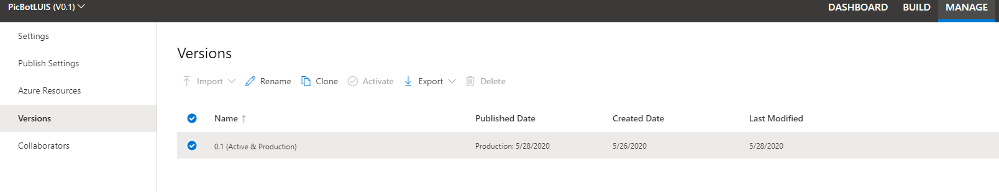
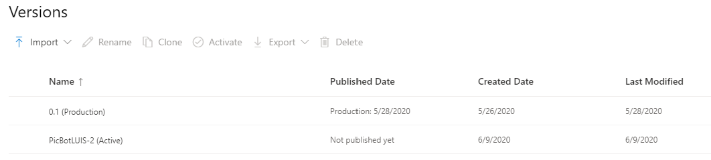

Versioning a LUIS app refers to iterations on the LUIS app you build.  Iterating a LUIS app is a part of the lifecycle. The lifecycle looks similar to the following steps.

- Create a LUIS app
- Edit the schema (intents, utterances, entities, features)
- Train the app
- Test the app
- Publish the app
- Evaluate the app

:::image type="content" source="../media/iteration.png" alt-text="LUIS iteration diagram cover lifecycle":::

## Testing and logging

The initial testing of your LUIS app can be accomplished in the LUIS portal.  The test cycle should consist of you, or your team, testing the app with various utterances and evaluating the score for the returned results.  You can then tweak your utterances and entities to improve the results.  To truly test the app, you need to publish it to a slot (staging or production) and then use the prediction endpoint.  Testing from the prediction endpoint allows LUIS to choose any utterances with low-confidence for review.

To test for improving the LUIS app, you need to be able to review the endpoint utterances.  You accomplish the review by enabling active learning.  Calling the endpoint query with the ``` log=true ``` query string parameter and value enables active learning.

1. Sign in to the LUIS portal.
1. Open your app by selecting its name on **My Apps** page.
1. Go to the **Manage** section.
1. Select **Azure resources**.
1. For the assigned prediction resource, select **Change query parameters**.

   :::image type="content" source="../media/change-query-params.png" alt-text="Change query parameters link under the prediction key resource":::

1. Ensure that the **Save logs** toggle is **On** (moved to the right).

   :::image type="content" source="../media/manage-azure-resource-save-logs.png" alt-text="Change request parameters with Save logs toggled on":::

1. Select **Done**.
1. This action changes the example URL by adding the ```log=true``` querystring parameter. Copy and use the changed example query URL when making prediction queries to the runtime endpoint.

## Review testing results

Once you have the app published and logging turned on, users can visit the endpoint to use and test the LUIS application.  On the **Build** tab of your LUIS app, you will find the **Review endpoint utterances** option in the left toolbar.

:::image type="content" source="../media/review-utterances.png" alt-text="Review endpoint utterances option from left toolbar":::

You will find a list of utterances that were entered during the user interactions with the prediction endpoint along with an **aligned intent**.

## Creating a new version

The different versions of your LUIS app can be found on the Manage page.  The various options for your LUIS app versions are:

- Import a LUIS app
- Rename an existing LUIS app
- Clone a specific version (doing so, is how you create a new version, more on that to follow)
- Activate a previously deactivated LUIS app
- Export a version of your LUIS app
- Delete an existing app version
- Search versions

   >[!TIP]
   >Each version is a snapshot in time of the LUIS app. Before you make changes to the app, create a new version. It is easier to go back to an older version than to try to remove intents and utterances to a previous state.

The recommended method for creating a new LUIS app version is to clone an existing version and then make changes to the cloned app, saving it as a new version.

1. Sign in to the LUIS portal.
1. Select **Manage** in the top toolbar.
1. Select **Versions** in the left toolbar.
1. Your current versions are displayed.

   > [!div class="mx-imgBorder"]
   > [](../media/versions.png#lightbox)

1. Select the version that you want to clone by hovering your mouse cursor just to the left of the app name and then selecting the radio button that is displayed.
1. Once you have selected the app, select the **Clone** button in the top nav bar.
1. Provide a new descriptive name in the dialog that pops up.
1. Select **Done** on that dialog to clone the app.
1. Your cloned app now displays in the **Versions** page.

   > [!div class="mx-imgBorder"]
   > [](../media/new-versions.png#lightbox)

1. Notice that the newly cloned app is also set as the **Active** app.
1. Because it is the active app, you can now go to the **Build** page and begin making changes to the intents, entities, and utterances, to address the changes that you identified as necessary from your monitoring.

   >[!NOTE]
   >You may have to refresh the page when going to the **Build** tab to see the list of intents and entities.

## Manage contributor versions

Microsoft recommends using multiple versions for collaboration among contributors. There are two methods for handling versions among contributors.

- Multiple versions in the same app
- Multiple versions as apps

### Multiple versions in the same app

When you have multiple contributors, you can clone the base app, for each contributor. If you have five contributors, you would have the base app (version 0.1 for example) and five cloned copies.  Using this method, each contributor makes changes to their version.  When they have completed their work, they can export their version.  The export is in the form of a JSON file or an *lu* file.

You can then take each of the exported files, compare the changes, and merge the changes that you want to keep.  Once you have all changes merged, you change the *versionId* property for that file to indicate it is a new *merged version*.  Then you import the merged version into the original LUIS app.

### Multiple versions as apps

For this method, you would export the base version of the app into a JSON or.lu file. Each contributor then imports that version. Because they are importing the base version, they become the owner of that imported version of the app.  Once they have completed their modifications, they export their version.

You can then compare and merge the changes into a single JSON file.  Change the *versionId* property to indicate it is a new version and import the file into the original LUIS app.
