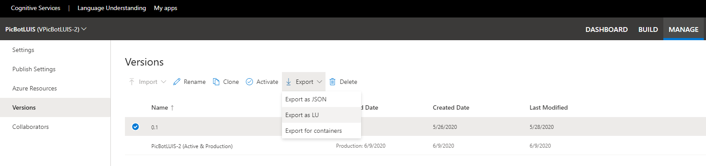
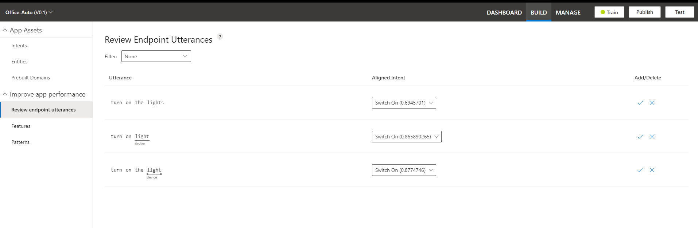

Managing the data in your LUIS app involves altering, converting, extracting, and managing storage.  At its core, the data in a LUIS app consists of the utterances, intents, and entities. LUIS stores data encrypted in an Azure data store corresponding to the region specified by the key. This data is stored for 30 days.

When you create the intents in a LUIS app, you enter sample utterances. Utterances represent phrases a user might speak when seeking to perform some action.  

You create entities to extract core information from the utterances to help LUIS understand what the user is asking for. Once your LUIS app is published and your users begin interacting with the app, the user input becomes the utterances that LUIS evaluates.

You have the ability to alter the data in these utterances, before using it in your LUIS app.  You can also convert the data format in the utterance, and you can extract data from the utterance text for use in your applications.

## Export data

If you would like to maintain the data in your LUIS app, separately from the internal storage mechanisms, you can export your LUIS app. Exporting the LUIS app results in the creation of either a JSON file or an LU file.  Both file types are comprehensive and contain the intents, utterances, and entities, among other information.  In this way, you can ensure that the data for your LUIS application is available offline.  You can use the information to reconstruct the intents, entities, and utterances if needed.  You can also import the file into LUIS to create another version of the app in a different LUIS region or account.

1. Sign into your LUIS portal.
1. Select **My apps** from the top toolbar.
1. Select the app you want to export.
1. Select the **Manage** tab.
1. Select **Versions** from the left toolbar.
1. Select the version you want to export.
1. Select the **Export** drop-down option and choose the file type (JSON or LU).
1. Your file will be exported and available for you to copy, save, or import to another location.

> [!div class="mx-imgBorder"]
> [](../media/export-app.png#lightbox)

## Utterances storage

When you create a LUIS app, you are using the **authoring process**.  You create **Intents** as part of your core LUIS configuration.  Within those **Intents**, you create **Utterances**. The first storage location for utterance data is within the intents of your LUIS app. As a result, you manage the utterances through the LUIS intents.  You can create new utterances and delete existing utterances as part of the LUIS app lifecycle.  Retraining of the model is necessary if you add or delete utterances.

When users interact with your LUIS app through the endpoint URL, the phrases that they enter can be stored in the endpoint utterances.  For the entries to be stored, the request's query string parameter for logging must be set to true, ```log=true```. The phrases can be found in the **Review endpoint utterances** page of the **Build** tab for a specific LUIS app.

> [!div class="mx-imgBorder"]
> [](../media/endpoint-utterances.png#lightbox)

Within the entries that are available on this page, you can review the aligned intent and decide if you need to make changes to your model and retrain, or if you want to add or remove these utterances to the intents that already exist and show as aligned.  For example, if you find that an aligned intent is what you believe is correct, you can select the check mark to **Add** the utterance to your intent storage in the app, or you can select the *X* to **Delete** the utterance from the app. If you select the **Add** option, the utterance will be removed from the **Review endpoint utterances** location and will then be available in the utterances for that Intent in the app. 

You can also add utterances to a LUIS app through code.  The following example shows a method, in C# and Python, that adds utterances to a **FindFlights** intent in a LUIS app. The code is not a complete sample but you can find the complete listing at this [GitHub repo](https://github.com/Azure-Samples/cognitive-services-dotnet-sdk-samples/tree/master/LUIS)

:::zone pivot="csharp"

```csharp
        // Add utterances to the LUIS application.
        async static Task AddUtterances(LUISAuthoringClient client, ApplicationInfo app_info)
        {
            var utterances = new List<ExampleLabelObject>()
            {
                CreateUtterance ("FindFlights", "find flights in economy to Madrid", new Dictionary<string, string>() { {"Flight", "economy to Madrid"}, { "Destination", "Madrid" }, { "Class", "economy" } }),
                CreateUtterance ("FindFlights", "find flights to London in first class", new Dictionary<string, string>() { { "Flight", "London in first class" }, { "Destination", "London" }, { "Class", "first" } })
            };
            await client.Examples.BatchAsync(app_info.ID, app_info.Version, utterances);
        }
```

:::zone-end

:::zone pivot="python"

```python
# Helper function for creating the utterance data structure.
# <createUtterance>
def create_utterance(intent, utterance, *labels):
    """Add an example LUIS utterance from utterance text and a list of
       labels.  Each label is a 2-tuple containing a label name and the
       text within the utterance that represents that label.
       Utterances apply to a specific intent, which must be specified."""

    text = utterance.lower()

    def label(name, value):
        value = value.lower()
        start = text.index(value)
        return dict(entity_name=name, start_char_index=start,
                    end_char_index=start + len(value))

    return dict(text=text, intent_name=intent,
                entity_labels=[label(n, v) for (n, v) in labels])
# </createUtterance>

# Add example utterances for the intent.  Each utterance includes labels
# that identify the entities within each utterance by index.  LUIS learns
# how to find entities within user utterances from the provided examples.
#
# Example utterance: "find flights in economy to Madrid"
# Labels: Flight -> "economy to Madrid" (composite of Destination and Class)
#         Destination -> "Madrid"
#         Class -> "economy"
# <addUtterances>
def add_utterances(app_id, app_version):
    # Now define the utterances
    utterances = [create_utterance("FindFlights", "find flights in economy to Madrid",
                            ("Flight", "economy to Madrid"),
							("Destination", "Madrid"),
							("Class", "economy")),

				  create_utterance("FindFlights", "find flights to London in first class",
							("Flight", "London in first class"),
							("Destination", "London"),
							("Class", "first")),

				  create_utterance("FindFlights", "find flights from seattle to London in first class",
							("Flight", "flights from seattle to London in first class"),
							("Destination", "London"),
							("Class", "first"))]

	# Add the utterances in batch. You may add any number of example utterances
	# for any number of intents in one call.
	client.examples.batch(app_id, app_version, utterances)
	print("{} example utterance(s) added.".format(len(utterances)))
# </addUtterances>
```

:::zone-end

## Altering data

When you publish your app, you have the option to select additional settings to alter or handle the input data. On the **Settings** page in the **Manage** section, you can adjust options on the version settings by enabling punctuation normalization and normalize word forms.  Punctuation normalization means that punctuation in the utterances will not affect the prediction scoring when turned on.

When you select the **Publish** button, you can also enable additional settings that can impact how LUIS handles the input from users.  Turning on Sentiment Analysis will cause LUIS to send the utterances to the Text Analytics API and perform a sentiment analysis on the utterance.  You can use that information to detect the "mood" of the utterances entered by the users.

You can also enable the Bing Spell Check to help catch spelling errors in the input, which may affect the scoring of the utterances.

Speech priming will also utilize Azure Cognitive Services by providing a speech-to-text integration, allowing users to interact with the LUIS app through spoken phrases.  The Speech to text service will recognize the speech patterns and output the phrases as text, which is then passed to the LUIS app, as text input utterances.

All of these options allow you to manage the key data that your LUIS app uses.  Managing and maintaining the data helps you maintain your LUIS app as an effective solution.
