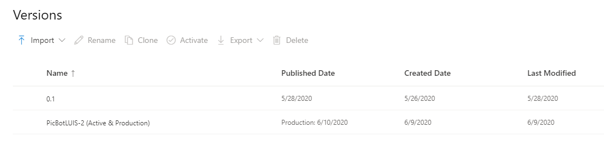
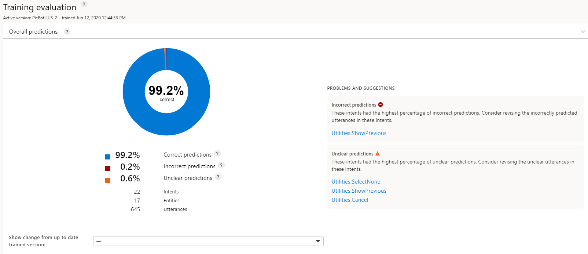

All LUIS apps have a lifecycle.  Part of that lifecycle is involves the iteration process of testing, training, and updating the data to improve the performance of the app.  In this case, performance refers to the ability to correctly predict intents from the phrases, or utterances, that have been received by the app.

Improving predictions can be achieved by manipulating the data stored in the LUIS app.  The LUIS dashboard provides ample information about three core issues  you can use improving prediction performance.

- Data imbalance - You will have a data imbalance when the number of utterances varies significantly among intents.  If you have an intent for SearchPics that has 20 utterances and an intent for SharePics that only has 4, you have a data imbalance.  All intents should have roughly the same number of example utterances entered.

There is a possibility that an imbalance may exist but intent accuracy is still over a certain threshold.  If the situation is true, an imbalance will not be reported on the dashboard.

- Unclear predictions - This situation may present itself if you have the top two intents with scores that are close.  So close that they may "flip" on a subsequent training.  The intent in second place becomes the top intent and the top intent is moved to the second place.  The dashboard will display this situation with an orange chart color.
- Incorrect predictions - occurs when an example utterance doesn't get predicted with the intent that it is labeled under.  The dashboard will show a red color chart for incorrect predictions.

   >[!CAUTION]
   >Before you make any changes to your LUIS data, ensure that the version you are viewing the report on, is actually the version you wish to modify.  Check the version information on the **Publish Status** page.

## Check the evaluation

You can use the **Dashboard** in the LUIS portal to evaluate the training results for your LUIS app.  Various charts are used to display the status along with problems and suggestions for fixes.

1. Sign in to your LUIS portal.
1. Select the LUIS app you want to evaluate.
1. Select the **Manage** option in the top toolbar.
1. Select **Versions** from the left toolbar.
1. Verify which version is active to ensure you are evaluating the correct version.
   
   > [!div class="mx-imgBorder"]
   > 

1. Select the **Dashboard** option from the top toolbar.
1. Verify the version in the **Publishing status** section.

   :::image type="content" source="../media/published-version.png" alt-text="Version information on Dashboard for published app version":::

1. If it is not already expanded, expand the **Overall Predictions** section under **Training evaluation**.  If there is no chart or data, ensure that you have trained, tested, and published the app first.
   > [!div class="mx-imgBorder"]
   > 

1. Review the problems and suggestions for the issues that are identified and apply those suggestions.
1. Also note the count of intents, entities, and utterances under the chart.
1. Expand the **Predictions per intent** section to view a bar chart depicting the correct, unclear, and incorrect predictions.
1. Hover your cursor over each bar in the chart to see the name of the intent to which that bar applies.  The data will also display the correct, incorrect, and unclear information in the window that pops up.
1. Expand the **Intents with prediction errors** section.  You will find detailed information on the most problematic intents and suggestions on how to improve the intents for more accurate predictions.

## Compare across versions

Create a new version before making changes to the app. In the new version, make the suggested changes to the intent's example utterances, then train again. On the Dashboard page's **Training evaluation** card, use the **Show change from trained version** to compare the changes.  Selecting the drop-down presents available versions.  Select the version you want to compare with the current version.

:::image type="content" source="../media/compare-improvement-across-versions.png" alt-text="Comparing across versions for predictions.  Percentages are listed after each prediction, showing the change of accuracy.":::

By evaluating the changes, you can determine if you have improved the predictions of the utterances.
