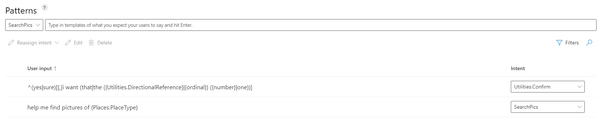

During the creation of utterances for your LUIS app, you may find that several of the utterances are similar. For example, you may create utterances for a travel application similar to this list.

- Book a flight to Paris
- Buy tickets for Paris
- Buy airline tickets to Paris
- Buy airplane tickets for a trip to Paris
- Book a Paris trip
- Book a Paris trip by air travel
- Book a Paris trip by air

All items in that list seem like good examples of utterances for an intent that relates to booking a flight. You may find that the intent score is rather low on the utterances however.  The reason is because the example utterances having varying sentence length, different word order, and different words with similar meaning. You might consider using patterns to help overcome the low score.

Use pattern matching to help with situations where your intent score is low or if the correct intent is not the top scoring intent.  Patterns do not guarantee the intent will be correctly predicted but it is a good indicator to the prediction engine that the pattern matches the intent and could help improve the intent score. 

The important aspect to keep in mind is that patterns can improve prediction scores on utterances that reveal patterns in the word order and choice of words used.

## Add a pattern

In this example, consider the use of a LUIS app that helps you search for pictures.  Perhaps you want to search for pictures with certain types of places such as a beach or a coffee shop. You can add the prebuilt entity of Places.PlaceType to your LUIS application. Once the prebuilt entity is in place, you can create a pattern.

1. Sign in to your LUIS portal.
1. Select the **LUIS app** that you want to modify.
1. Select **Build** on the top toolbar to open the build screen.
1. If you do not already have the **Places.PlaceType** prebuilt entity in your app, continue with the next set of steps, otherwise skip to step 9.
1. Select **Entities** in the left toolbar.
1. Select **Add prebuilt domain entity** under the **Entities** header.
1. Enter **Places.PlaceType** and select that entry from the list.
1. Select **Done**.  The prebuilt entity is now added to your LUIS app.
1. Locate the **Places.PlaceType** entity in your LUIS app.
1. Select the entity name and then select **Examples**.
1. Review the entries and note the specific aspects that are called out as **Places.PlaceType**.  You will use this information to help identify appropriate patterns.
1. While you are still on the **Build** page, select **Patterns** in the left toolbar.
1. The first step in adding a pattern is to determine the **Intent** that it will apply to. In this example, we want to focus on the ability to search for pictures.
1. Select **SearchPic** from the **Select an intent** drop-down.

   :::image type="content" source="../media/intent-pattern-select.png" alt-text="Selecting SearchPics from Select and intent drop-down":::

1. Now, you will enter a template for the pattern.
1. Select inside the text box that states **Type in templates of what you expect your users to say and hit Enter**.
1. Begin entering the pattern using this example:

   *help me find pictures of {*

1. Once you type the open curly brace, the LUIS portal responds by displaying a pop-up dialog that lists the entices you can select from.  Scroll through the list and select the **Places.PlaceType** prebuilt entity.
1. LUIS completes the template by adding the entity and closing the curly brace for you.
1. Press **Enter** to complete the pattern entry and have it added to your patterns.
1. Your **Patterns** screen should look similar to this image.

> [!div class="mx-imgBorder"]
> 

## Considerations for using patterns

While it is true that patterns can help improve prediction accuracy, it's also important to note that if you have provided enough example utterances, covering as many possible iterations of phrases, LUIS can increase the prediction accuracy without patterns. Consider these aspects of patterns found in this bullet list.

- Patterns use a mix of prediction technologies. Setting an intent for a template utterance in a pattern is not a guarantee of the intent prediction but it is a strong signal.
- Do not expect to see improved entity prediction if you collapse multiple utterances into a single pattern. For simple entities to fire, you need to add utterances or use list entities else your pattern will not fire.
- A pattern is matched based on detecting the entities inside the pattern first, then validating the rest of the words and word order of the pattern. Entities are required in the pattern for a pattern to match. The pattern is applied at the token level, not the character level.

For more information, review the [patterns best practices](https://docs.microsoft.com/azure/cognitive-services/luis/luis-concept-best-practices) documentation.
