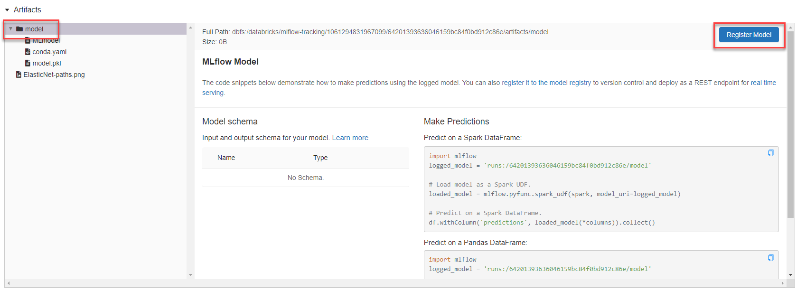
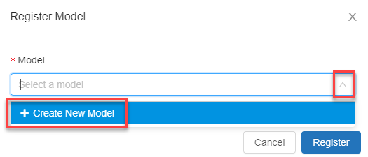
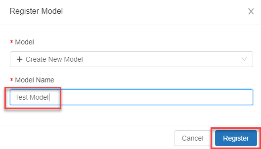

Once you have a model trained using the library of your choice, the next step is to register that model. Registration allows MLflow to keep track of the model, saving details on how the model performed in training, as well as the contents of the model itself.

## The registration process

Registration is possible through the Azure Databricks UI and through code.

### Registration through the UI

1. Registering a model is fairly straightforward. First, start with an experiment run.

    

2. On the run details page, select the folder, which contains the model and then select **Register Model**.

    

3. If you have not already created the model before, select the **Model** drop-down list and choose **+ Create New Model**.

    

4. Choose an appropriate name for the model and then select **Register**.

    

5. At this point, model registration will occur and you will have a new model. Navigate to the **Models** menu to view the model.

### Registration through code

The other method to register a model is through code. There are two ways we can register a model. The first method is to register directly from an experiment.

```python
model_details = mlflow.register_model(model_uri=model_uri, name=model_name)
```

The second method is to register during a run by naming `registered_model_name`.

```python
with mlflow.start_run() as run:
    mlflow.log_params("param1", 123)
    mlflow.sklearn.log_model(
        sk_model=model,
        artifact_path="model",
        registered_model_name="sklearn Trained Model")
```

At this point, model registration will occur and you will have a new model. You can reference the model in code using the following method:

```python
model = mlflow.sklearn.load_model(
    model_uri=f"models:/{model_name}/{model_version}")
```

## The importance of model registration

Model registration allows MLflow and Azure Databricks to keep track of models. This is important for two reasons. First, registering a model allows you to serve the model for real-time or batch scoring. This makes the process of using a trained model easy, as now data scientists will not need to develop application code; the serving process builds that wrapper and exposes a REST API or method for batch scoring automatically.

Second, registering a model allows you to create new versions of that model over time. This gives you the opportunity to track model changes and even perform comparisons between different historical versions of models. This helps answer a question of whether your model changes are significant - that is, newer models are definitely better than older models - or if the newer models are *chasing noise* and are not actually better than their predecessors.
