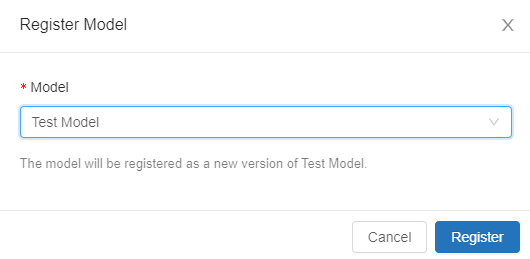
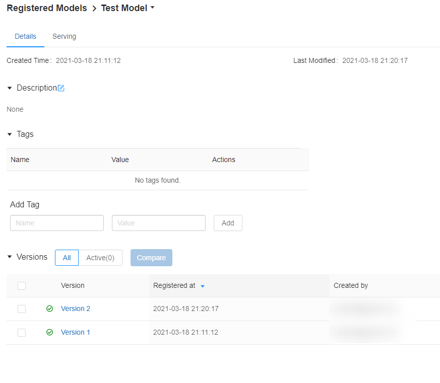
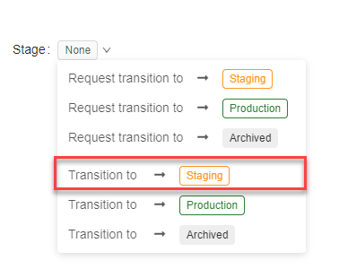
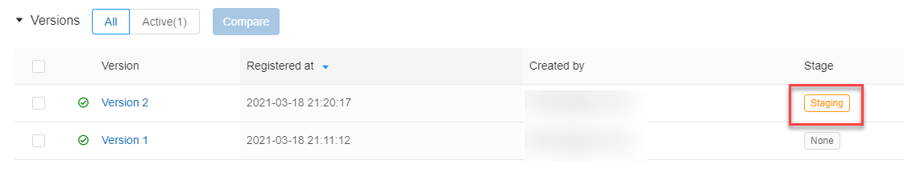

With machine learning, model training is not a one-time process. Instead, models will update over time. Keeping track of these changes is possible in MLflow using versioning.

## The versioning process

1. Versioning a model using the Azure Databricks UI is essentially the same as the model registration process. First, start with an experiment run.

   

2. On the run details page, select the folder, which contains the model and then select **Register Model**.

   

3. Because you have already created a model, select the **Model** drop-down list and choose the appropriate model name.

   

4. Select **Register** to complete model versioning.

   At this point, you will have a new version of the model. Navigate to the **Models** menu to view the model and its versions.

   

## Stage model versions

In addition to creating versions of models, MLflow allows model versions to be in certain specified stages. These include:

- **Production**. This is a model version, which is intended for deployment.
- **Staging**. This is a model version, which is intended for testing prior to taking over in production.
- **Archived**. This is a model version, which is no longer intended for use, usually because it has been supplanted by a superior model version.

Model versions start out without a stage. There are two ways of doing this: through the Azure Databricks UI as well as through code.

### Stage model versions through the UI

In order to transition a model version to a stage through the Azure Databricks UI, select the version link and in the **Stage** drop-down, select the new stage, either by requesting a transition or performing the transition. Performing a transition requires one of the following permissions: **Manage Staging Versions**, **Manage Production Versions**, or **Manage**. Any user with **Read** permissions or better may request a transition.



After performing this transition, return to the model details and the **Stage** column will contain information on the newly transitioned model version.



### Stage model versions through code

In order to transition a model version to a stage through code, use the following method:

```python
client.transition_model_version_stage(
  name=model_details.name,
  version=model_details.version,
  stage='Staging',
)
```

After performing this transition, use the following method to retrieve a model at a particular stage:

```python
import mlflow.pyfunc
model_uri = "models:/{model_name}/{model_stage}".format(model_name=model_name, model_stage=model_stage)
model = mlflow.pyfunc.load_model(model_uri)
```
