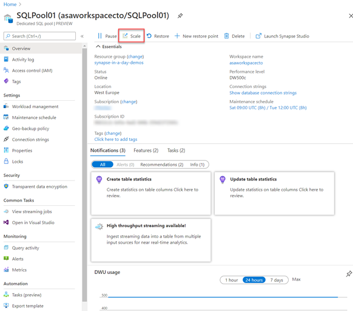
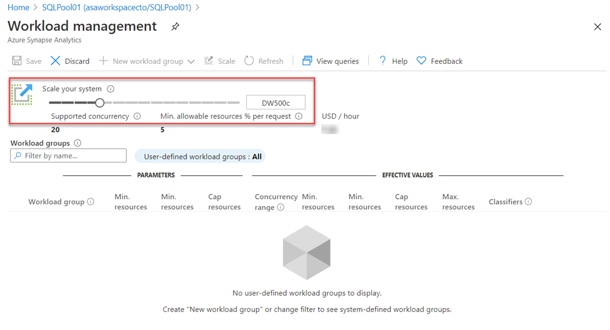
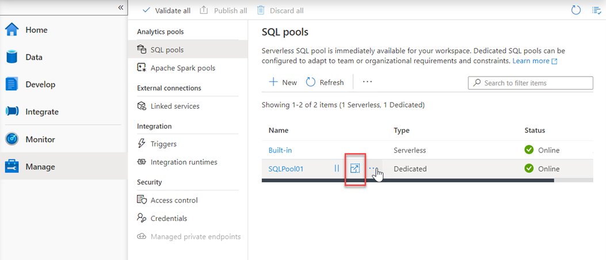
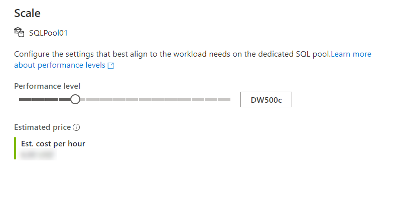
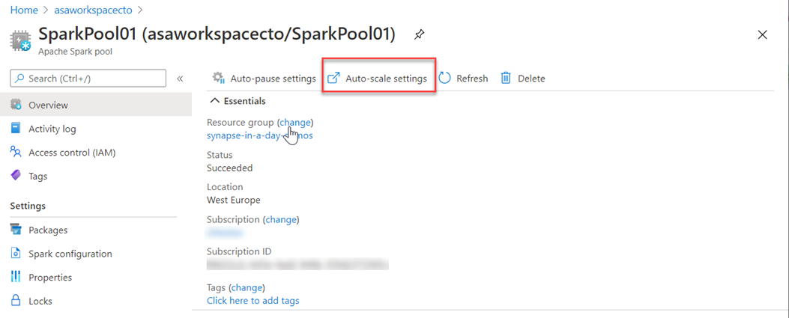
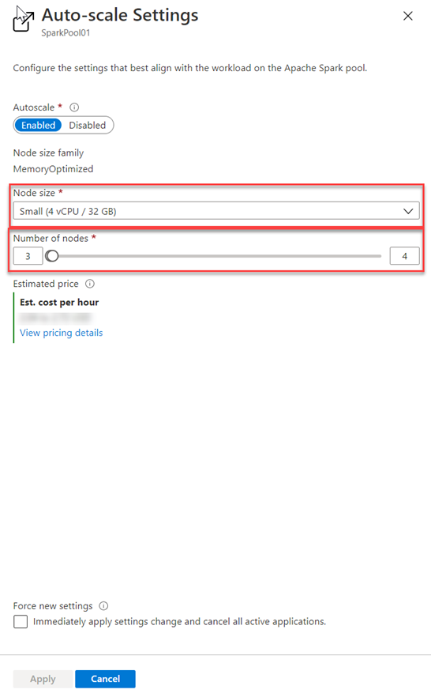
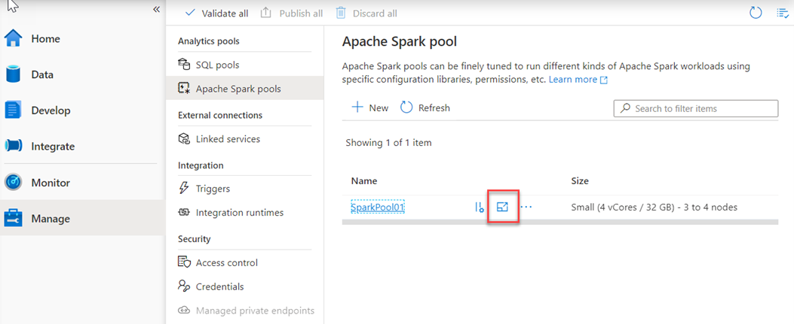
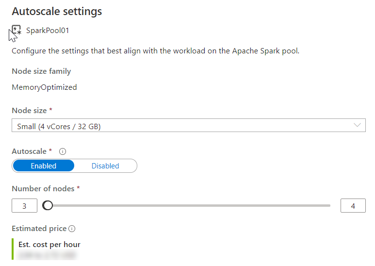

One of the key management features that you have at your disposal within Azure Synapse Analytics, is the ability the scale the compute resources for SQL or Spark pools to meet the demands of processing your data. In SQL pools, the unit of scale is an abstraction of compute power that is known as a data warehouse unit. Compute is separate from storage, which enables you to scale compute independently of the data in your system. This means you can scale up and scale down the compute power to meet your needs.

You can scale a Synapse SQL pool either through the Azure portal, Azure Synapse Studio or programmatically using TSQL or PowerShell.

In the Azure portal, you can click on **scale** icon
> [!div class="mx-imgBorder"]  
> 

And then you can adjust the **slider** to scale the SQL Pool
> [!div class="mx-imgBorder"]  
> 

Another option to scale is within Azure Synapse Studio, click on the **scale** icon:
> [!div class="mx-imgBorder"]  
> 

And then move the **slider** as follows:
> [!div class="mx-imgBorder"]  
> 

You can also make the modification using Transact-SQL

```sql
ALTER DATABASE mySampleDataWarehouse
MODIFY (SERVICE_OBJECTIVE = 'DW300c');
```

Or by using PowerShell 

```powershell
Set-AzSqlDatabase -ResourceGroupName "resourcegroupname" -DatabaseName "mySampleDataWarehouse" -ServerName "sqlpoolservername" -RequestedServiceObjectiveName "DW300c"
```

## Scaling Apache Spark pools in Azure Synapse Analytics

Apache Spark pools for Azure Synapse Analytics uses an **Autoscale** feature that automatically scales the number of nodes in a cluster instance up and down. During the creation of a new Spark pool, a minimum and maximum number of nodes can be set when **Autoscale** is selected. Autoscale then monitors the resource requirements of the load and scales the number of nodes up or down. To enable the Autoscale feature, complete the following steps as part of the normal pool creation process:

1.	On the **Basics** tab, select the **Enable autoscale** checkbox.
2.	Enter the desired values for the following properties:
    - **Min** number of nodes.
    - **Max** number of nodes.

The initial number of nodes will be the minimum. This value defines the initial size of the instance when it's created. The minimum number of nodes can't be fewer than three.

You can also modify this in the Azure portal, you can click on **auto-scale settings** icon
> [!div class="mx-imgBorder"]  
> 

Choose the node size and the number of nodes
> [!div class="mx-imgBorder"]  
> 


and for Azure Synapse Studio as follows
> [!div class="mx-imgBorder"]  
> 

And Choose the node size and the number of nodes
> [!div class="mx-imgBorder"]  
> 

Autoscale continuously monitors the Spark instance and collects the following metrics:

|Metric|Description|
|---|---|
|Total Pending CPU|The total number of cores required to start execution of all pending nodes.|
|Total Pending Memory|The total memory (in MB) required to start execution of all pending nodes.|
|Total Free CPU|The sum of all unused cores on the active nodes.|
|Total Free Memory|The sum of unused memory (in MB) on the active nodes.|
|Used Memory per Node|The load on a node. A node on which 10 GB of memory is used, is considered under more load than a worker with 2 GB of used memory.|

The following conditions will then autoscale the memory or CPU

|Scale-up|Scale-down|
|---|---|
|Total pending CPU is greater than total free CPU for more than 1 minute.|Total pending CPU is less than total free CPU for more than 2 minutes.|
|Total pending memory is greater than total free memory for more than 1 minute.|Total pending memory is less than total free memory for more than 2 minutes.|

The scaling operation can take between 1 -5 minutes. During an instance where there is a scale down process, Autoscale will put the nodes in decommissioning state so that no new executors can launch on that node.

The running jobs will continue to run and finish. The pending jobs will wait to be scheduled as normal with fewer available nodes.
