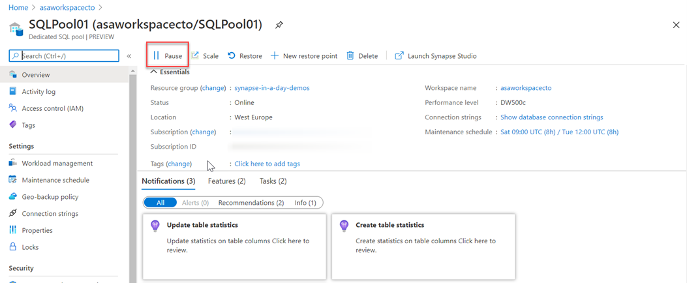
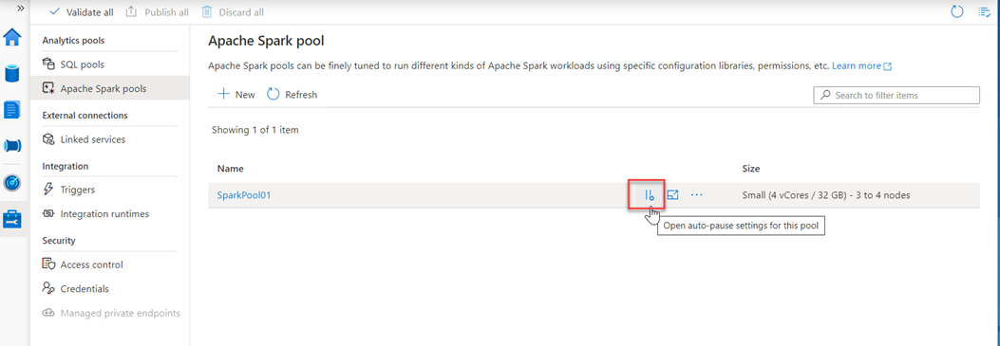
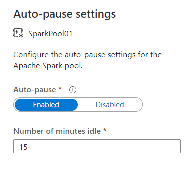

When performing the batch movement of data to populate a data warehouse, it is typical for the data engineer to understand the schedule on which the data loads take place. In these circumstances, you may be able to predict the periods of downtime in the data loading and querying process and take advantage of the pause operations to minimize your costs.

In the Azure portal you can use the Pause command within the dedicated SQL pool
> [!div class="mx-imgBorder"]  
> 

And this can also be used within Azure Synapse Studio, in the Manage hub.
> [!div class="mx-imgBorder"]  
> 

Which allows you to enable it, and set the number of minutes idle
> [!div class="mx-imgBorder"]  
> 
