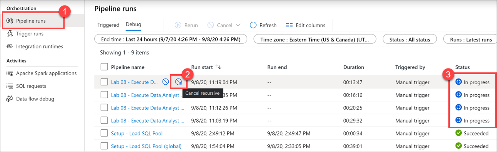
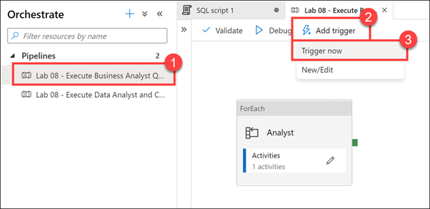
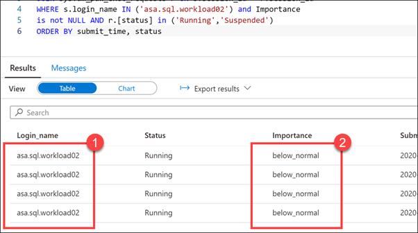
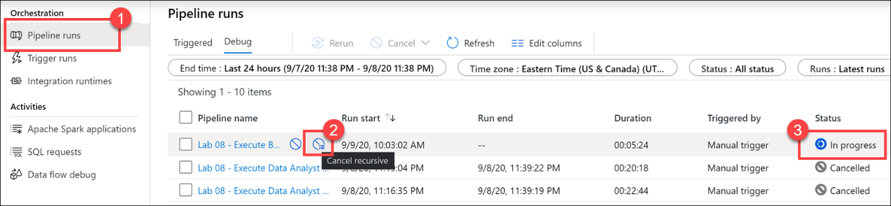

Azure Synapse Analytics allows you to create, control and manage resource availability when workloads are competing. This allows you to manage the relative importance of each workload when waiting for available resources.

To facilitate faster load times, you can create a workload classifier for the load user with the “importance” set to above_normal or High. Workload importance ensures that the load takes precedence over other waiting tasks of a lower importance rating. Use this in conjunction with your own workload group definitions for workload isolation to manage minimum and maximum resource allocations during peak and quiet periods.

Dedicated SQL pool workload management in Azure Synapse consists of three high-level concepts: 
-   Workload Classification
-   Workload Importance 
-   Workload Isolation

These capabilities give you more control over how your workload utilizes system resources.

## Workload classification

Workload management classification allows workload policies to be applied to requests through assigning resource classes and importance.

While there are many ways to classify data warehousing workloads, the simplest and most common classification is load and query. You load data with insert, update, and delete statements. You query the data using selects. A data warehousing solution will often have a workload policy for load activity, such as assigning a higher resource class with more resources. A different workload policy could apply to queries, such as lower importance compared to load activities.

You can also subclassify your load and query workloads. Subclassification gives you more control of your workloads. For example, query workloads can consist of cube refreshes, dashboard queries or ad-hoc queries. You can classify each of these query workloads with different resource classes or importance settings. Load can also benefit from subclassification. Large transformations can be assigned to larger resource classes. Higher importance can be used to ensure key sales data is loader before weather data or a social data feed.

Not all statements are classified as they do not require resources or need importance to influence execution. DBCC commands, BEGIN, COMMIT, and ROLLBACK TRANSACTION statements are not classified.

## Workload importance

Workload importance influences the order in which a request gets access to resources. On a busy system, a request with higher importance has first access to resources. Importance can also ensure ordered access to locks. There are five levels of importance: low, below_normal, normal, above_normal, and high. Requests that don't set importance are assigned the default level of normal. Requests that have the same importance level have the same scheduling behavior that exists today.

## Workload isolation

Workload isolation reserves resources for a workload group. Resources reserved in a workload group are held exclusively for that workload group to ensure execution. Workload groups also allow you to define the amount of resources that are assigned per request, much like resource classes do. Workload groups give you the ability to reserve or cap the amount of resources a set of requests can consume. Finally, workload groups are a mechanism to apply rules, such as query timeout, to requests.

You can perform the following steps to implement workload management

### Create a workload classifier to add importance to certain queries

Your organization has asked you if there is a way to mark queries executed by the CEO as more important than others, so they don't appear slow due to heavy data loading or other workloads in the queue. You decide to create a workload classifier and add importance to prioritize the CEO's queries.

1. Select the **Develop** hub. 

    

2. From the **Develop** menu, select the **+** button **(1)** and choose **SQL Script (2)** from the context menu.

    

3. In the toolbar menu, connect to the **SQL Pool** database to execute the query.

    

4. In the query window, replace the script with the following to confirm that there are no queries currently being run by users logged in as `asa.sql.workload01`, representing the CEO of the organization or `asa.sql.workload02` representing the data analyst working on the project:

    ```sql
    --First, let's confirm that there are no queries currently being run by users logged in workload01 or workload02

    SELECT s.login_name, r.[Status], r.Importance, submit_time, 
    start_time ,s.session_id FROM sys.dm_pdw_exec_sessions s 
    JOIN sys.dm_pdw_exec_requests r ON s.session_id = r.session_id
    WHERE s.login_name IN ('asa.sql.workload01','asa.sql.workload02') and Importance
    is not NULL AND r.[status] in ('Running','Suspended') 
    --and submit_time>dateadd(minute,-2,getdate())
    ORDER BY submit_time ,s.login_name
    ```

5. Select **Run** from the toolbar menu to execute the SQL command.

    

    Now that we have confirmed that there are no running queries, we need to flood the system with queries and see what happens for `asa.sql.workload01` and `asa.sql.workload02`. To do this, we'll run a Azure Synapse Pipeline which triggers queries.

6. Select the **Integrate** hub.

    

7. Select the **Lab 08 - Execute Data Analyst and CEO Queries** Pipeline **(1)**, which will run / trigger the `asa.sql.workload01` and `asa.sql.workload02` queries. Select **Add trigger (2)**, then **Trigger now (3)**. In the dialog that appears, select **OK**.

    

8. Let's see what happened to all the queries we just triggered as they flood the system. In the query window, replace the script with the following:

    ```sql
    SELECT s.login_name, r.[Status], r.Importance, submit_time, start_time ,s.session_id FROM sys.dm_pdw_exec_sessions s 
    JOIN sys.dm_pdw_exec_requests r ON s.session_id = r.session_id
    WHERE s.login_name IN ('asa.sql.workload01','asa.sql.workload02') and Importance
    is not NULL AND r.[status] in ('Running','Suspended') and submit_time>dateadd(minute,-2,getdate())
    ORDER BY submit_time ,status
    ```

9. Select **Run** from the toolbar menu to execute the SQL command.

    

    You should see an output similar to the following:

    

    Notice that the **Importance** level for all queries is set to **normal**.

10. We will give our `asa.sql.workload01` user queries priority by implementing the **Workload Importance** feature. In the query window, replace the script with the following:

    ```sql
    IF EXISTS (SELECT * FROM sys.workload_management_workload_classifiers WHERE name = 'CEO')
    BEGIN
        DROP WORKLOAD CLASSIFIER CEO;
    END
    CREATE WORKLOAD CLASSIFIER CEO
      WITH (WORKLOAD_GROUP = 'largerc'
      ,MEMBERNAME = 'asa.sql.workload01',IMPORTANCE = High);
    ```

    We are executing this script to create a new **Workload Classifier** named `CEO` that uses the `largerc` Workload Group and sets the **Importance** level of the queries to **High**.

11. Select **Run** from the toolbar menu to execute the SQL command.

    

12. Let's flood the system again with queries and see what happens this time for `asa.sql.workload01` and `asa.sql.workload02` queries. To do this, we'll run an Azure Synapse Pipeline which triggers queries. **Select** the `Integrate` Tab, **run** the **Lab 08 - Execute Data Analyst and CEO Queries** Pipeline, which will run / trigger the `asa.sql.workload01` and `asa.sql.workload02` queries.

13. In the query window, replace the script with the following to see what happens to the `asa.sql.workload01` queries this time:

    ```sql
    SELECT s.login_name, r.[Status], r.Importance, submit_time, start_time ,s.session_id FROM sys.dm_pdw_exec_sessions s 
    JOIN sys.dm_pdw_exec_requests r ON s.session_id = r.session_id
    WHERE s.login_name IN ('asa.sql.workload01','asa.sql.workload02') and Importance
    is not NULL AND r.[status] in ('Running','Suspended') and submit_time>dateadd(minute,-2,getdate())
    ORDER BY submit_time ,status desc
    ```

14. Select **Run** from the toolbar menu to execute the SQL command.

    

    You should see an output similar to the following:

    

    Notice that the queries executed by the `asa.sql.workload01` user have a **high** importance.

15. Select the **Monitor** hub.

    

16. Select **Pipeline runs (1)**, and then select **Cancel recursive (2)** for each running Lab 08 pipelines, marked **In progress (3)**. This will help speed up the remaining tasks.

    

### Reserve resources for specific workloads through workload isolation

Workload isolation means resources are reserved, exclusively, for a workload group. Workload groups are containers for a set of requests and are the basis for how workload management, including workload isolation, is configured on a system. A simple workload management configuration can manage data loads and user queries.

In the absence of workload isolation, requests operate in the shared pool of resources. Access to resources in the shared pool is not guaranteed and is assigned on an importance basis.

Given the workload requirements provided by Tailwind Traders, you decide to create a new workload group called `CEODemo` to reserve resources for queries executed by the CEO.

Let's start by experimenting with different parameters.

1. In the query window, replace the script with the following:

    ```sql
    IF NOT EXISTS (SELECT * FROM sys.workload_management_workload_groups where name = 'CEODemo')
    BEGIN
        Create WORKLOAD GROUP CEODemo WITH  
        ( MIN_PERCENTAGE_RESOURCE = 50        -- integer value
        ,REQUEST_MIN_RESOURCE_GRANT_PERCENT = 25 --  
        ,CAP_PERCENTAGE_RESOURCE = 100
        )
    END
    ```

    The script creates a workload group called `CEODemo` to reserve resources exclusively for the workload group. In this example, a workload group with a `MIN_PERCENTAGE_RESOURCE` set to 50% and `REQUEST_MIN_RESOURCE_GRANT_PERCENT` set to 25% is guaranteed 2 concurrency.

2. Select **Run** from the toolbar menu to execute the SQL command.

    

3. In the query window, replace the script with the following to create a Workload Classifier called `CEODreamDemo` that assigns a workload group and importance to incoming requests:

    ```sql
    IF NOT EXISTS (SELECT * FROM sys.workload_management_workload_classifiers where  name = 'CEODreamDemo')
    BEGIN
        Create Workload Classifier CEODreamDemo with
        ( Workload_Group ='CEODemo',MemberName='asa.sql.workload02',IMPORTANCE = BELOW_NORMAL);
    END
    ```

    This script sets the Importance to **BELOW_NORMAL** for the `asa.sql.workload02` user, through the new `CEODreamDemo` Workload Classifier.

4. Select **Run** from the toolbar menu to execute the SQL command.

    

5. In the query window, replace the script with the following to confirm that there are no active queries being run by `asa.sql.workload02` (suspended queries are OK):

    ```sql
    SELECT s.login_name, r.[Status], r.Importance, submit_time,
    start_time ,s.session_id FROM sys.dm_pdw_exec_sessions s
    JOIN sys.dm_pdw_exec_requests r ON s.session_id = r.session_id
    WHERE s.login_name IN ('asa.sql.workload02') and Importance
    is not NULL AND r.[status] in ('Running','Suspended')
    ORDER BY submit_time, status
    ```

6. Select **Run** from the toolbar menu to execute the SQL command.

    

7. Select the **Integrate** hub.

    

8. Select the **Lab 08 - Execute Business Analyst Queries** Pipeline **(1)**, which will run / trigger  `asa.sql.workload02` queries. Select **Add trigger (2)**, then **Trigger now (3)**. In the dialog that appears, select **OK**.

    

9. In the query window, replace the script with the following to see what happened to all the `asa.sql.workload02` queries we just triggered as they flood the system:

    ```sql
    SELECT s.login_name, r.[Status], r.Importance, submit_time,
    start_time ,s.session_id FROM sys.dm_pdw_exec_sessions s
    JOIN sys.dm_pdw_exec_requests r ON s.session_id = r.session_id
    WHERE s.login_name IN ('asa.sql.workload02') and Importance
    is not NULL AND r.[status] in ('Running','Suspended')
    ORDER BY submit_time, status
    ```

10. Select **Run** from the toolbar menu to execute the SQL command.

    

    You should see an output similar to the following that shows the importance for each session set to `below_normal`:

    

    Notice that the running scripts are executed by the `asa.sql.workload02` user **(1)** with an Importance level of **below_normal (2)**. We have successfully configured the business analyst queries to execute at a lower importance than the CEO queries. We can also see that the `CEODreamDemo` Workload Classifier works as expected.

11. Select the **Monitor** hub.

    

12. Select **Pipeline runs (1)**, and then select **Cancel recursive (2)** for each running Lab 08 pipelines, marked **In progress (3)**. This will help speed up the remaining tasks.

    

13. Return to the query window under the **Develop** hub. In the query window, replace the script with the following to set 3.25% minimum resources per request:

    ```sql
    IF  EXISTS (SELECT * FROM sys.workload_management_workload_classifiers where group_name = 'CEODemo')
    BEGIN
        Drop Workload Classifier CEODreamDemo
        DROP WORKLOAD GROUP CEODemo
        --- Creates a workload group 'CEODemo'.
            Create  WORKLOAD GROUP CEODemo WITH  
        (MIN_PERCENTAGE_RESOURCE = 26 -- integer value
            ,REQUEST_MIN_RESOURCE_GRANT_PERCENT = 3.25 -- factor of 26 (guaranteed more than 4 concurrencies)
        ,CAP_PERCENTAGE_RESOURCE = 100
        )
        --- Creates a workload Classifier 'CEODreamDemo'.
        Create Workload Classifier CEODreamDemo with
        (Workload_Group ='CEODemo',MemberName='asa.sql.workload02',IMPORTANCE = BELOW_NORMAL);
    END
    ```
    > [!NOTE]  
    > Configuring workload containment implicitly defines a maximum level of concurrency. With a CAP_PERCENTAGE_RESOURCE set to 60% and a REQUEST_MIN_RESOURCE_GRANT_PERCENT set to 1%, up to a 60-concurrency level is allowed for the workload group. Consider the method included below for determining the maximum concurrency:
    > [Max Concurrency] = [CAP_PERCENTAGE_RESOURCE] / [REQUEST_MIN_RESOURCE_GRANT_PERCENT]

14. Select **Run** from the toolbar menu to execute the SQL command.

    

15. Let's flood the system again and see what happens for `asa.sql.workload02`. To do this, we will run an Azure Synapse Pipeline which triggers queries. Select the `Integrate` Tab. **Run** the **Lab 08 - Execute Business Analyst Queries** Pipeline, which will run / trigger  `asa.sql.workload02` queries.

16. In the query window, replace the script with the following to see what happened to all of the `asa.sql.workload02` queries we just triggered as they flood the system:

    ```sql
    SELECT s.login_name, r.[Status], r.Importance, submit_time,
    start_time ,s.session_id FROM sys.dm_pdw_exec_sessions s
    JOIN sys.dm_pdw_exec_requests r ON s.session_id = r.session_id
    WHERE s.login_name IN ('asa.sql.workload02') and Importance
    is  not NULL AND r.[status] in ('Running','Suspended')
    ORDER BY submit_time, status
    ```

17. Select **Run** from the toolbar menu to execute the SQL command.

    

    After several moments (up to a minute), we should see several concurrent executions by the `asa.sql.workload02` user running at **below_normal** importance. We have validated that the modified Workload Group and Workload Classifier works as expected.

    

18. Select the **Monitor** hub.

    

19. Select **Pipeline runs (1)**, and then select **Cancel recursive (2)** for each running Lab 08 pipelines, marked **In progress (3)**. This will help speed up the remaining tasks.

    

