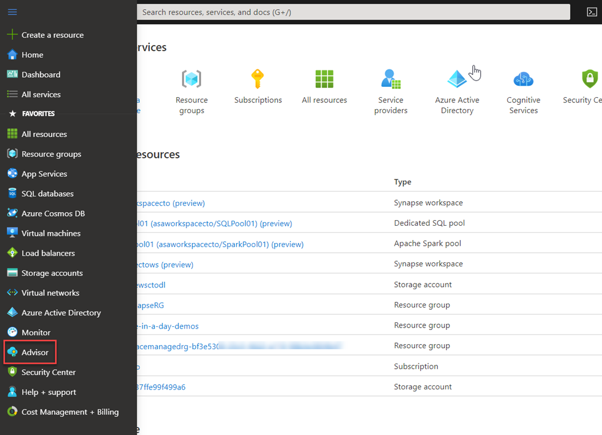
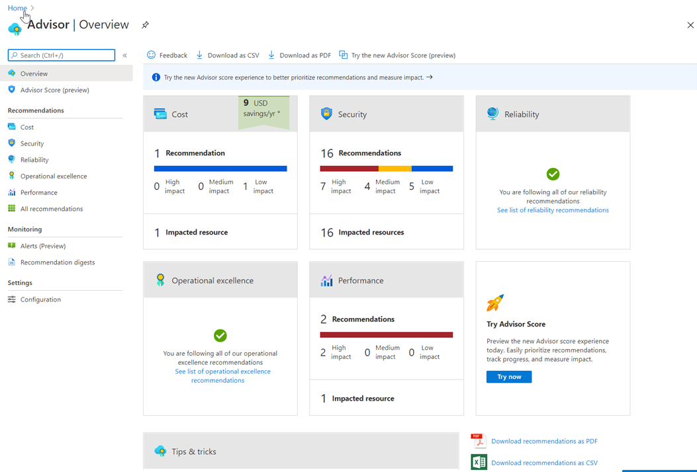
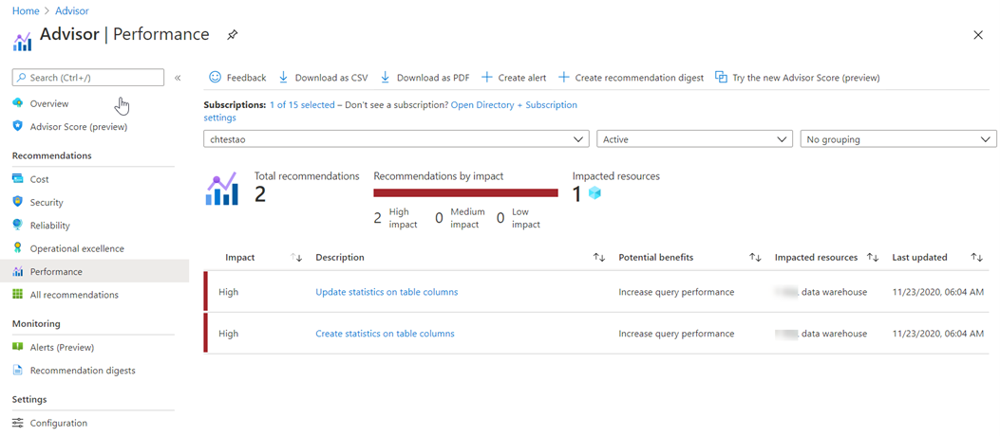
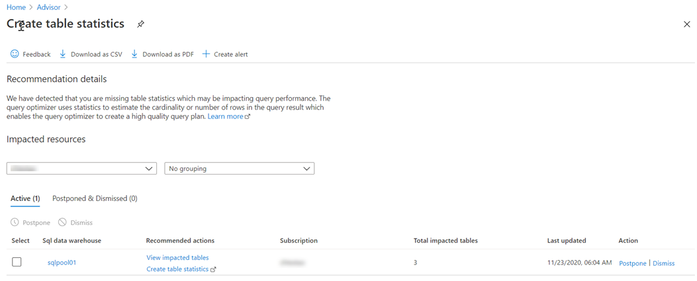
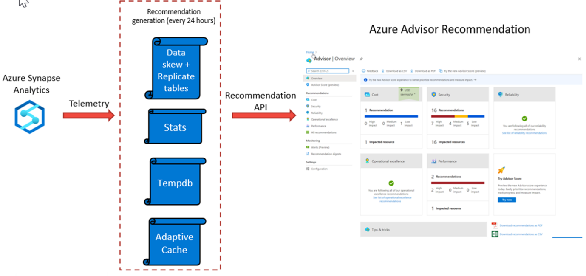

Azure Advisor provides you with personalized messages that provide information on best practices to optimize the setup of your Azure services.  It analyzes your resource configuration and usage telemetry and then recommends solutions that can help you improve the cost effectiveness, performance, Reliability (formerly called High availability), and security of your Azure resources.

The Advisor may appear when you log into the Azure portal, but you can also access the Advisor by selecting Advisor in the navigation menu. 
> [!div class="mx-imgBorder"]  
> 

On accessing Advisor, a dashboard is presented that provides recommendations in the following areas:
-	Cost
-	Security
-	Reliability
-	Operational excellence
-	Performance
> [!div class="mx-imgBorder"]  
> 

You can click on any of the dashboard items for more information. In the following example, the performance dashboard item is showing more information on two high impact items in Azure Synapse Analytics.
> [!div class="mx-imgBorder"]  
> 

You can also click on each item to get even more information that can help you resolve the issue. In the following example, this is the information that is shown when clicking on the **Create statistics on table columns** recommendation.
> [!div class="mx-imgBorder"]  
> 

In this screen, you can click on the **view impacted tables** to see which tables are being impacted specifically, and there are also links to the help in the Azure documentation that you can use to get more understanding of the issue.

## How Azure Synapse Analytics works with Azure Advisor

Azure Advisor recommendations are free, and the recommendations are based on telemetry data that is generated by Azure Synapse Analytics. The telemetry data that is captured by Azure Synapse Analytics include
-	Data Skew and replicated table information.
-	Column statistics data.
-	TempDB utilization data.
-	Adaptive Cache.
> [!div class="mx-imgBorder"]  
> 

Azure Advisor recommendations are checked every 24 hours, as the recommendation API is queried against the telemetry generated from with Azure Synapse Analytics, and the recommendation dashboards are then updated to reflect the information that the telemetry has generated. This can then be viewed in the Azure Advisor dashboard.
