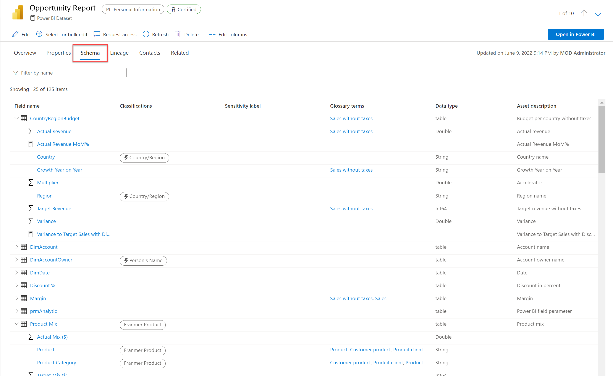
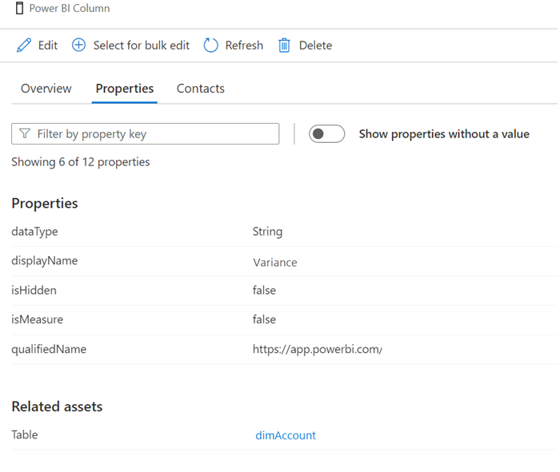
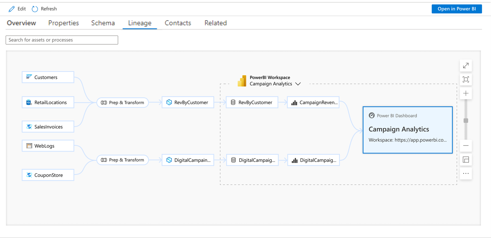

Purview and Power BI together are powerful, enhancing the ability of the search and browse features to see both the schema and lineage of Power BI assets. 

## Extend your search with enhanced metadata

Metadata scanning facilitates governance by making it possible to catalog and report on the metadata of your organization's Power BI artifacts. The results of metadata scanning are displayed on the schema tab of the asset.

> [!NOTE]
> Metadata scanning must be enabled in the Power BI admin portal. See [Set up metadata scanning in your organization](/power-bi/admin/service-admin-metadata-scanning-setup) to learn more.

After performing a search in the Purview Governance Portal, select a Power BI asset from your search result to see the sensitivity labels and endorsement metadata. Additional business metadata includes the dataset user configuration, create datetime, and description.

Under the Schema tab, you can see the list of all the tables, columns, and measures created inside the Power BI dataset.

> [!div class="mx-imgBorder"]
> 

For more detail, selecting a particular field within the schema tab will take you to the details for that field. You can then view the overview, properties, lineage, contacts, and related assets for that particular field.

> [!div class="mx-imgBorder"]
> 

Metadata scanning requires no special license. It works for all of your tenant metadata, including items that are located in non-Premium workspaces.

If you'd like more information about assets, you also have the option open the Power BI dataset in the Power BI service for further analytics, root-cause investigation, impact analysis, management tasks, and dataset enrichment.

## Extend your search with lineage

If you're using the search and browse features in Microsoft Purview to find assets for reporting or to troubleshoot existing assets, you likely need more information on where data actually comes from, and what transformation steps it has undergone. The lineage view displays the flow of data from the source through to Power BI assets, including dataflows, datasets, reports, and dashboards.

Although you can track [data lineage in Power BI](/power-bi/collaborate-share/service-data-lineage), this information is limited to the items in a single workspace. Lineage in Purview enables you to view the movement of data across more than one workspace, in a single view.

Lineage enables easy troubleshooting and deeper analysis of analytics projects. You're able to look both up and down-stream, to perform either root cause or impact analysis.

For example, you can detect the Azure Synapse Analytics pipeline that is responsible for the transformation of the data upstream of Power BI.

> [!div class="mx-imgBorder"]
> 

In the Purview Governance Portal, lineage is displayed from the asset you're currently viewing. 

