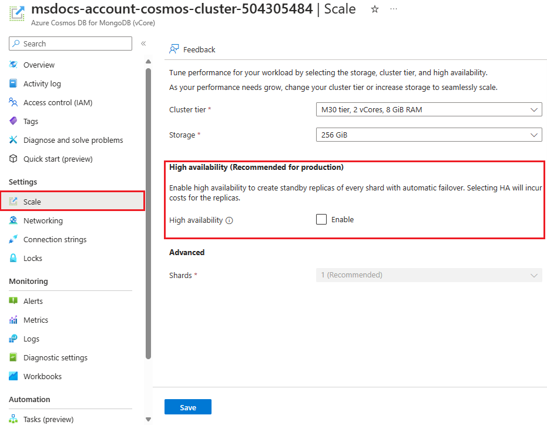

High availability is key to ensuring your vCore-based Azure Cosmos DB for MongoDB operates smoothly, particularly in handling disruptions from events like earthquakes, floods, fires, or hardware failures. By using redundancy and logical isolation of Azure services, high availability helps maintain continuous operation across different regions.

## Understand availability zone support

Azure availability zones are at least three physically separate groups of datacenters within each Azure region. Azure availability zone-enabled services can be configured in two ways:

- **Zone-redundant**, which replicates data across zones to enhance fault tolerance.
- **Zonal**, which confines instances to a specific zone for better data locality and compliance.

You must enable the vCore-based Azure Cosmos DB for MongoDB's *high availability* setting to support availability zones.

## Implement high availability and disaster recovery

Activating high availability maintains standby replicas of data shards. If a primary shard fails, the system redirects operations to a standby replica in another zone, minimizing downtime. Without high availability, each shard uses locally redundant storage (LRS) with three synchronous replicas in one zone, risking downtime during regional failures.

To use the high availability feature, ensure your cluster is created in a [supported region](/azure/reliability/reliability-cosmos-mongodb#prerequisites) like Australia East, Southeast Asia, or certain regions in Europe and the US.

Disaster recovery is critical for recovering from major disruptions, which can range from natural disasters to technical failures. Azure Cosmos DB for MongoDB vCore doesn't automatically provide built-in failover across regions, making it essential to actively design and implement a disaster recovery plan that includes:

- **Enabling high availability**: Essential for critical workloads to ensure continuous availability and operational continuity.
- **Backup and Restore**: Regular automatic backups are taken to prevent data loss and support recovery efforts.

### Enable high availability

To enable high availability, go to the vCore-based Azure Cosmos DB for MongoDB cluster's *scale* setting in the Azure portal, select the **High availability** checkbox, and save.

> 

When you enable high availability on your vCore-based Azure Cosmos DB for MongoDB cluster, your cluster is better prepared to handle disruptions and maintain smooth operations.
