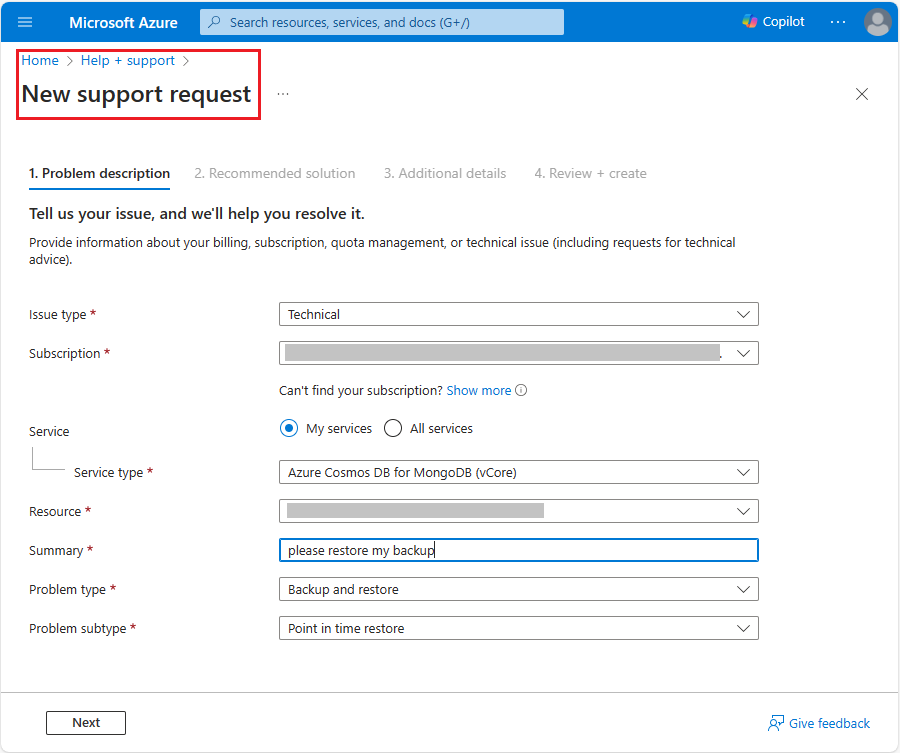

Azure Cosmos DB for MongoDB vCore includes an automatic backup feature that enables point-in-time recovery (PITR) of your data. This feature is crucial for restoring your database to any specific moment within a defined retention period.

## Explore the backup process

Backups in vCore-based Azure Cosmos DB for MongoDB are handled automatically and continuously without impacting the database performance. These backups are encrypted using AES (Advanced Encryption Standard) 256-bit encryption to ensure data security. The backups are retained for up to 35 days for active clusters and 7 days for deleted clusters.

In Azure regions that support availability zones, backup snapshots are stored in three zones. This redundancy ensures that, as long as one availability zone remains operational, your cluster can be restored.

## Explore the restore process

The restore process requires initiating a *support request* with Azure. When a backup is restored, the restore creates a new cluster with the same configuration in the same Azure region, subscription, and resource group.

To initiate a support request, on the Azure portal, select the ***Help + support*** section, and choose **Create a support request**'. *The Azure support team will guide you through the process of restoring your data from the backup*. For more information on Azure support requests, go to the [create an Azure support request](/azure/azure-portal/supportability/how-to-create-azure-support-request) page.

> 

While the automatic backup feature helps reduce the probability of data loss, it's not a replacement for a thorough disaster recovery plan. For significant outages, it's crucial to have a disaster recovery strategy that fits your organizational and compliance needs. This strategy should complement the built-in backup capabilities of Azure Cosmos DB for MongoDB vCore, providing an extra layer of protection for your critical data.
