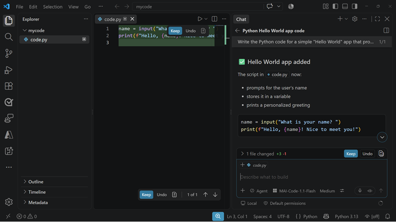
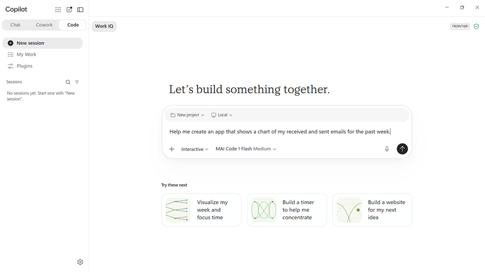
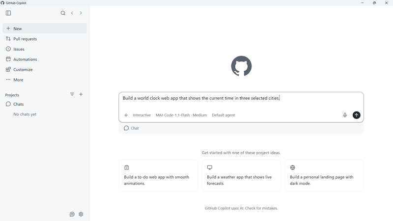

::: zone pivot="video"

>[!VIDEO https://learn-video.azurefd.net/vod/player?id=7187f146-4582-4b90-9077-94f14ca9eb50]

> [!TIP]
> See the **Text and images** tab for more details!

::: zone-end

::: zone pivot="text"

AI-assisted coding tools provide a chat or agent experience that connects a model to your development environment. When an MAI-Code model is available, you can select it for tasks that benefit from coding-specific reasoning and tool use.



> [!NOTE]
> Model names, availability, and user interfaces evolve. Consult the current documentation for the AI-assisted coding tool you're using.

## Select an MAI-Code model

The exact interface varies between products and versions, but the general process in AI-assisted coding tools like Microsoft Copilot Code and GitHub Copilot is:

1. Open the coding assistant's chat or agent interface.
1. Open the model picker.
1. Select an available model whose name begins with **MAI-Code**, such as **MAI-Code-1.1-Flash**.
1. Select the interaction mode for your task. Use a conversational mode to ask questions or plan, and an agent mode when you want the tool to edit files and run development tools.
1. Confirm the selected model before you submit your prompt.



If you don't see an MAI-Code model, check the models supported by your tool and subscription. Model access can also depend on product rollout, organization policy, and administrator configuration.

## Define the coding task

Start with a prompt that makes the desired outcome testable. Include:

- **Objective**: What you want to create, change, or fix.
- **Context**: Relevant files, existing behavior, architecture, and repository conventions.
- **Constraints**: Required languages, frameworks, versions, dependencies, security rules, and accessibility requirements.
- **Acceptance criteria**: Observable behavior that defines success.
- **Validation**: Tests, linters, builds, or manual checks the result must pass.

For example:

```text
Create a world clock web app that shows the cirret time in three selected cities.
Include user interface controls to enable users to select the cities, and ensure the controls are keyboard accessible with an approprate tab order.
Ensure the user interface meets accessibility standards and validates all user input to mitigate errors or malicious misuse attempts.
Add focused unit tests, then run the relevant test and lint commands.
```

This prompt gives the model a bounded objective and tells it how to verify the result.



## Guide the model through the work

For a small, well-defined task, you can ask the model to implement and validate the change directly. For a larger task, work in stages:

1. Ask the model to inspect the relevant code and summarize the existing design.
1. Ask for an implementation plan and review it before editing begins.
1. Generate one coherent part of the solution at a time.
1. Examine the changed files and command output.
1. Refine the prompt when requirements or failures reveal missing context.

Give the model error messages and failed-test output instead of asking it to guess why something failed. Don't include secrets, credentials, personal data, or other information that your organization doesn't permit you to share with the coding tool.

## Validate generated code

Before accepting a generated application or change:

- Read the code and verify that it matches the requirements.
- Run the relevant build, tests, linter, and type checker.
- Review dependencies and generated configuration.
- Check authentication, authorization, input validation, error handling, and data protection.
- Test accessibility and the user experience where applicable.
- Inspect the final diff to make sure the model didn't make unrelated changes.

Use additional human review for high-impact code, including security controls, production infrastructure, financial calculations, and workflows that process sensitive data.

::: zone-end
