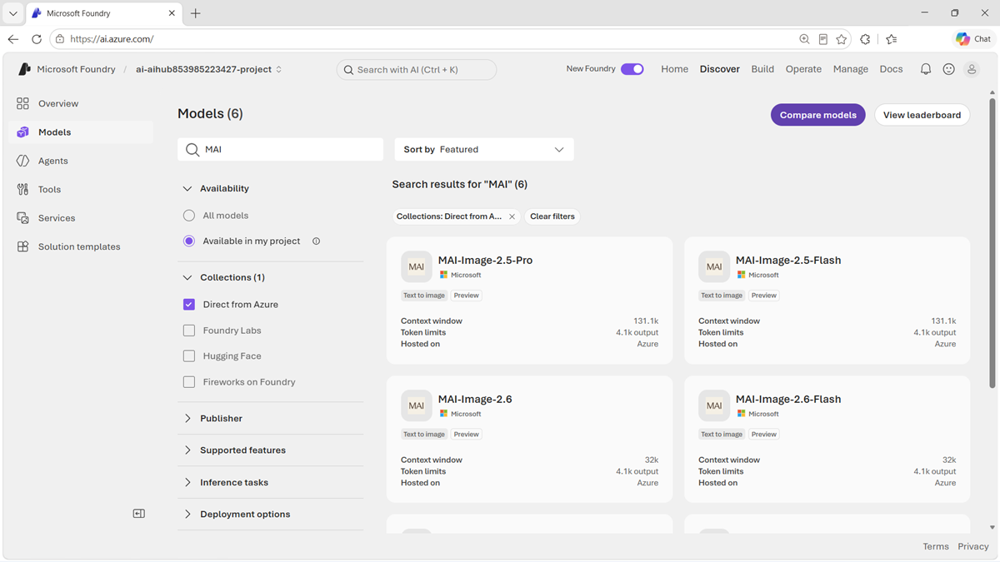

::: zone pivot="video"

>[!VIDEO https://learn-video.azurefd.net/vod/player?id=0ee9aef9-e097-4d21-9815-fa9611602432]

> [!TIP]
> See the **Text and images** tab for more details!

::: zone-end

::: zone pivot="text"

Microsoft Foundry Models provides a catalog for discovering, evaluating, and deploying AI models. The catalog includes models from Microsoft and other providers for language, reasoning, vision, speech, embeddings, and specialized industry workloads.

## Discover Microsoft AI models

Use search and filters in the model catalog to narrow the available models. Useful filters include the model collection, inference task, supported capabilities, lifecycle status, deployment option, and region. A region filter is especially important because a model that fits the workload might not be available with the required deployment type in your target region.

After you select a model, review its **model card**. Depending on the model, the card can provide:

- A description of the model's capabilities and architecture.
- Intended uses, limitations, and responsible AI guidance.
- Supported inputs, outputs, languages, and context constraints.
- Available versions and deployment options.
- Benchmark results for quality, safety, latency, throughput, or estimated cost.

Benchmarks are useful for forming a shortlist, but they use standardized datasets that might not represent your application. Compare candidate models with your own prompts, audio, or images before making a production decision.

## Match a model to the workload

Begin with the input, output, and task that your application requires:

| Application requirement | Microsoft AI model to evaluate |
| --- | --- |
| Reason over a difficult text-based problem | MAI-Thinking-1 |
| Generate or edit visual content | MAI-Image-2.5 family |
| Convert spoken audio into text | MAI-Transcribe-1.5 |
| Convert text into natural speech | MAI-Voice-2 family |

Then define measurable criteria. For example, a transcription workload might prioritize recognition of domain terminology, while a voice assistant might prioritize the delay before audio begins. An image workflow might prioritize instruction following, object consistency, or cost per accepted asset.

## Experiment before deployment

Foundry provides a playground experience appropriate to a model's modality. Use it to try realistic inputs, adjust available parameters, and inspect outputs without first building an application. Keep a repeatable set of test cases so that comparisons between models and versions are consistent.

A sound selection process is:

1. Define the task and acceptance criteria.
1. Use catalog filters and model cards to create a shortlist.
1. Test representative and difficult cases in the playground.
1. Evaluate output quality, safety, latency, and cost.
1. Select a model and deployment option that meet the requirements.
1. Monitor the deployed application and reevaluate when models or requirements change.

> [!NOTE]
> You're responsible for determining whether a model is appropriate for your use case and for implementing suitable safety, security, privacy, and human-oversight measures.

Learn more in the [Microsoft Foundry Models overview](/azure/foundry/concepts/foundry-models-overview?azure-portal=true).

::: zone-end
