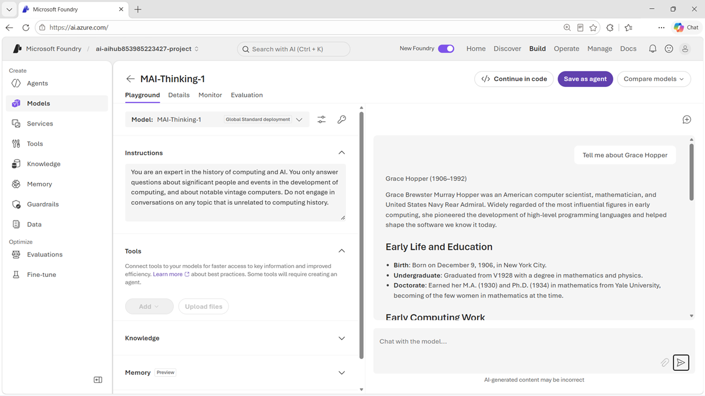

::: zone pivot="video"

>[!VIDEO https://learn-video.azurefd.net/vod/player?id=96c2b1c4-6b69-4565-ae3a-078ac00f282b]

> [!TIP]
> See the **Text and images** tab for more details!

::: zone-end

::: zone pivot="text"

**MAI-Thinking-1** is a Microsoft AI reasoning model designed to work through complex problems. Its mixture-of-experts architecture activates a subset of the model's parameters during inference, reducing the inference footprint compared with a similarly sized dense model.

## Identify suitable reasoning workloads

MAI-Thinking-1 is a candidate for tasks such as:

- Solving multi-step mathematics and logic problems.
- Analyzing requirements and producing or reviewing code.
- Comparing options that involve several constraints.
- Planning a sequence of actions for an agent.
- Synthesizing evidence to support an enterprise decision.

Reasoning models are most useful when the task requires decomposition or deliberation. For extraction, classification, routing, or a simple factual response, a faster model might meet the requirement with lower latency and cost.

## Evaluate reasoning in Foundry

Open the model card in the Foundry catalog to review current availability, limitations, and deployment details. In the model playground, use a test set that includes the kinds of ambiguity, constraints, and edge cases the application will encounter.

Don't evaluate only whether the final response sounds convincing. Check whether it:

- Reaches a correct and reproducible conclusion.
- Uses supplied evidence without inventing unsupported facts.
- Follows all task constraints and required output formats.
- Recognizes when information is missing or uncertain.
- Uses tools correctly when the production workflow includes tools.

For multi-turn experiences, test whether earlier context helps or distracts the model. For agent scenarios, measure successful task completion and tool-call accuracy in addition to response quality.

## Design for reliable use

Ground the model with authoritative data when responses depend on private or changing information. Validate structured outputs before passing them to another system, and require confirmation before actions with significant consequences. Applications involving people, money, security, health, or legal decisions need appropriate safeguards and human oversight.

Reasoning can increase processing time, so measure end-to-end latency and cost with production-like prompts. Route simpler requests to an appropriate faster model when that design meets the application's quality requirements.

> [!TIP]
> Review the [MAI-Thinking-1 model card](https://aka.ms/mai-thinking-1-foundrycard?azure-portal=true) for current capabilities, limitations, and deployment information.

::: zone-end
