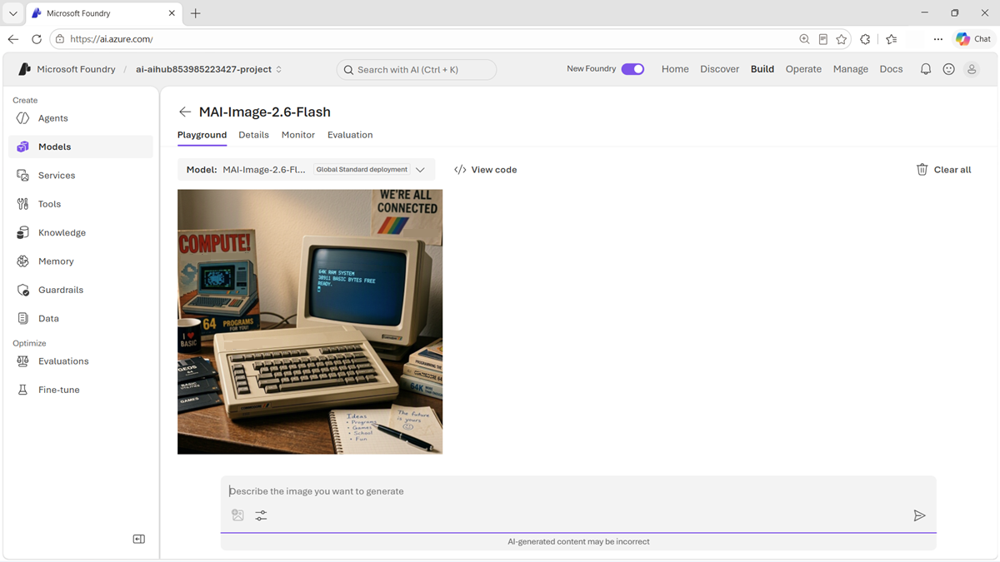

::: zone pivot="video"

>[!VIDEO https://learn-video.azurefd.net/vod/player?id=0d66a36e-6eae-4e4f-af08-2382204a2e8e]

> [!TIP]
> See the **Text and images** tab for more details!

::: zone-end

::: zone pivot="text"

The **MAI-Image-2.5** family generates images from text and edits existing images from natural-language instructions. It supports photorealistic scenes, design assets, product imagery, and controlled changes to uploaded content.

## Choose a model variant

The family provides variants for different priorities:

- **MAI-Image-2.5-Pro** emphasizes object consistency, visual reasoning, and world knowledge for demanding creative work.
- **MAI-Image-2.5** balances high-quality generation with precise, controllable editing.
- **MAI-Image-2.5-Flash** targets production-ready quality at a lower cost than the flagship model.

Treat these descriptions as a starting point. In Foundry, confirm current model availability and compare variants with the prompts, source images, sizes, and output volumes expected in production.

## Prompt for generation and editing

You can test MAI-Image models in the Foundry playground.

For a new image, specify the subject, setting, composition, visual treatment, lighting, colors, and orientation. For example:

> Create a landscape product photograph of a reusable orange water bottle on a pale stone desk. Use soft morning window light, realistic shadows, and a clean editorial style. Keep the label centered and legible.

For editing, distinguish the requested change from the details that must remain stable. You might ask the model to change a product's color while preserving its shape, label, camera angle, background, and lighting. Clear preservation constraints make the result easier to evaluate.

## Evaluate visual outputs

Create a prompt set that includes ordinary and difficult cases. Assess:

- Adherence to the prompt and requested composition.
- Consistency of objects, people, branding, and text.
- Accuracy of edits and preservation of unchanged regions.
- Physical and factual plausibility.
- Unwanted artifacts, stereotypes, or unsafe content.
- Generation latency and cost per usable result.

Image quality is partly subjective, so define a review rubric and use multiple reviewers when consistency matters. Confirm that you have rights to uploaded source material, disclose generated content when appropriate, and don't use generated or edited images to deceive people.

> [!TIP]
> Review the model cards for [MAI-Image-2.5-Pro](https://microsoft.ai/pdf/MAI-Image-2.5_Pro-Model_Card.pdf?azure-portal=true), [MAI-Image-2.5](https://microsoft.ai/pdf/MAI-Image-2.5-Model-Card.PDF?azure-portal=true), and [MAI-Image-2.5-Flash](https://microsoft.ai/pdf/MAI-Image-2.5-Flash-Model-Card.pdf?azure-portal=true).

::: zone-end
