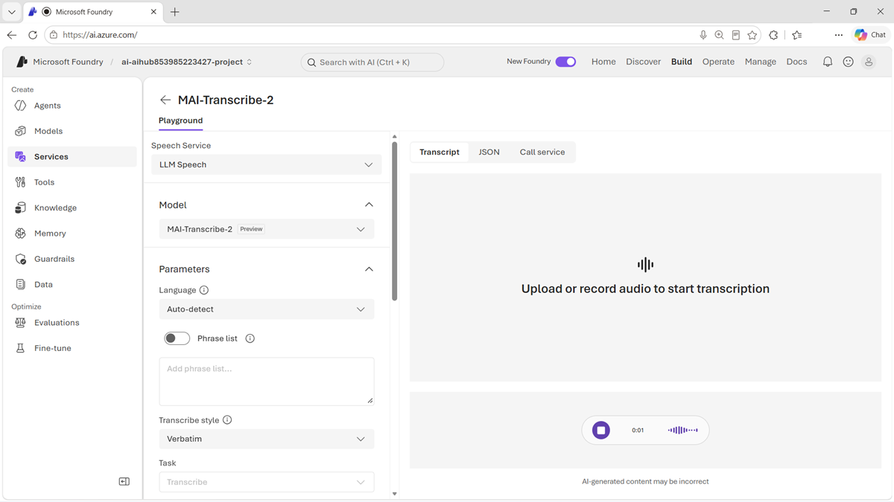

::: zone pivot="video"

>[!VIDEO https://learn-video.azurefd.net/vod/player?id=d7ae2749-fe6a-458a-9002-d416c8854acf]

> [!TIP]
> See the **Text and images** tab for more details!

::: zone-end

::: zone pivot="text"

**MAI-Transcribe-1.5** converts spoken audio into text. It supports 43 languages, includes automatic language detection, and is designed to work across accents, background noise, and variable recording quality.

## Apply speech recognition

MAI-Transcribe is a model option for Azure Speech in Foundry Tools. You can test it in the speech playground in the Foundry portal.

Transcription can provide the text foundation for:

- Captions and accessibility experiences.
- Meeting, interview, and voicemail transcripts.
- Searchable archives of recorded content.
- Customer-call analysis and summarization.
- Voice-controlled applications and agents.
- Domain-specific notes and records.

Contextual biasing helps the model recognize specialized vocabulary, such as product names, acronyms, medical terms, or organization-specific language. Supply relevant context carefully: an unrelated or overly broad vocabulary list can reduce rather than improve accuracy.

## Prepare audio for evaluation

Use production-like recordings when you test the model through Foundry. Include the microphones, codecs, speaker characteristics, languages, accents, and noise conditions expected in the application. Test interruptions, overlapping speech, proper names, numbers, and specialized terms instead of relying only on clean studio audio.

Word error rate measures insertions, deletions, and substitutions, but a single error can be more consequential than several minor mistakes. Also assess:

- Whether errors change the meaning of the transcript.
- Recognition of names and domain terminology.
- Language detection and code-switching behavior.
- Timestamps, formatting, and speaker information required downstream.
- Latency for live or interactive scenarios.
- The quality of downstream search, summaries, or decisions that use the transcript.

## Protect speech data

Recordings and transcripts can contain personal, confidential, or regulated information. Define retention and access policies, secure data in transit and at rest, and inform people when conversations are recorded or transcribed. Review important transcripts before using them for high-impact decisions.

> [!TIP]
> Review the [MAI-Transcribe-1.5 model card](https://microsoft.ai/pdf/MAI-Transcribe-1.5-Model-Card.PDF?azure-portal=true) for current capabilities, limitations, and responsible-use guidance.

::: zone-end
