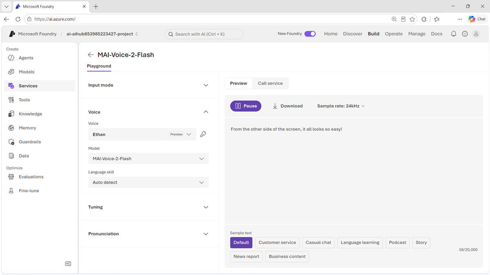

::: zone pivot="video"

>[!VIDEO https://learn-video.azurefd.net/vod/player?id=9d23c122-69e7-4505-9c42-6363d89efbe7]

> [!TIP]
> See the **Text and images** tab for more details!

::: zone-end

::: zone pivot="text"

The **MAI-Voice-2** family converts text or a short reference recording into natural, expressive speech. It supports multilingual generation, control over pacing and emotion, and speaker consistency across generated content.

## Choose for fidelity or latency

The family includes two variants:

- **MAI-Voice-2** prioritizes fidelity. Evaluate it for audiobooks, learning content, podcasts, documentaries, and voice-over work where naturalness and long-form consistency are important.
- **MAI-Voice-2-Flash** prioritizes low latency. Evaluate it for call-center agents, interactive voice response, and assistants that must begin speaking quickly.

The faster model isn't automatically the best choice for every interactive system, and the highest-fidelity model isn't automatically best for every recorded asset. Test the actual languages, voices, text lengths, speaking styles, and response-time targets of the application.

## Evaluate generated speech

MAI-Voice models are supported in Azure Speech in Foundry Tools. You can test speech generation with MAI-Voice in the speech playground in the Foundry portal.

In addition to listening for overall naturalness, assess:

- Pronunciation of names, numbers, abbreviations, and domain terms.
- Whether pacing, emphasis, tone, and emotion fit the content.
- Speaker consistency across long passages and repeated sessions.
- Audio artifacts and behavior around punctuation or unusual input.
- Time to first audio and total generation time.
- Accessibility and intelligibility for the intended audience.

Use a consistent listening rubric and a diverse group of reviewers. Automated measurements can help with latency and technical quality, but they don't replace human assessment of naturalness and appropriateness.

## Build an interactive voice pipeline

A voice assistant commonly combines several models:

- MAI-Transcribe-1.5 converts the user's speech to text.
- A chat or reasoning model interprets the request and creates a response.
- MAI-Voice-2-Flash converts the response into speech.

Measure the complete delay from the end of the user's utterance to the beginning of the spoken response. Streaming, detecting the end of speech, model inference, application tools, and speech generation all contribute to that experience.

Use synthetic voices only with appropriate consent and authorization. Make it clear when users are interacting with generated speech, and protect reference recordings from misuse.

> [!TIP]
> Review the [MAI-Voice-2 model card](https://microsoft.ai/pdf/MAI-Voice-2-Model-Card.PDF?azure-portal=true) for current capabilities, limitations, and responsible-use guidance.

::: zone-end
