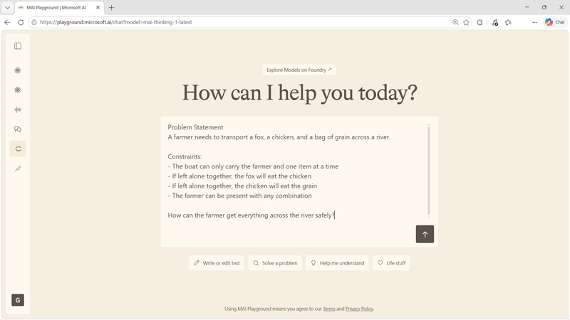

::: zone pivot="video"

>[!VIDEO https://learn-video.azurefd.net/vod/player?id=444377aa-ee3b-4d37-9390-a35fcbe9476c]

> [!TIP]
> See the **Text and images** tab for more details!

::: zone-end

::: zone pivot="text"

Chat applications range from straightforward question answering to conversations that require planning, analysis, and tool use. When a chat experience must work through a difficult problem rather than only produce a fluent response, a reasoning model is an appropriate choice.

## MAI-Thinking-1

**MAI-Thinking-1** is Microsoft AI's first reasoning model. It was built from scratch for serious mathematics, coding, software engineering, and real-world enterprise deployment. Its mixture-of-experts architecture activates a subset of its overall parameters during inference, giving it a smaller inference footprint than a similarly sized dense model.

MAI-Thinking-1 is designed for workloads such as:

- Working through multi-step mathematics and logic problems.
- Analyzing requirements and producing or reviewing code.
- Planning a sequence of actions for an agent.
- Synthesizing information to support an enterprise decision.
- Maintaining context across a multi-turn problem-solving conversation.

The model is integrated with Microsoft Foundry capabilities for evaluation, observability, safety, and deployment. These capabilities help teams assess output quality, trace application behavior, and apply controls when moving from an experiment to production.

> [!TIP]
> Review the [MAI-Thinking-1 model card](https://aka.ms/mai-thinking-1-foundrycard?azure-portal=true) for current capabilities, limitations, and deployment details.

## Match the model to the chat experience

Reasoning can improve answers to difficult questions, but it can also require more processing than a direct response. Before choosing a thinking model for every message, classify the work your chat application performs.

Use a reasoning model when the request requires decomposition, calculation, coding, planning, or comparison across multiple constraints. For simple extraction, routing, or frequently repeated answers, evaluate whether a faster model can meet the quality target at lower latency and cost.

A practical evaluation process is:

1. Collect representative single-turn and multi-turn conversations from the intended workload.
1. Define what makes an answer correct, useful, safe, and appropriately concise.
1. Test the model with the tools and context that the production application will provide.
1. Measure task completion and error patterns, not only how fluent the answer sounds.
1. Compare quality, latency, and cost before selecting a deployment.

> [!NOTE]
> A reasoning model can still make mistakes. Applications that affect people, money, security, or other high-impact decisions need grounding, evaluation, safeguards, and appropriate human oversight.

::: zone-end
