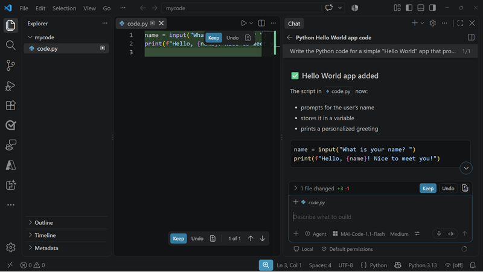

::: zone pivot="video"

>[!VIDEO https://learn-video.azurefd.net/vod/player?id=1ee94102-2708-4d7b-aeda-8b8740e41fa3]

> [!TIP]
> See the **Text and images** tab for more details!

::: zone-end

::: zone pivot="text"

Code-generation models can help developers move from an idea to working software. Some coding assistants complete a line or explain a function. Agentic coding models go further by planning, reasoning, and executing across a sequence of development tasks.

## Work with MAI-Code-1.1-Flash

**MAI-Code-1.1-Flash** is a lightweight, agentic coding model optimized for efficient everyday software engineering. It can support workflows such as:

- Understanding requirements and planning an implementation.
- Generating, explaining, and modifying code.
- Investigating defects and proposing fixes.
- Working across multiple files to implement a feature.
- Interpreting screenshots, diagrams, and designs to create prototypes.
- Running development tools and iterating on their results when used through an agentic coding environment.

The model supports a broad range of programming languages and ecosystems, including Python, C++, HTML, CSS, .NET, Java, JavaScript, and TypeScript. This breadth is useful in projects that combine frontend, backend, scripting, and infrastructure code.

MAI-Code-1.1-Flash is custom-trained for native integration with GitHub Copilot in Visual Studio Code and the Copilot CLI. Through these environments, the model can use repository context and development tools to work across a task rather than respond to an isolated prompt.

> [!TIP]
> Review the [MAI-Code-1.1-Flash model card](https://microsoft.ai/pdf/MAI-Code-1.1-Flash-Model-Card.PDF?azure-portal=true) for current capabilities, limitations, and intended uses.

## Provide useful context

A coding model produces better results when the request includes enough information to define success. Give it the relevant requirements, constraints, repository conventions, language and framework versions, and expected behavior. For visual implementation tasks, provide the source screenshot or design along with responsive and accessibility requirements.

Break ambiguous projects into verifiable outcomes. For example, instead of asking the model to "build a sign-in page," specify the authentication flow, validation rules, supported screen sizes, design references, and tests that should pass.

## Review and validate generated code

Treat generated code as a proposed implementation, not as automatically trusted output. Review changes for correctness, maintainability, security, accessibility, and alignment with the repository's conventions. Run focused tests, static analysis, and security checks before accepting a change.

Pay particular attention to generated dependencies, authentication and authorization logic, data handling, error paths, and code that affects production infrastructure. Keep human approval in workflows where a change could create significant cost, security, privacy, or operational impact.

> [!IMPORTANT]
> Model quality, performance, availability, and pricing can change. Review the current model card and GitHub Copilot documentation before selecting a model for a production development workflow.

::: zone-end
