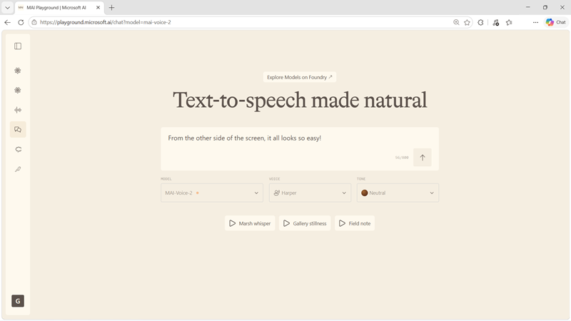
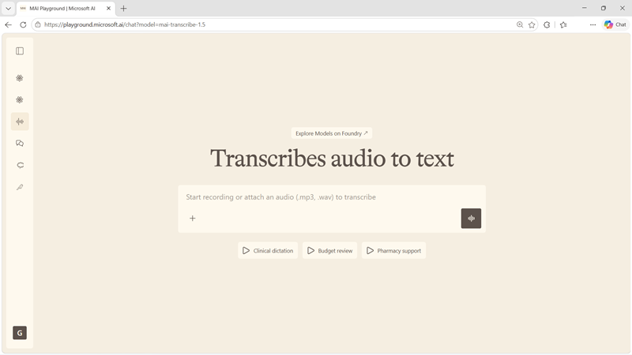

::: zone pivot="video"

>[!VIDEO https://learn-video.azurefd.net/vod/player?id=bfe2da15-2c51-488b-921d-87075d47917a]

> [!TIP]
> See the **Text and images** tab for more details!

::: zone-end

::: zone pivot="text"

Speech synthesis and transcription are common requirements for AI apps and agents. Text-to-speech models create audio from written content, while speech-to-text models transcribe recorded or live audio. Microsoft AI provides a specialized model family for each direction.

## Generate speech with MAI-Voice-2

The **MAI-Voice-2** family produces natural, expressive speech from text or a short reference clip. It supports control over pacing, tone, and emotion, and can preserve speaker consistency across long-form content.

The family has two variants:

- **MAI-Voice-2** prioritizes fidelity. It's suited to audiobooks, courses, podcasts, documentaries, and voice-over work where naturalness and consistency matter most.
- **MAI-Voice-2-Flash** prioritizes low latency. It's suited to call-center agents, interactive voice response, and voice assistants that must respond quickly.

Both variants support multilingual generation, granular emotion control, and zero-shot voice prompting. Choose between them by testing the actual languages, voices, content lengths, and response-time requirements of your application.

> [!TIP]
> Review the [MAI-Voice-2 model card](https://microsoft.ai/pdf/MAI-Voice-2-Model-Card.PDF?azure-portal=true) for current capabilities, limitations, and responsible-use guidance.

## Transcribe audio with MAI-Transcribe-1.5

**MAI-Transcribe-1.5** converts audio into text across 43 languages. It includes automatic language detection and is designed to remain accurate across accents, background noise, and variable audio quality.

Contextual biasing helps the model recognize specialized terms. This capability is useful in workloads that contain product names, medical terminology, industry vocabulary, or other words that a general transcription system might misrecognize. Typical scenarios include:

- Captions and accessibility workflows.
- Meeting and voicemail transcription.
- Customer-call analysis.
- Domain-specific notes and records.
- Searchable archives of recorded content.

When evaluating transcription, use recordings that reflect production conditions. Include different speakers, accents, microphones, noise levels, languages, and domain terms. Word error rate is useful, but also assess whether errors change meaning and whether timestamps, speaker separation, formatting, or downstream search meet your application's needs.

> [!TIP]
> Review the [MAI-Transcribe-1.5 model card](https://microsoft.ai/pdf/MAI-Transcribe-1.5-Model-Card.PDF?azure-portal=true) for current capabilities, limitations, and responsible-use guidance.

## Combine speech models

A voice agent can combine both model families in a pipeline:

1. MAI-Transcribe-1.5 converts a user's speech to text.
1. A chat or reasoning model interprets the request and produces a response.
1. MAI-Voice-2 or MAI-Voice-2-Flash turns the response into spoken audio.

For an interactive system, end-to-end latency matters more than the speed of any one model. Measure the complete path from the end of the user's utterance to the start of the generated response.

::: zone-end
